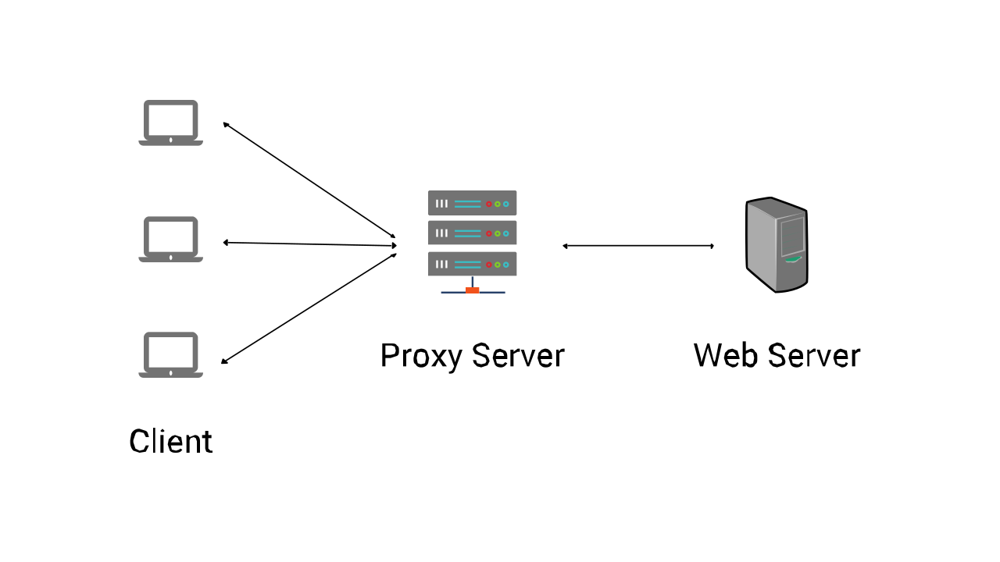
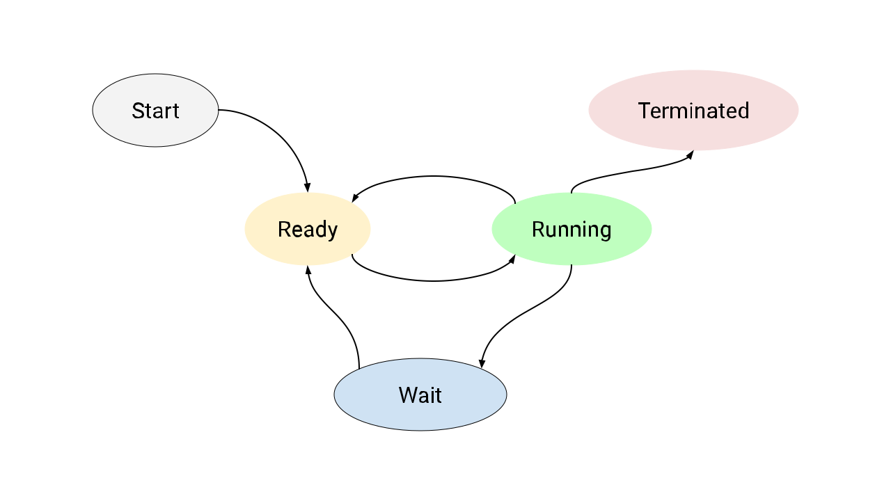
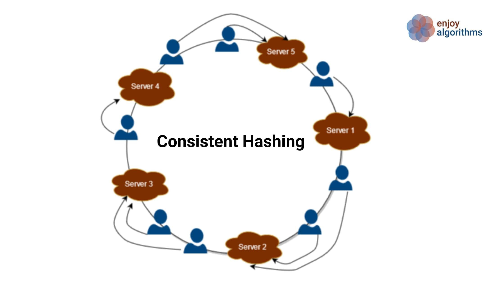
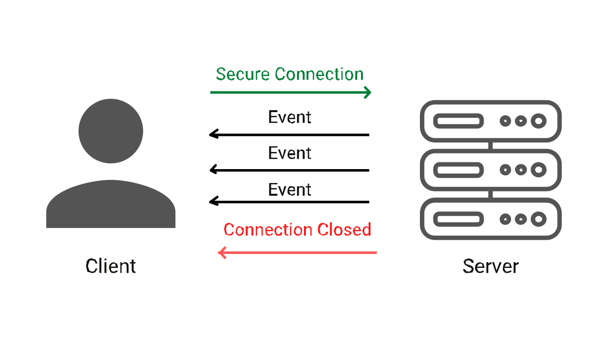
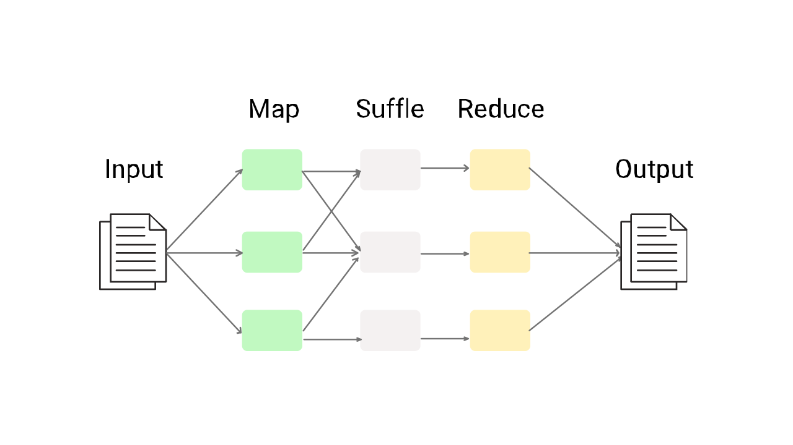
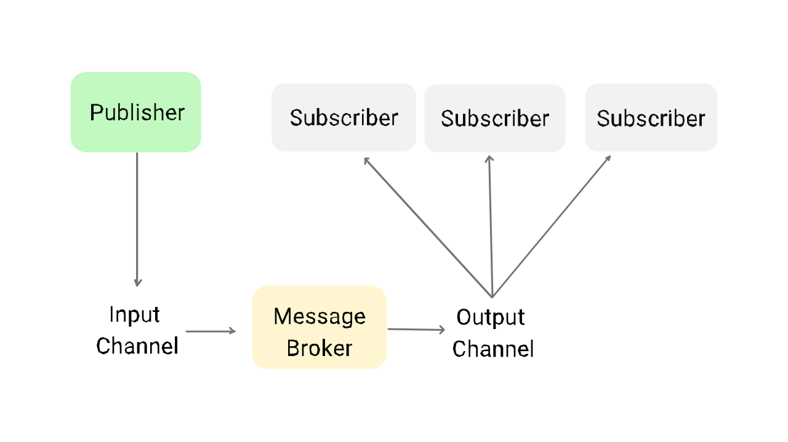
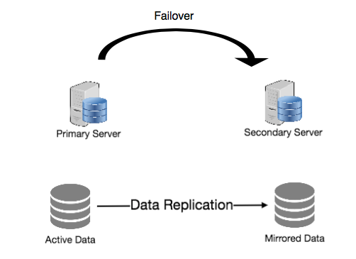

# System Design

## Concepts

| Availability | Latency | Throughput |
|-|-|-|
|  |  |  |
| Caching | Load Balancers | Proxies |
|  |  |  |
| CAP Theorem | Database | Distributed System |
|  |  | 
| Network Protocols | Process in OS | Consistent Hashing |
|  |  |  |
| Long Polling | Server-Sent Events | WebSockets |
|  |  |  |
| Map Reduce | PubSub Pattern | Redundancy |
|  |  | 