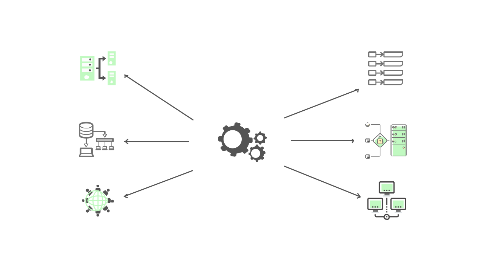
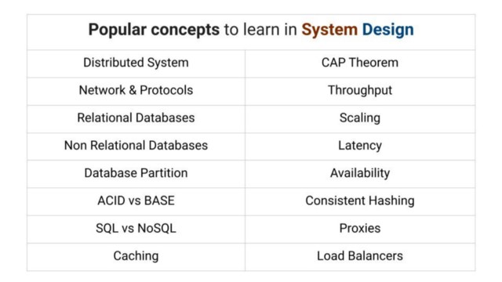
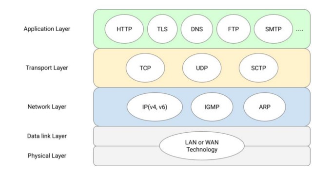
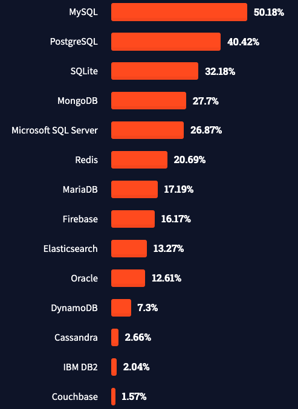

# Các Khái Niệm Phổ Biến Trong Thiết Kế Hệ Thống

Thiết kế hệ thống một chủ đề ưu thích trong các cuộc phỏng vấn ở các công ty công nghệ lớn. Nó giúp người phỏng vấn đánh giá được kiến thức và khả năng giải quyết vấn đề quy mô lớn của các ứng viên.

Series bài viết này sẽ nói về các khái niệm cơ bản (và nâng cao một chút) liên quan đến thiết kế hệ thống. Hiểu rõ các khái niệm này sẽ giúp bạn nhìn nhận được các cấp độ rõ ràng trong thiết kế hệ thống và giải quyết các vấn đề của nó.

## Thiết kế hệ thống là gì?

Thiết kế hệ thống là các công việc xây dựng, thiết kế từ các thành phần nhỏ đến một hệ thống hoàn chỉnh về các dịch vụ và chức năng. Trong quá trình thiết kế, cần cân nhắc nhiều sự lựa chọn hay có thể gọi là đánh đổi giữa hiệu suất hệ thống và độ phức tạp của nó. Người thiết kế cần phải:
- Hiểu các nguyên tắc, định lý phổ biến, ưu nhược điểm của chúng từ đó có thể đưa ra quyết định đúng đắn.
- Cần có kiến thức về tất cả khái niệm quan trọng thường gặp trong thiết kế hệ thống. Ví dụ như khả năng mở rộng (ngang và dọc), bộ nhớ cache, cân bằng tải, giao thức mạng, cơ sở dữ liệu,... và nhiều thứ khác nữa.

Tương tự, chúng ta cần cân nhắc sự cân bằng khi xem xét các chức năng cốt lõi của hệ thống mà chúng ta đang thiết kế. Tuỳ vào yêu cầu, chúng ta có thể phải quyết định: độ trễ hoặc thông lượng, hiệu suất hoặc khả năng mở rộng, tính nhất quán hoặc tính khả dụng,...

Nhìn chung, thiết kế hệ thống là một chủ đề mở dành cho thảo luận. Đó là lý do tại sao hầu hết các công ty công nghệ hàng đầu lại có một hoặc hai vòng phỏng vấn thiết kế hệ thống. Bây giờ, chúng ta hãy đi sâu vào để làm quen với các chủ đề hoặc khái niệm cơ bản được sử dụng trong thiết kế hệ thống.

## [Tính khả dụng](./avability/)

Tính khả dụng là một trong những cách đảm bảo độ tin cậy của hệ thống. Nó có nghĩa là hệ thống phải luôn hoạt động và phản hồi lại mỗi khi có bất kỳ máy khách nào yêu cầu nó thực hiện bất kỳ hoạt động nào. Bất cứ khi nào người dùng tìm kiếm dịch vụ, nó phải sẵn sàng đáp ứng yêu cầu của người dùng.

Tính khả dụng có thể được định lượng bằng cách đo phần trăm thời gian mà các dịch vụ và chức năng của hệ thống vẫn hoạt động trong một khoảng thời gian nhất định. Người ta thường xác định "tỷ lệ phần trăm khả dụng" cho các hệ thống theo các con số 9 trong phần trăm khả dụng, như được hiển thị trong bảng sau:

Tính khả dụng của dịch vụ thường được tăng lên khi có dự phòng. Các bản sao thường được sử dụng để cung cấp phương án dự phòng bằng cách triển khai một bản sao của cùng một máy chủ để nếu một máy chủ gặp sự cố, các bản sao sẽ thay thế nó và không ảnh hưởng đến tính khả dụng của dịch vụ.

## [Thông lượng](./throughput/)

Thông lượng là tốc độ truyền hoặc dung lượng tối đa của hệ thống. Nó được sử dụng làm thước đo để xác định mức độ công việc mà hệ thống có thể thực hiện trong một khung thời gian nhất định. Thông lượng của hệ thống có thể được tăng lên bằng cách mở rộng quy mô hệ thống. Một cách đầy hứa hẹn khác để tăng thông lượng của hệ thống là chia nhỏ các yêu cầu và phân phối chúng cho các tài nguyên khác nhau.

## [Proxy](./proxy/)

Proxy là phần trung gian nằm giữa máy khách (client) và máy chủ (server). Khi phía client gửi một yêu cầu, nó sẽ đi qua proxy và sau đó đến server. Proxy có hai loại: Forward Proxy và Reverse Proxy.

- Forward Proxy hoạt động như một mặt nạ cho client và ẩn danh tính của client khỏi server, ví dụ: VPN. 
- Reverse Proxy hoạt động như một mặt nạ cho server và ẩn danh tính của server khỏi phản hồi đi kèm, ví dụ: Load Balancer.

## [Độ trễ](./latency/)

Độ trễ là khoảng thời gian mà hệ thống cần để tạo ra kết quả. Độ trễ là thước đo tốc độ của hệ thống. Độ trễ càng giảm, tốc độ của hệ thống càng cao.

## [Giao thức mạng](./network-protocol/)

Hầu hết mọi hệ thống đều có sự phụ thuộc rất lớn vào mạng. Mạng hoạt động như một nền tảng để giao tiếp giữa người dùng và máy chủ hoặc giữa các máy với nhau. 

Ngược lại, giao thức là tập hợp các quy tắc chi phối cách các máy giao tiếp qua mạng. Một số giao thức mạng phổ biến như là HTTP, TCP/IP, ...

## Cơ sở dữ liệu

Cơ sở dữ liệu được sử dụng để lưu trữ. Mọi hệ thống đều được có một số lượng lớn dữ liệu cần được lưu trữ ở đâu đó để khi cần thiết, chúng có thể được tìm nạp dễ dàng và do đó cơ sở dữ liệu được sử dụng. Hầu hết cơ sở dữ liệu được phân loại thành cơ sở dữ liệu quan hệ và phi quan hệ.

**Cơ sở dữ liệu quan hệ (SQL)** là những cơ sở dữ liệu thực thi chặt chẽ mối quan hệ giữa các bảng dữ liệu. Bản chất của cơ sở dữ liệu quan hệ có tính cấu trúc cao. Ví dụ: MySQL, PostgreSQL, ...

**Cơ sở dữ liệu phi quan hệ (NoSQL)** có cấu trúc linh hoạt, tức là chúng ít cứng nhắc hơn. Dữ liệu được lưu trữ theo cách phi cấu trúc và các cơ sở dữ liệu này thường được sử dụng trong các dịch vụ yêu cầu tốc độ cao và được phân tán. Ví dụ: Cassandra, Redis, ...

**[Phân vùng cơ sở dữ liệu](./sharding/)** là một khái niệm quan trọng khác được sử dụng để cải thiện độ trễ và thông lượng của dịch vụ để ngày càng có nhiều yêu cầu hơn được giải quyết. Sharding là cách chia cơ sở dữ liệu thành các phần nhỏ hơn để tăng hiệu suất của dịch vụ.

Danh sách các cơ sở dữ liệu phổ biến dựa trên Stack Overflow 2021.

## ACID vs BASE

Cơ sở dữ liệu quan hệ và cơ sở dữ liệu phi quan hệ đảm bảo các kiểu tuân thủ khác nhau. Cơ sở dữ liệu quan hệ được kết hợp với ACID, trong khi cơ sở dữ liệu phi quan hệ kết hợp với BASE.

### ACID: Atomicity, Consistency, Isolation, Durability

Chúng được coi là bốn thuộc tính quan trọng của một cơ sở dữ liệu quan hệ khi xử lý bất kỳ giao dịch nào. Nếu thiếu một trong những thuộc tính này thì tính toàn vẹn của cơ sở dữ liệu khó có thể được đảm bảo. 

Trong một cơ sở dư liệu quan hệ, một giao dịch là một đơn vị logic thao tác trên dữ liệu, có thể bao gồm nhiều thao tác. Chẳng hạn việc chuyển tiền từ tài khoản này sang tài khoản khác là một giao dịch, bao gồm thao tác trừ tiền một tài khoản và cộng tiền vào tài khoản kia. Các tính chất ACID trong trường hợp này sẽ đảm bảo các giao dịch được thực hiện một cách đáng tin cậy:
- **Tính nguyên tố (Atomicity)**. Một giao dịch có nhiều thao tác khác biệt thì hoặc là toàn bộ các thao tác hoặc là không một thao tác nào được hoàn thành. Chẳng hạn việc chuyển tiền có thể thành công hay trục trặc vì nhiều lý do nhưng tính nguyên tố bảo đảm rằng một tài khoản sẽ không bị trừ tiền nếu như tài khoản kia chưa được cộng số tiền tương ứng.
- **Tính nhất quán (Consistency)**. Một giao dịch hoặc là sẽ tạo ra một trạng thái mới và hợp lệ cho dữ liệu, hoặc trong trường hợp có lỗi sẽ chuyển toàn bộ dữ liệu về trạng thái trước khi thực thi giao dịch.
- **Tính độc lập (Isolation)**. Một giao dịch đang thực thi và chưa được xác nhận phải bảo đảm tách biệt khỏi các giao dịch khác.
- **Tính bền vững (Durability)**. Dữ liệu được xác nhận sẽ được hệ thống lưu lại sao cho ngay cả trong trường hợp hỏng hóc hoặc có lỗi hệ thống, dữ liệu vẫn đảm bảo trong trạng thái chuẩn xác.

### BASE: Basically Available Soft State Eventual Consistency

Cơ sở dữ liệu NoSQL phù hợp hơn nhiều để lưu trữ dữ liệu như nội dung bài viết, bài đăng trên các kênh xã hội, dữ liệu cần kiểm duyệt và các loại dữ liệu phi cấu trúc khác khó mà xếp vừa trong một bảng. Cơ sở dữ liệu NoSQL được xây dựng với tính linh hoạt, khả năng mở rộng và tuân theo mô hình nhất quán BASE, có nghĩa là:

- **Tính khả dụng ở mức cơ bản (Basic Availability)**. Trong khi cơ sở dữ liệu đảm bảo tính khả dụng cho dữ liệu, cơ sở dữ liệu có thể không nhận được dữ liệu như mong đợi, dữ liệu có thể ở trạng thái thay đổi hoặc không nhất quán.
- **Trạng thái mềm (Soft state)**. Trạng thái của cơ sở dữ liệu có thể thay đổi theo thời gian.
- **Tính nhất quán (Eventual consistency)**. Cơ sở dữ liệu sẽ trở nên nhất quán và dữ liệu sẽ được lan truyền khắp mọi nơi tại một thời điểm nào đó trong tương lai.

## [SQL vs NoSQL](./sql-vs-nosql/)

Trong khi thiết kế bất kỳ ứng dụng nào, người ta cần phải hiểu rõ về kiểu lưu trữ theo yêu cầu hệ thống. Nếu hệ thống là phân tán và cần tốc độ và khả năng mở rộng thì cơ sở dữ liệu No-SQL là lựa chọn tốt nhất để đi cùng. Cơ sở dữ liệu No-SQL cũng được ưu tiên hơn khi lượng dữ liệu rất lớn. Đồng thời, cơ sở dữ liệu SQL lại thuận lợi khi cấu trúc dữ liệu quan trọng hơn và thường được ưu tiên khi có các truy vấn phức tạp hơn. Tuy nhiên, luôn có sự đánh đổi khi lựa chọn giữa cơ sở dữ liệu No-SQL và SQL. Do đó, đôi khi một kiến trúc hỗn hợp bao gồm cả cơ sở dữ liệu SQL và No-SQL được sử dụng để đảm bảo hiệu suất của ứng dụng.

## Mở rộng quy mô

Khi dịch vụ của bạn phát triển và ngày càng có nhiều yêu cầu đến với hệ thống, thì lúc đó, dịch vụ của bạn sẽ trở nên chậm và ảnh hưởng đến hiệu suất. Cách tốt nhất để giảm thiểu điều này là mở rộng quy mô, tức là tăng tiềm năng của hệ thống. Có hai cách để làm như vậy: mở rộng theo chiều ngang và mở rộng theo chiều dọc.

Mở rộng theo chiều ngang có nghĩa là mở rộng dịch vụ bằng cách thêm nhiều máy chủ hơn vào các ứng dụng của bạn để phân phối các yêu cầu. Còn, mở rộng theo chiều dọc tương ứng với việc tăng công suất hoặc năng lực của cùng một máy bằng cách nâng cấp phần cứng máy để xử lý nhiều lưu lượng truy cập.

## [Caching](./cache/)

Bộ nhớ đệm (caching) đảm bảo hiệu suất và giúp giảm độ trễ của hệ thống. Để làm cho ứng dụng của chúng ta nhanh hơn, thuận tiện để lưu trữ một số dữ liệu thường dùng và truy cập trong thời gian ngắn hơn để đảm bảo tốc độ của hệ thống. Bộ nhớ đệm được sử dụng để lưu trữ các phần dữ liệu nhất định này, vì vậy thay vì truy vấn cơ sở dữ liệu, dữ liệu có thể dễ dàng được tìm nạp từ bộ đệm. Tuy nhiên, với việc bổ sung bộ nhớ đệm, độ phức tạp của hệ thống sẽ tăng lên. Điều tối cần thiết là duy trì đồng bộ hóa giữa dữ liệu được lưu trữ trong ổ đĩa và bộ đệm để hệ thống có được tính nhất quán. Hơn nữa, với dung lượng giới hạn của các bộ nhớ đệm ta cần các thuật toán loại bỏ dữ liệu khác nhau như LIFO, FIFO, LRU, LFU, ..., được sử dụng để đảm bảo hiệu suất của dịch vụ.

## [Hệ thống phân tán](./distributed-system/)

Một hệ thống phân tán tập hợp nhiều máy độc lập hoạt động cùng nhau bằng cách phối hợp với nhau để đạt được một mục tiêu chung. Hệ thống phân tán hoạt động theo cách mà nó hiện diện như một thực thể duy nhất đối với người dùng bên ngoài. Hệ thống phân tán hoạt động đồng thời và có khả năng mở rộng cao. Ngày nay hệ thống phân tán là một nhu cầu thiết yếu với hầu hết mọi ứng dụng đều dựa trên tính toán phân tán. Hệ thống phân tán có khả năng mở rộng cao, đáng tin cậy và cung cấp các dịch vụ có độ trễ thấp.

## [Băm nhất quán](./consitentcy-hash/)

Băm nhất quán là khái niệm được sử dụng rộng rãi nhất trong hệ thống phân tán vì nó mang lại sự linh hoạt đáng kể trong việc mở rộng quy mô của ứng dụng. Băm nhất quán là một cải tiến so với băm thông thường. Phương pháp băm truyền thống không hiệu quả trong việc xử lý các yêu cầu qua mạng. Với băm nhất quán, người dùng và máy chủ được đặt trong một cấu trúc vòng tròn được gọi là vòng băm (hash ring). Vòng được coi là vô hạn và có thể chứa bất kỳ số lượng máy chủ nào và gán vị trí ngẫu nhiên cho các máy chủ dựa trên một số hàm băm. Khái niệm này cho phép phân phối các yêu cầu hoặc dữ liệu ánh xạ của chúng đến các máy chủ một cách hiệu quả. Nó giúp đạt được khả năng mở rộng theo chiều ngang và tăng thông lượng và độ trễ của ứng dụng.

## [Định lý CAP](./cap-therorem/)

Định lý CAP là một trong những khái niệm quan trọng cần thiết cho việc thiết kế các hệ thống dữ liệu dùng chung có kết nối mạng. Định lý CAP giúp tạo ra sự cân bằng giữa ba chức năng quan trọng, dựa trên trường hợp sử dụng cụ thể mà chúng ta cần cho hệ thống của mình:
- **Tính nhất quán (Consistency):** Nhất quán có nghĩa là mọi thứ sẽ được phối hợp với nhau một cách nhịp nhàng và được đồng bộ hóa thích hợp. Tính nhất quán đảm bảo rằng hệ thống phải duy trì sự nhất quán và trả về kết quả sao cho bất kỳ thao tác đọc nào cũng phải ứng với thao tác ghi thường xuyên nhất.
- **Tính khả dụng (Availability):** Tính khả dụng có nghĩa là hệ thống luôn ở đó và sẵn sàng bất cứ khi nào có bất kỳ yêu cầu nào đối với hệ thống đó. Bất cứ khi nào khách hàng yêu cầu máy chủ cung cấp kết quả, hệ thống sẽ vẫn sẵn sàng và đưa ra phản hồi bất kể sự cố của một hoặc nhiều nút. Các bản sao được sử dụng để đảm bảo tính dự phòng, điều này trực tiếp góp phần vào tính khả dụng của hệ thống.
- **Dung sai phân vùng (Partition Tolerance):** Dung sai phân vùng cần thiết cho bất kỳ hệ thống phân tán nào; chúng ta luôn cần phải lựa chọn giữa tính khả dụng và tính nhất quán. Dung sai phân vùng tương ứng với điều kiện hệ thống phải hoạt động bất kể tác hại hoặc sự cố nào của các nút. Do sự phụ thuộc lớn vào các cuộc gọi nội mạng, hệ thống phân tán thường rơi vào bẫy lỗi mạng; do đó dung sai phân vùng là cần thiết. Vì vậy, trong trường hợp đó, chúng ta phải lựa chọn một cách thận trọng giữa tính nhất quán hoặc tính khả dụng dựa trên yêu cầu của chúng ta.

## [Bộ cân bằng tải](./load-balancer/)

Bộ cân bằng tải (Load Balancers) là máy cân bằng tải giữa các máy chủ khác nhau. Với việc mở rộng, ngày càng có nhiều máy chủ được thêm vào hệ thống và do đó phải có cách để hướng các yêu cầu đến các máy chủ phù hợp, vì để tránh trường hợp một máy chủ bị sập do quá tải. Thế nên, cân bằng tải được sử dụng để giải quyết vấn đề này:
- Cân bằng tải phân phối lưu lượng truy cập, ngăn dịch vụ bị hỏng và góp phần duy trì độ tin cậy của dịch vụ.
- Cân bằng tải hoạt động như người quản lý lưu lượng và giúp duy trì thông lượng và tính khả dụng của dịch vụ.

# Kết luận

Thiết kế hệ thống là một kỹ năng cần thiết phải có và không kém phần quan trọng trong các cuộc phỏng vấn tại hầu hết các công ty công nghệ hàng đầu. Một người cần phải nhận thức rõ ràng về tất cả những vấn đề khi thiết kế bất kỳ hệ thống nào. Trong bài viết này, chúng tôi đã cố gắng đề cập đến tất cả các khái niệm cơ bản cần thiết để bắt đầu. Chúng tôi hy vọng sau khi đọc bài viết này, bây giờ bạn sẽ quen thuộc với những kiến thức cơ bản về hệ thống.