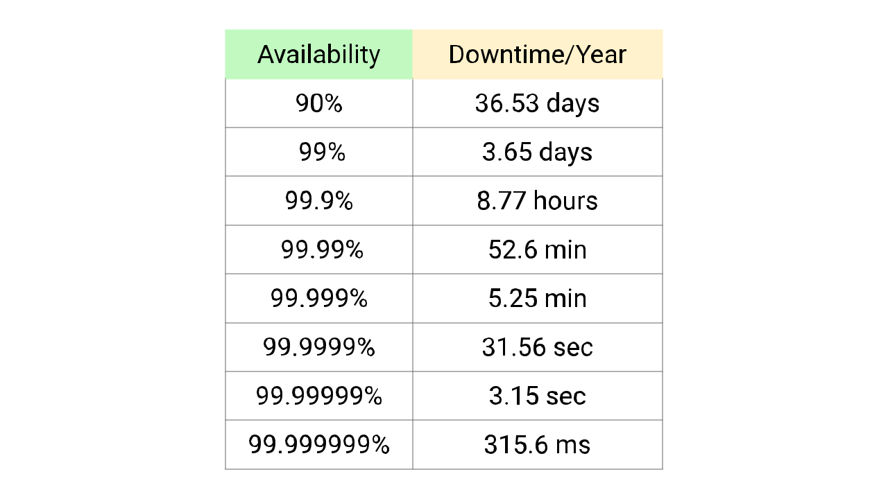
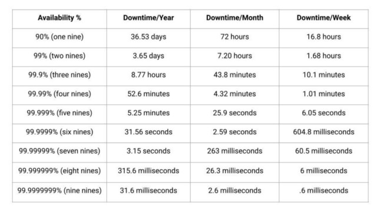
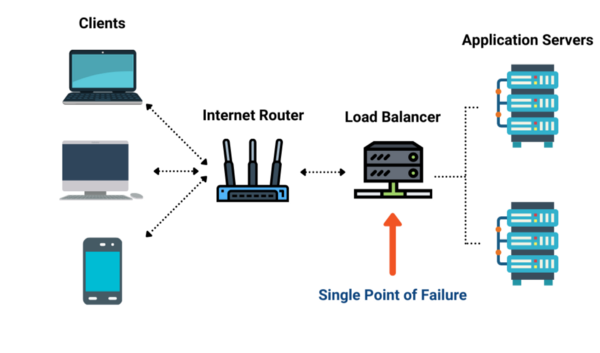

# Tính Khả Dụng

Tính khả dụng là khái niệm được đề cập nhiều nhất trong các câu hỏi phỏng vấn thiết kế hệ thống. Bản thân chúng ta cũng có thể đã từng trải qua những khoảnh khắc mà chúng ta không thể truy cập một ứng dụng nhất định do ngừng hoạt động hoặc không khả dụng. Gần đây, YouTube phải đối mặt với sự cố ngừng hoạt động toàn cầu khiến người dùng không thể phát video trong khoảng một giờ. Bạn đã bao giờ tự hỏi lý do đằng sau những sự cố này là gì và làm thế nào người ta có thể ngăn nó xảy ra? Hãy cùng tìm hiểu.

## Tính khả dụng là gì?

Tính khả dụng là tỉ lệ phần trăm trong một khoảng thời gian nhất định mà một hệ thống sẵn sàng thực hiện các tác vụ và chức năng của nó trong điều kiện bình thường. Tỷ lệ khả dụng mà hệ thống yêu cầu phụ thuộc vào logic nghiệp vụ hoặc cách sử dụng hệ thống. Hãy lấy một số ví dụ. 

Hệ thống kiểm soát không lưu là một trong những ví dụ điển hình về các hệ thống yêu cầu **tính khả dụng cao**. Trong thế giới ngày nay, việc di chuyển bằng đường hàng không rất phổ biến và được đông đảo người sử dụng, một sai sót trong việc điều khiển máy bay có thể dẫn đến một kết quả thảm khốc.

Ngược lại, một hệ thống có ít người truy cập và không dễ bị hỏng hóc nghiêm trọng thì lại yêu cầu tính khả dụng ít hơn một chút. Tính khả dụng cao đi kèm với chi phí đắt, vì vậy chúng ta phải tối ưu hóa theo nhu cầu của mình.

## Tính khả dụng được đo lường như thế nào?

Tính khả dụng của hệ thống được đo bằng phần trăm thời gian hoạt động của hệ thống trong một khoảng thời gian nhất định hoặc bằng cách chia thời gian hoạt động cho tổng thời gian hoạt động cộng với thời gian ngừng hoạt động trong một khoảng thời gian nhất định.

**Tính khả dụng = Thời gian hoạt động ÷ (Thời gian hoạt động + thời gian ngừng hoạt động)**

### Tính khả dụng của số 9

Tính khả dụng cũng có thể được thể hiện dưới con số **9**. Trong các ứng dụng có yêu cầu cao, chúng ta thường đo lường tính khả dụng theo con số 9 hơn là tỷ lệ phần trăm. Nếu tính khả dụng là 99,00 phần trăm, nó được cho là có "2 nines" khả dụng và nếu nó là 99,9 phần trăm, nó được gọi là "3 nines"... Hệ thống có 5 nines (tức là 99,999%) khả dụng được cho là đạt tiêu chuẩn vàng về tính khả dụng. Chúng ta hãy xem bảng dưới đây.

Tính khả dụng cao luôn có sự đánh đổi của nó, chẳng hạn như độ trễ cao hơn hoặc thông lượng thấp hơn và việc đạt được tính khả dụng cao là rất khó. Chúng ta cần xem xét sự cân bằng mà chúng ta cần thực hiện dựa trên yêu cầu hệ thống của chúng ta.

Để tạo ra các hệ thống có tính khả dụng cao, chúng ta cần đảm bảo rằng hệ thống không có bất kỳ **SPOF** nào. SPOF - Single point of failure, một điểm lỗi duy nhất trong hệ thống là một điểm hay một vị trí nào đó trong hệ thống mà nó có thể dẫn đến sự cố sập toàn bộ hệ thống.

Vậy, làm thế nào để chúng ta loại bỏ một điểm lỗi duy nhất trong một hệ thống?
Để loại bỏ bất kỳ điểm lỗi nào, chúng ta cần tạo cho hệ thống có nhiều phiên bản dự phòng hơn. Dự phòng là hành động sao chép hoặc thêm một số thành phần nhất định vào trong hệ thống. Hãy lấy một ví dụ; hãy tưởng tượng bạn có một hệ thống bao gồm hai server giống hệt nhau được cài đặt phía sau bộ cân bằng tải. Lưu lượng đến từ client sẽ được phân phối giữa các server, nhưng nếu một trong các server gặp sự cố, bộ cân bằng tải sẽ chuyển hướng tất cả lưu lượng đến server còn lại, hệ thống vẫn sẽ hoạt động.

Bây giờ chúng ta đã tạo dự phòng cho server của mình và bộ cân bằng tải có thể phát hiện lỗi và phản hồi phù hợp. Tuy nhiên, trong trường hợp này, bản thân bộ cân bằng tải vẫn là một điểm lỗi duy nhất khác. Để tránh điều này, ta tiếp tục tạo dự phòng cho bộ cân bằng tải.

Một điều quan trọng cần lưu ý ở đây là chỉ với dự phòng không thể đảm bảo tính khả dụng cao. Một thiết bị luôn cần có các cơ chế để phát hiện các hư hỏng. Điều quan trọng nữa là có thể thực hiện kiểm tra tính khả dụng cao và có thể thực hiện hành động khắc phục bất cứ khi nào một trong các thành phần của hệ thống không khả dụng. Cả hai cách tiếp cận là *top-to-bottom* và *phân tán tính khả dụng* đều hoạt động trên phần cứng, đồng thời cũng có thể sử dụng các kỹ thuật *giảm downtime* dựa trên phần mềm.

Dự phòng là một cách tiếp cận dựa trên phần cứng. Mặt khác, việc thực hiện các kỹ thuật khả dụng cao, hầu như luôn luôn yêu cầu phần mềm.

- **Dự phòng chủ động (Active redundancy):** Khi bạn có nhiều máy hoạt động cùng nhau, nhưng chỉ một hoặc một số máy sẽ xử lý lưu lượng truy cập hoặc thực hiện công việc. Nếu một trong số chúng bị lỗi, các máy khác sẽ nhận biết bằng cách nào đó và sau đó tiếp quản.
- **Dự phòng thụ động (Passive redundancy):** Khi bạn có nhiều thành phần tại một lớp nhất định trong hệ thống của mình và nếu vào bất kỳ thời điểm nào, một trong số chúng sập, các máy chủ còn lại sẽ tiếp quản và ngăn chặn bất kỳ lỗi nào.

## Sự khác biệt giữa tính khả dụng cao và khả năng chịu lỗi

Cả tính khả dụng cao và khả năng chịu lỗi đều áp dụng cho các phương pháp cung cấp mức thời gian hoạt động cao. Tuy nhiên, các phương pháp chịu lỗi và tính khả dụng cao sẽ hoàn thành mục tiêu theo cách khác nhau.

Việc tính toán khả năng chịu lỗi yêu cầu dự phòng phần cứng đầy đủ. Để đạt được khả năng chịu lỗi, một số hệ thống chạy song song, sao chép các chương trình giống nhau và thực hiện các lệnh cùng nhau. Nếu hệ thống chính bị lỗi, không thể hoạt động, hệ thống khác có thể đảm nhận.

Sẽ là tốt nhất nếu bạn có phần cứng tiên tiến để đạt được khả năng chịu lỗi của máy tính. Nó phải có khả năng phát hiện các lỗi thành phần ngay lập tức và cho phép các hệ thống khác nhau hoạt động cùng lúc.

Ưu điểm chính của dạng máy này là bảo toàn bộ nhớ và bản ghi của chương trình. Tuy nhiên, có thể mất nhiều thời gian hơn đối với các sự cố của mạng hay thiết bị phức tạp hơn. Trong khi đó, các vấn đề kỹ thuật gây ra sự cố hệ thống cũng có thể gây ra sự cố tương tự đối với các hệ thống dự phòng đang chạy song song, tạo ra sự cố trên toàn hệ thống.

Thay vào đó, chiến lược high-value sử dụng phương pháp dựa trên phần mềm để giảm thiểu thời gian ngừng hoạt động của máy chủ thay vì phương pháp dựa trên phần cứng. Một cụm high-display sử dụng một tập hợp các máy chủ hoạt động cùng nhau thay vì sử dụng phần cứng vật lý để đạt được khả năng dự phòng tối đa.
