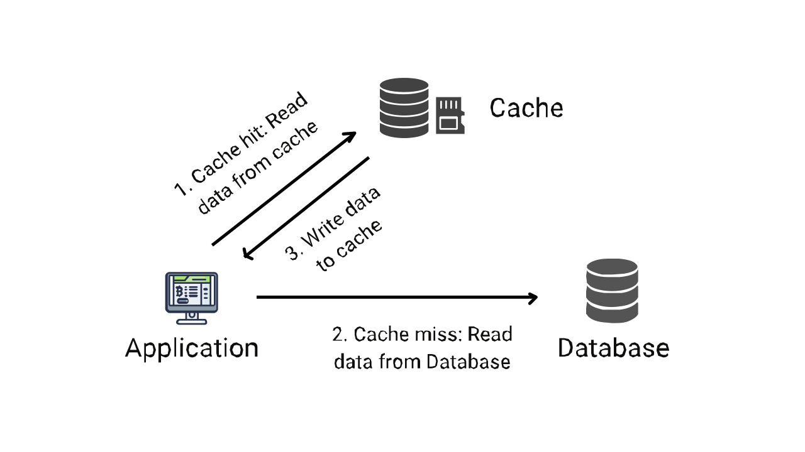
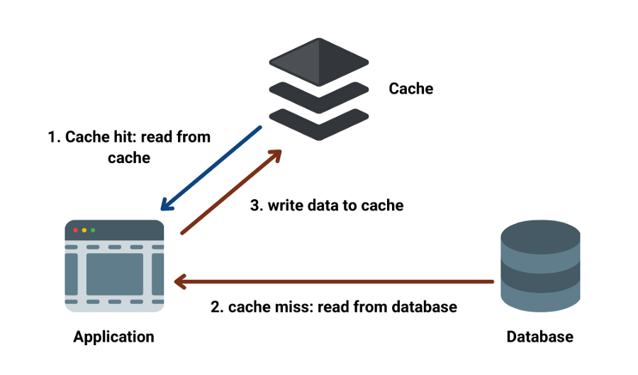
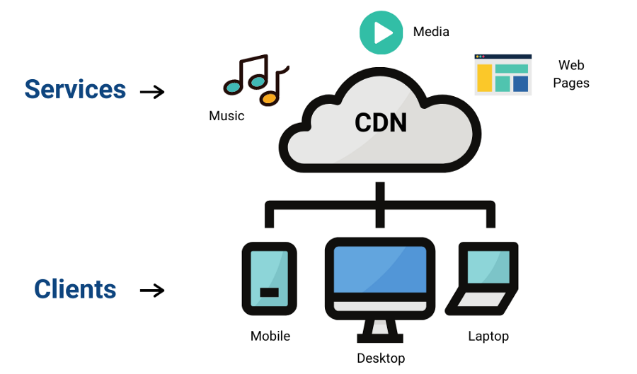

# Caching: System Design Concept



In this blog, we will learn about Caching, an important fundamental concept in system design. Have you ever experienced that when you open a website the first time, it takes more time than usual, but when you open the same website again, it takes no time to load? Do you know why this happens? Let’s find out!

## What do you mean by caching?

Caching is the process of storing the results of a request at a different location than the original or a temporary storage location so that we can avoid redoing the same operations. Basically, the cache is temporary storage for files and data such that it’s faster to access this data from this new location.



### Caching Examples

- Web Browsers cache the HTML, CSS, JS, and images for faster access to the website when requested again.
- CDNs store static files and help reduce latency.
- DNS is used to get the IP address of a query. So, rather than requesting the IP address multiple times, it can be stored in a cache, allowing us not to re-perform a DNS query again, and the web pages can be accessed more quickly.

## Real-World Analogy of Caching

Let us take an example of a librarian to understand the basic idea behind the cache system. Let's imagine a library with 1000s of books and a librarian behind the desk whose responsibility is to get you the desired book from the library store. First, let’s start with a librarian without a cache.

The day starts, and the first customer arrives. He asks for a book; let’s say Book A. The librarian goes to the storeroom, fetches the book, returns it to the desk, and issues the book to the customer. After some days, the customer returns the book, and the librarian keeps the book back to its place and returns to her desk to wait for another customer. Now, the next customer arrives, and he asks for the same Book A. The librarian again has to go to the same place and fetch the book and give it to the customer. In this system, the librarian has to visit the store every time a customer arrives — even to get the book that is demanded frequently.


Now, let’s put the librarian on her desk a bag that can store 15 books (like a 15 book cache). In this bag, the librarian can keep the books that customers have recently returned. Now, the first customer arrives and requests Book A, and the librarian has to go to the storeroom and give it to the client. Later, the customer returns the book, and instead of going to the storeroom to return the book, the librarian keeps it in her bag. Another customer arrives; he asks for the same Book A. This time the librarian checks if she has the book in her bag, and he finds it! This time the librarian doe not have to make a round trip to the storeroom, and hence the customer is served more efficiently

## Implementation of a simple Cache using Node.js

Let’s implement a simple caching system:

First, we will create a simple server and a database. We will use the database to get the HTML page and the server to host the page locally. We will create two end-points, one that uses the cache and the other that does not.

```js
const express = require('express');

const app = express();

// define cache
const cache = {};

const database = {
    // we will be using this database to get this html page
    ['index.html']: '<html>Node.js Implementation of Caching!</html>',
};

get Database = (key, callback) => {
    // what this does is after 3000 miliseconds, call the database[key] 
    setTimeout(() => {
        callback(database[key])
    }, 3000);
}

// There are two end points defined

// This does not use the cache
app.get('/nocache/index.html', (req, res) => {
    // all it does is, it calls the database
    // to get the html page the page just send the page
    // and once it gets the page just send the page
    getDatabase('index.html', page => {
        res.send(page)
    });
});

// This uses the cache
app.get('/withcache/index.html', (req, res) => {
    // In this we check if the page is in the cache
    // and if it is we skip going to the database
    if('index.html' in cache) {
        res.send(cache['index.html']);
        return;
    }

    // Otherwise we make a call to the database
    // and cache the page
    // then we return the response of the page
    getDatabase('index.html', page => {
        cache['index.html'] = page;
        res.send(page);
    });
});
```

If we look in the browser on the server with the endpoint having no-cache, it will take 3 seconds to load (since we used setTimeout to load the page with no cache in 3 seconds). If you refresh this page again, it will again take 3 seconds to load the page because every time we refresh the page, it goes to the database to fetch it. Now, in the end-point, which uses caching, the first time we go to the endpoint with cache, it takes 3 seconds to load the page since the cache is empty and has to go to the database to fetch the data. But, when we refresh the page, it loads instantly. As soon as we loaded the page the first time, we cached the results for future requests.

### Cache Eviction policy

We need to delete existing items for new resources when the cache is complete. In fact, it is just one of the most popular methods to delete the least recently used object. The solution is to optimize the probability in the cache that the requesting resource exists

**Random Replacement (RR)**: As the term suggests, we can randomly delete an entry.

**Least frequently used (LFU)**: We can keep a count of how frequently an item is requested and delete the least frequently used.

**Least Recently Used (LRU)**: In LRU, we delete the item that has been used least recently.

**First In First Out (FIFO)**: The FIFO algorithm holds an object queue in the order that the objects have been loaded into the cache. It evicts one or more objects from the head when a cache misses and inserts a new object into the queue tail. Upon a cache hit, the list does not shift.

## What are the different types of caching?

### Application server cache

We can cache the data directly in the Application Layer. Every time a request is made to the service, it will return local, cached data quickly if it exists. If it is not in the cache, it will query the data from the database.

### Global caches

In Global Caches, the same single cache space is used for all the nodes. Each of the application nodes queries the cache in the same way as a local one would be.

### Distributed cache

The cache is usually broken up using a consistent hashing algorithm, and each of its nodes owns part of the cached data. If a requesting node is searching for a certain piece
of data, it can easily use the hashing function to locate information from the distributed cache to decide if the data is available.

### Content Distribution Network (CDN)



When our pages serve huge amounts of static media, this is the best option. Suppose that the framework we are developing is not yet big enough to have a CDN of its own! “Using a lightweight HTTP server like apache, we can serve static media from a different subdomain such as “blog.enjoyalgorithms.com” and cut the DNS from your servers to a CDN layer.

### Client-Side Caches

Client-side caching duplicates the data of previously requested files directly within browser applications or other clients (such as intermediate network caches).

### ISP layer cache

ISP caching works in much the same way as browser caching. Once you have visited a website, your ISP may cache those pages so that they appear to load faster the next time you visit them. The main problem with this is that, unlike your browser cache, you can not delete these temporary files; instead, you have to wait until your ISP's cache expires and requests fresh copies of the files.

## What is cache invalidation?

Cache invalidation refers to when web cache proxies declare cached content as invalid, meaning it will no longer be served as the most recent piece of content when requested. The ultimate purpose, of course, is to ensure that the next time a client requests the affected content, the client receives the newest version at all times. There are primarily three kinds of systems for caching:
1. **Write through cache**: The writes go through the cache, and only if writes to DB and the cache both succeed, write verified as a success. Between cache and storage, we will have full data consistency. Nothing can get lost in case of a crash, power failure, or other system disturbances. In this case, however, writing latency would be higher since two different systems are written.
2. **Write around cache**: The write directly goes to the DB, bypassing the cache. Cache misses are increased because, in a cache error, the cache device reads the information from the Database. Consequently, in applications that quickly write and re-read the data, this can lead to higher reading latency. Reading must take place through slower back-end storage and higher latency.
3. **Write back cache**: The write is rendered directly to the cache layer, and as soon as the write to the cache is finished, the write is verified. The cache then synchronizes this writing to the DB asynchronously. For write-intensive applications, this will result in rapid write latency and high write throughput. However, if the caching layer dies, there is a chance of losing the data since the cache is the only single copy of the written data. By having more than one replica that recognizes the writing in the cache, we can maximize this.

## Advantages of Caching


- **Improve Application Performance** : Caching can be used to improve system performance and API latency.
- **Reduce Database Cost** : Caching can take up additional traffic to its cache server and reduce database traffic, eventually reducing database cost.
- **Reduce the Load on the Backend**: Offloading the same request traffic from the main server to caching server would reduce the backend load.
- **Increase Read Throughput (IOPS)**: Caching server responds much faster than the main server for the cached key, which increases read throughput