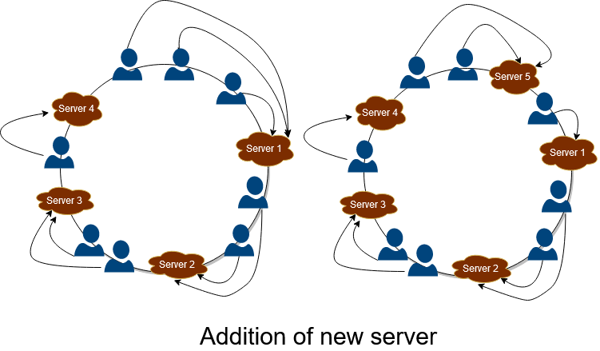
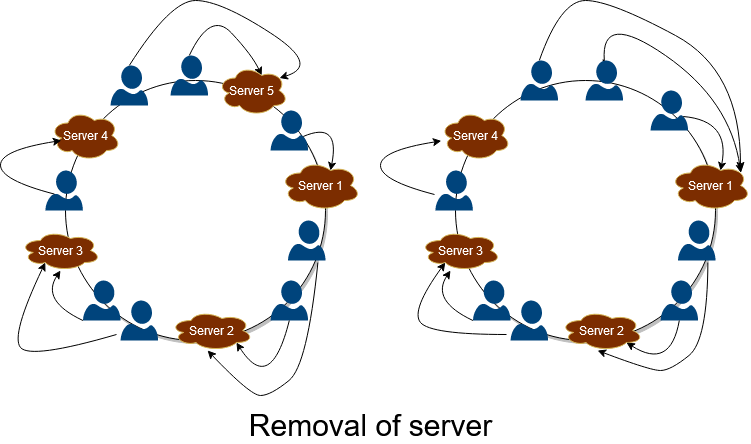
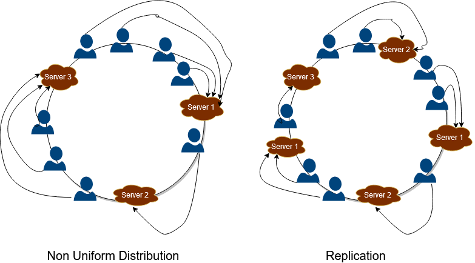

# Consistent Hashing: System Design Concept

This blog discusses the key concepts and approaches which come in handy while scaling out the distributed storage systems. Consistent hashing is beneficial and frequently applied to solving various system-related challenges and helpful in System Design Interviews. It is also useful for alleviating the bottlenecks while designing any back-end system and scaling an application.

## What is Consistent Hashing?

Before diving deep into Consistent Hashing, let’s first understand what Hashing is? Hashing is a computationally efficient way of information retrieval and helpful in enhancing the performance of various programs. In hashing, a hash function is generally used to map the information to a storage pool by generating a hash value using a welldefined logic.

For example, we can generate a random number that can map to storage by taking mod using the total number of servers. Hence, the hashing is used to map the requests to various servers and get the work done. However, this concept is valid only when the servers don’t change and memory locations are known. Distributed systems often involve changing the underlying servers to handle the requests over a network. Hence to deal with such shortcomings of distributed systems and handle the requests over a network, we need a more efficient manner of handling and organizing requests for a scalable application. This is compensated using Consistent Hashing.

Consistent hashing is an improvement over normal Hashing. Here, the user and servers are located virtually in a circular ring structure called the Hash ring. The ring is considered infinite and can accommodate any number of servers with/having no fixed allocation and assign them to random locations based on some hash function.

## Why do we need Consistent Hashing?

The traditional hashing method is very ineffective to use and handling requests over a network. This classical method assumes that we have a fixed number of servers, and all the mapping location is known beforehand. This condition is quite problematic in dealing with distributed systems where multiple users are requesting multiple servers. If in case of some servers breakdown, then to map the work to different servers, it requires a large and heavy computation that is very inefficient and affects the throughput of the service and increases the latency of the application.

In distributed systems, multiple nodes keep on interacting with each other. Suppose we have five nodes in the system and there is a sudden increase in traffic, and to deal with this, we have to add more nodes to the system. Let us say we added two more nodes which make total nodes seven. If we are using normal hashing, we have again recompute the mapping of requests as previously we were taking hash using five nodes, but now we have seven. Similarly, in case of maintenance or failure, the number of nodes decreases, and hence we again need to re-compute the mapping, which is genuinely very inefficient.

Hence in situations when we are not sure about the number of servers that are operational at any moment, we can not go with the classical hashing method as this requires a lot of redundant computations and reshuffling of the data or requests around the cluster. Moreover, when the number of servers increases, then this approach becomes more and more inefficient as there would be more and more re-computation and re-assignment of requests to the remaining nodes. We need some dynamic way to mitigate all these shortcomings, and hence the idea of Consistent Hashing comes in.

## How Consistent Hashing Works?

Consistent Hashing helps us in effective organization and distribution of resources by ensuring minimum reorganization of requests or users in any failure. In Consistent Hashing, a hash function is used to map servers to locations in a virtual ring. The position of the server is just a random position obtained using the hash function. Consistent Hashing is organized in the following manner:
1. The servers are hashed using their IP addresses and assigned the position based on the hashing function.
2. Similarly, the keys are hashed to positions using the same hashing function and placed in the virtual ring.
3. Map the keys with the server having the same position, and in case the position doesn’t match, then assign the key to the first server that we get while moving in a clockwise direction.

Hence in this manner, the keys are assigned to the server in Consistent Hashing. The beauty of Consistent Hashing comes when we add or remove servers.

## Addition of new server

When a new server is added to the application, it is mapped using the hash function and allocated to the hash ring’s desired location. After its allotment, all the keys will map on these newly added servers passing its location. This is depicted in the figure below. When server 5 is added between 1and 4, all the requests after 4 are assigned to 5 instead of mapping to 1. Hence in this way, Consistent Hashing helps reduce loads of massive servers and proves highly effective in scaling and increasing the throughput, and improves the latency of the application.

## Removal of server

Whenever any server fails in the system, then all the keys previously mapped to the failed server will redirect to the next server, which is located after the failed server in the clockwise direction. Hence in this manner, the service remains active and provides fault tolerant service. This is depicted in the figure below. When server 4 breakdowns, then all the keys mapped to 4 are reallocated to 1, preventing the system from breaking down.

## Non-Uniform Distribution

There is a shortcoming of this approach. All the keys may get mapped to the same server, and hence one server will get all the workload, and all the other servers will remain idle. This situation is very inefficient and is very prone to failure. To deal with this, a new concept has been introduced. All the servers are replicated and arranged at different positions in the ring. In this manner, with an increased number of servers, the distribution becomes much more uniform and helps in the service’s scaling. This is depicted in the figure below. All the servers are replicated and allocated to different locations, and hence this makes the distribution of keys uniform in the hash ring.

## Conclusion

Consistent Hashing is one of the most crucial concepts in designing distributed systems as it tackles the scalability challenges with dynamic nodes assignment and provides fault tolerance. It is also very useful in system design interviews. This concept allows the distribution of requests or data in the servers and their mapping to servers efficiently. It helps in achieving Horizontal Scaling and increases the throughput and improves the latency of the application