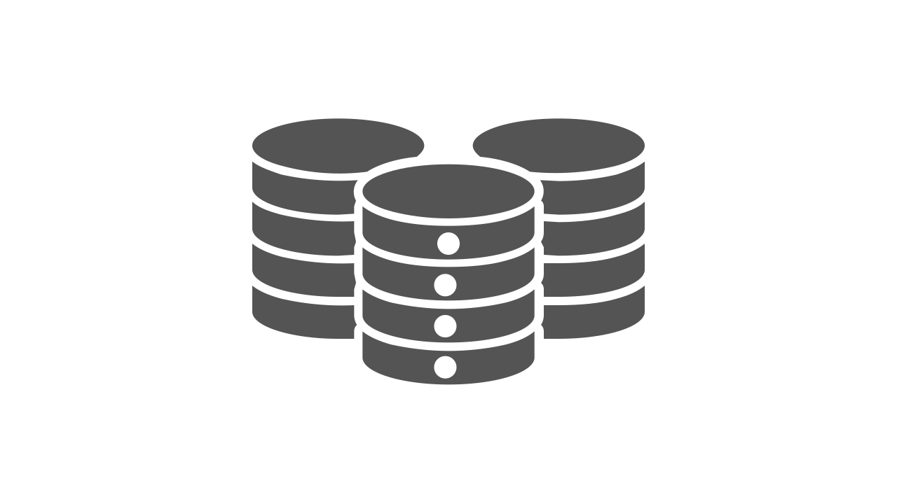

# How to Choose the Right Database?

Databases are a critical component of the world’s most complex technology systems, and how they are used has a significant impact on their performance, scalability, and consistency. Because this is an essential topic with many moving components, hence in this article, we’ve outlined the most crucial database topics that you’ll need to know during a system design interview. If you want to do well in system design interviews for a technical position, you’ll need to know about databases and how to use them in a more extensive system.

## What is Database?

A database is responsible for storing and retrieving data for an application at its most basic level. Because it is a program that handles access to physical data storage, a database is sometimes known as a Database Management System (DBMS). A database’s primary functions are storing, updating, and deleting data, returning data in response to a query, and administering the database.

A database must be dependable, efficient, and accurate. It turns out that accomplishing all of these tasks at the same time is quite tricky. You must be familiar with several ideas to construct a database that is both efficient and successful. Let’s start by looking at the CAP theorem to understand the tradeoff at the very heart of database design.

### CAP Theorem

According to the CAP Theorem, any distributed database can only satisfy two of the three requirements:
1. **Consistency**: Every node answers with the most recent version of the data, ensuring consistency.
2. **Availability**: any node can send a response.
3. **Partition Tolerance**: Even if connectivity between any node is disrupted, the system continues to function.

Suppose a system provides Consistency and Partition Tolerance. In that case, it is referred to as a CP database, and if it provides Availability and Partition Tolerance, it is referred to as an AP database.

### Scalability

As dataset sizes grow more significantly, scalability becomes increasingly critical in distributed clusters. Because of the functionality they give, different databases scale better or worse. Scaling can be divided into two categories:
1. Vertical scaling is the process of increasing the amount of computing and memory available on a single computer.
2. Horizontal scaling is the process of increasing the number of computers in a cluster.

Vertical scaling is simple, but the overall memory capacity is substantially lower. On the other hand, horizontal scaling has far more overall computing and storage capacity and can be scaled dynamically without causing downtime. The main disadvantage is that relational databases, the most widely used database model, have difficulty scaling horizontally.

### Transactions

A transaction is a “single unit of work” that consists of a sequence of database actions. A transaction’s operations are either successful or unsuccessful. In this sense, the concept of a transaction helps to maintain data integrity when a system component fails. The “ACID” attributes are a formalization of this:
1. Atomicity — the transaction is an “atomic” unit if all operations succeed or fail simultaneously.
2. Consistency — when a transaction is completed successfully, the database is legitimate, with no schema violations.
3. Isolation — several transactions can run at the same time.
4. Durability — when a transaction is “committed,” it is saved in memory.

Till now, you have an understanding of some essential components related to database
design. Let’s dive deep into exploring different types of databases.

### Relational Databases

A data model is required for all databases to specify the data’s logical organization and principles. A relational database is essentially a database that uses the relational data model to organize data in tables with rows of data entries and columns of predefined data types. Foreign key columns that relate to the primary key columns of other tables represent table relationships. 

Above all, relational data models impose strong constraints on data values and relationships to ensure that they are always valid against the schema. To ensure schema conformance, ACID transactions are almost always used. Databases support special ordering data structures on indices to make access faster than scanning row by row. However, because each index must be updated in addition to the primary table, this performance boost on reads is offset by slower writes.

Relational databases are the best choice when there are many-to-many relationships between entries, data must follow a predetermined schema, or data relationships must always be precise. On the other hand, they have the major drawback of being difficult to scale over distributed clusters. Database processes can be slowed down by slower network communication. Oracle, MySQL, and PostgreSQL are the most widely used relational database technologies.

We’ll give you an overview of the many non-relational database solutions accessible in the next part so that you can pick the optimal database method for your system architecture.

### Non-Relational databases

What model do you want to use to store your data based on its structure? This is the key question facing system designers today when choosing a database. Non-relational databases are designed to meet unique scalability, schema flexibility, or specialized query functionality. There are many different types of non-relational databases, as you’ll discover in this section. We’ll go through a few of the most crucial things to keep in mind
when creating systems.

Because they’re addressing unique use cases with variable priorities between availability and consistency, non-relational databases are classified as either AP or CP databases. The eventual consistency concept is used in AP non-relational databases to ensure that consistency occurs over time, even if it isn’t guaranteed suitable when a transaction completes.

There are many different types of non-relational databases, as you’ll discover in this section. We’ll go through a few of the most crucial things to keep in mind when creating systems. Let’s get started!

#### Graph Database

Nodes and edges are used to model data in graph databases. Because they represent data with many relationships, they are the most similar non-relational databases to a relational data model. Because data isn’t stored in tables, the fundamental advantage of a graph database is that queries don’t require joins to follow relationship edges. As a result, queries that traverse numerous edges of a graph, such as social network analytics, are ideally suited to them. Neo4J and CosmosDB are the industry’s top graph databases.

#### Document Store

Simple JSON objects with a key identifier are typically stored in document stores. Documents collect data about a single topic that might be scattered across multiple tables in a relational database. A document store, for example, might archive medical documents for a particular patient such that only one document needs to be retrieved at a time and all essential information is available. MongoDB, Couchbase, Firebase, and DynamoDB are the industry’s top document store databases.

#### Column Database

The term “column databases” refers to a group of columns that are frequently retrieved together. A column-family database represents data in tables like a relational database but maintains column families in files rather than rows and does not enforce relational constraints. This model improves performance by minimizing the amount of data that has to be read for data with strong column-family access patterns. Columns can also be compressed to conserve space because they tend to store repetitive information, especially if the data is sparse. Cassandra, HBase is the industry’s top column-family database.

#### Time Series Database

A time-series database is optimized for data entries that need to be strictly organized by time. The key use case is storing real-time data streams from system monitors. Because time series databases need a lot of writing, they typically include services for sorting streams as they arrive to ensure that they are appended in the correct order. These datasets can readily be divided into periods. InfluxDB and Prometheus are the industry’s top time-series databases.

#### Key-Value Store

A key-value store is somewhat similar to a document store. Because the key-value store has no idea what’s in the value, it only supports read, overwrite, and delete actions. There are no schemas, joins, or indexes; it’s essentially a massive hash table. They are simple to scale due to their low overhead. Caching implementations benefit greatly from key-value storage. Redis and Memcached are the industry’s top key-value stores.

#### Some requirements oriented use cases

We may be looking for the following storage solutions based on our needs and how we
want to utilize or access our data:
- **Caching** — When developing a read-heavy system like Twitter or Facebook, we may end up catching a lot of data, even entire timelines, to achieve the low latency requirement. Redis or Memcached are two alternatives here. 
- **File system storage** — If we’re creating an asset delivery service and storing images or audio/video files, we’ll need to employ blob storage. Amazon S3 is a prevalent example. 

We’ve now seen various storage solutions and how to choose between different databases based on our needs and the type of data we need to store. Is that, however sufficient? There are times when a single database is insufficient to meet our needs. For example, in the case of Flipkart, order data must adhere to ACID principles while also being infinitely expandable in the manner of a Columnar DB. In this situation, we’ll utilize a database combination like MySQL + Cassandra. All information about ongoing orders that must adhere to ACID properties will now be saved in a MySQL database. After they are completed, they will be moved to Cassandra, which can be used as a permanent store. As long as the ACID qualities are required, the data is stored in a relational database before being migrated to a columnar database to expand to the data. The issue has been resolved!

## Summary

Database systems are not created equal, and each has its own set of benefits, drawbacks, strengths, and flaws. At a high level, the following items should be carefully evaluated and determined in the following order:
- Determine the type of data to be stored, queried, and updated (structured, unstructured, or semi-structured) and, if relevant, the best technique to model the data (e.g., schema vs. schemaless, relational, document, key-value, etc.)
- Determine if transactional and ACID assurances are required.
- Determine whether replication and horizontal partitioning are essential.
- Decide on any other database requirements and priorities, such as those mentioned earlier in this article.
- Security, scalability, performance, vendor establishment, and stability, and availability of necessary expertise are all critical considerations.
- Determine any cost limits and budgets that may exist.

As new technologies emerge regularly, the objective of this essay is not to make specific recommendations. Everything discussed here and the most significant available options at the time will heavily influence the optimal solution. Also, software and data solutions can and frequently use multiple data storage systems, so think about if that applies to your specific application. If so, select the proper database system for each, as mentioned above.

## Conclusion

When selecting a database, keep in mind the size of the data, the structure of the data, the links between the data, and how critical it is to enforce schemas and assure consistency. Remember that one database may not perform everything you need, especially in large systems; thus, it’s OK to use more than one. Relational databases become too expensive to maintain as scale becomes more critical; therefore, start looking at non-relational options for sections of the system that don’t require solid schemas or consistency guarantees.
