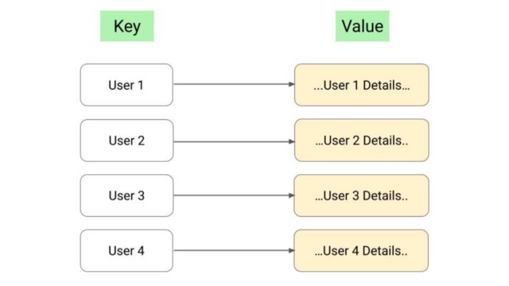
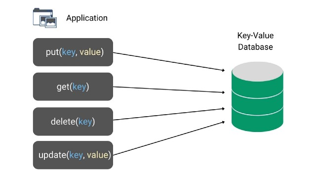

# Key-Value Database in System Design

A key-value database is a non-relational database (or a NoSQL database) that stores data in a form of key-value pairs, with a key serving as a unique identifier. The structure of this database is similar to that of maps or dictionaries, where each key is associated with only one value in the database.

The key could be anything, but it must be unique to avoid ambiguity while looking for the key and its value in a database.

There is no connection between values and they are unrelated to one another. It can be simple data types like strings, numbers, or complex objects.

The data schema isn’t required for most key-value storage. It provides a way to store, access, and update data using simple get, put and delete commands. So the simplicity of this model makes a key-value database fast, easy to use, scalable, portable, and flexible.

In a key-value database, data is kept in tables made up of rows and columns in a standard relational database design. The database developer can specify many attributes of the data stored in advance, which opens up possibilities for optimizations like data compression, data aggregations, and data access, but it also limits our options.

Instead of complex aggregations, key-value databases are significantly more flexible and offer fast read and write performance. The database looks for a single key and returns its corresponding value rather than performing complex aggregations.

Key-value databases are highly partitionable and can scale horizontally.

### Features of a Key-Value database

There is no universal list of features for key-value databases because they are defined so simply yet can be extended and optimized in various ways. However, there are a few frequent ones:
- Retrieving a value associated with a given key
- Insert a value associated with a given key
- Deleting the value associated with a given key
- Updating the value associated with a given key

### Properties of Key-Value Database

Key-value databases are typically used in applications when just one type of item can be looked for based on one property. Compared to traditional databases, it offers considerable speed and scalability benefits despite having a limited API. Most key-value storage systems seek the following properties.
- **Consistency**: Most key-value database systems claim to be “eventually consistent,” which means that data updates must be propagated across all nodes. Consistency varies by the system; those who use replication must ensure that all clones are consistent, and retrieving a value for a particular key must always be the same. To do this, those systems include means for ensuring consistency, such as multi-version concurrency control (MVCC).
- **Throughput**: The throughput statistic, which focuses on the number of transactions that can be performed in a given unit of time, is one of the fundamental goals of database systems.
- **Scalability**: We say a key-value database system satisfies the scalability criteria if it can distribute data and a load of read/write operations across multiple servers, potentially increasing the system’s performance. The term “horizontal scalability” is used here. Some systems take into account “vertical scalability,” in which many CPUs share RAM and storage. One essential strategy for ensuring vertical scalability is to keep data in RAM rather than on disc.
- **Availability**: The availability feature ensures that both readers and writers succeed at all times. The data must be available to the user at any given time.
- **Partition Tolerance**: Data must be stored in several places. The system can handle failures of some individual servers that can’t be contacted because of distribution and continue to function as a whole, ensuring that earlier functionalities are maintained.

### When to use a key-value database?

There are several situations where choosing a key-value database to store data would be the best idea. It can process a constant stream of read/write operations with low latency on large-scale data. Additionally, the built-in redundancy can handle lost storage or data without any issues. We can use this database in the following scenarios:
- **Session management**: We can use it to manage and store session attributes in online applications on a large scale. One of the best examples is multiplayer online games, where we use a key-value database to manage each player’s session.
- **In-memory data caching**: We can it as an effective cache mechanism for frequently accessed but rarely updated data to accelerate application responses.
- **User preference storage and personalization**: We can use it to provide product recommendations and store personalized lists of items for individual customers. One of the best examples is e-commerce.
- **Implementing blockchain-based solutions**: This database is common when implementing blockchain-based ideas. Here the key is a hash value, and the value is the corresponding block entity.
- **Real-time random data access**: Key-value databases offer fast in-memory access. So we can use it in a situation when our application needs to handle lots of small continuous reads and writes.
- **Storing basic information**: We can use it in an application to keep some basic data based on key-value pairs. For example, we can store web pages with the URL as the key and the webpage as the value.
- **Content Delivery Networks**: We can use it for multimedia storage and serve large web objects (video, images, audio, etc.) in a high availability environment.

### Different Types of Key-Value Databases

There are several implementations of key-value databases available in the market; they offer different functionalities and improvements over others.
- **Aerospike**: Aerospike is the world’s leading provider of next-generation, real-time NoSQL data solutions for organizations of any size. Aerospike businesses overcome apparently insurmountable data bottlenecks to compete and win at a fraction of the cost and complexity of traditional NoSQL databases. By unleashing the full power of current technology, Aerospike’s proprietary Hybrid Memory ArchitectureTM provides an unassailable competitive advantage, generating previously inconceivable value from massive amounts of data at the edge, in the core, and the cloud.
- **Apache Cassandra**: Cassandra is a complex key-value database that Facebook first released as open-source in 2008. Cassandra employs data structure building blocks to generate up to 4 or 5-dimensional hashes to represent data. Values are just a collection of other key-value pairs. The keyspace, which has a column family storing a group of keys and values pairs, is at the top of the database hierarchy.
- **Amazon Dynamo DB**: At any size, Amazon DynamoDB is a key-value, NoSQL document database with single-digit millisecond performance. It’s a fully managed, multi-region, multi-master, persistent database for internet-scale applications with built-in security, backup and restores, and in-memory caching.
- **Berkeley DB**: BerkeleyDB began to reimplement numerous DataBase Manager (dBm) system methods. It has multiple interfaces for C, C++, Java, and other languages. Records are made up of key-value pairs, which can be any data type or structure that the computer language supports. BerkeleyDB operates on keys using three separate access methods: B+tree, hashing, and fixed-or-variable-length records (Recno).
- **Couchbase**: Couchbase is a mission-critical NoSQL database that supports several models. It is intended to assist in the delivery of increasingly richer and more tailored customer and employee experiences. Developers will benefit from the geodistributed Engagement Database’s agility and manageability, as well as the performance at any size. Amadeus, AT&T, BD (Becton, Dickinson, and Company), Carrefour, Cisco, and hundreds of other famous names are among the company’s customers.
- **Memcached**: Reduces the number of times an external data source must be accessed by caching data and objects in RAM to speed up webpages. It’s open-source and free.
- **Riak**: Riak is a key-value database inspired by Dynamo. It’s mostly written in Erlang. The data is made up of a pair of keys and values kept in a bucket that serves as a namespace and allows the same key to appear in several buckets. Riak has a native interface and an HTTP API that allows users to manipulate data using the methods GET, PUT, POST, and DELETE.
- **Redis**: Strings, lists, sets, sorted sets, and hashes are among the data structures used by Redis. Redis only supports insert, update, delete, and lookup operations; it does not handle sophisticated queries. All Redis commands are carried out in a single step. The dataset is kept in RAM by Redis servers; however, the data is written to disc at customizable intervals for backup and system shutdown.

### Key-Value Database Vs Cache

Because of the ability to return a value given a specific key, we can use a key-value database as a cache to provide crucial real-time information. It can store a pool of read data so that future data requests can be quickly accessed at a later time to improve performance. But there are some differences between cache and key-value database:
- Where a key-value database can be used as a database to persist data, caches are used in conjunction with a database when there is a need to increase read performance.
- Caches are not used to enhance write or update performance yet key-value databases are very effective.
- Where key-value databases can be resilient to server failure, caches are stored in RAM and cannot provide you with transactional guarantees if the server crashes.
