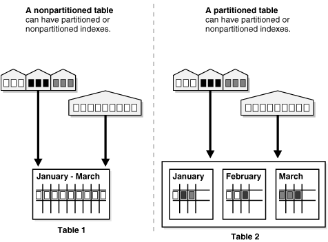

# Phân Vùng Cơ Sở Dữ Liệu

## Phân vùng cơ sở dữ liệu là gì?

Phân vùng cơ sở dữ liệu là xương sống trong việc quản lý các hệ thống cơ sở dữ liệu phân tán. Nó là quá trình phân chia một tập dữ liệu lớn thành các phần nhỏ hơn ở những máy khác nhau. Nói cách khác, nó là cách chia các dữ liệu dạng bảng thành các phần nhỏ hơn để dễ dàng truy cập và quản lý.

- Dữ liệu được phân tán trên nhiều phân vùng sẽ cải thiện hiệu suất về độ khả dụng, khả năng mở rộng và quá trình truy vấn. Dữ liệu được gộp trên tất cả phân vùng sẽ giống với dữ liệu ban đầu của cơ sở dữ liệu.
- Kiến trúc phân vùng này là vô hình ở phía client, họ sẽ không biết là mình đang giao tiếp với các phân vùng vì nó giống như đang giao tiếp với một cơ sở dữ liệu duy nhất.

## Phân vùng dữ liệu giải quyết được những vấn đề gì?

Với sự phát triển của dịch vụ và nhu cầu người dùng, cái yêu cầu về cơ sở dữ liệu cũng tăng theo đó. Kiến trúc một server cơ sở dữ liệu di nhất là không đủ để phục vụ các yêu cầu từ client. Nó có thể dẫn đến một vài trường hợp phát sinh như sau:
- Các thao tác trên cơ sở dữ liệu chậm.
- Băng thông mạng bắt đầu tiến đến trạng thái đầy.
- Server cơ sở dữ liệu có thể tràn ổ đĩa cùng thời điểm chạy.

Phân vùng cơ sở dữ liệu giúp ta giải quyết tất cả những vấn đề trên bằng cách phân phối dữ liệu trên nhiều phân vùng. Mỗi phân vùng có thể chạy trên cùng một máy hoặc chạy ở máy khác. Ý tưởng phân vùng cùng máy có thể giúp giảm kích cơ chỉ mục, và dung lượng I/O cần cho cập nhật bản ghi. Tương tự ý tưởng phân vùng khác máy giúp tăng băng thông cho truy cập dữ liệu vì có nhiều RAM hơn, tránh việc truy cập ổ đĩa, hay có thể các interface mạng và kênh I/O khả dụng.

Một góc nhìn phân vùng bảng.

## Khi nào cần phân vùng bảng?

Phân vùng trông có vẻ rất hữu ích, nhưng không phải tất cả trường hợp đều bắt buộc chúng ta phân vùng dữ liệu. Các kịch bản mà phân vùng dữ liệu hữu ích thường là: 
- Khi kích thước bảng quá lớn so với bộ nhớ.
- Khi dữ liệu cần thêm vào hoặc cập nhật mỗi ngày. Ví dụ như một bảng lưu dữ liệu hành trình, chỉ có thể cập nhật ở tháng hiện tại, 11 tháng trước chỉ có thể đọc.
- Khi bảng dữ liệu cần phân phối trên nhiều thiết bị lưu trữ. Tác vụ truy vấn sẽ trở nên dễ dàng hơn nếu dữ liệu được lưu trữ phân tán trên nhiều server.

## Tại sao cần phân vùng dữ liệu?

- **Cải thiện độ khả dụng**: 