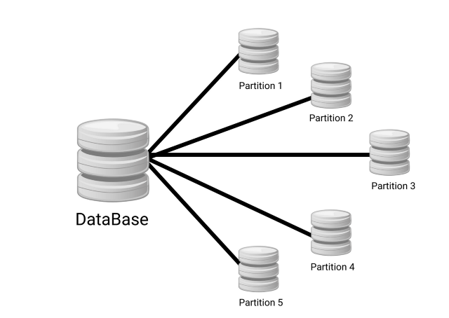
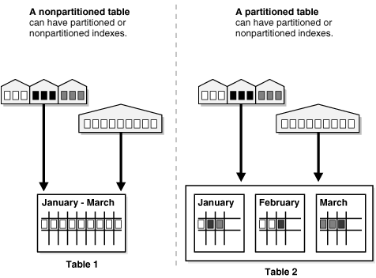
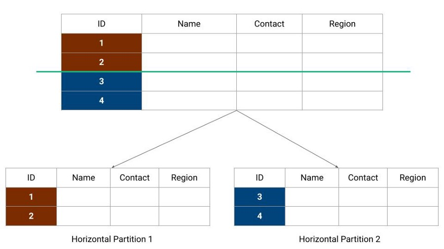
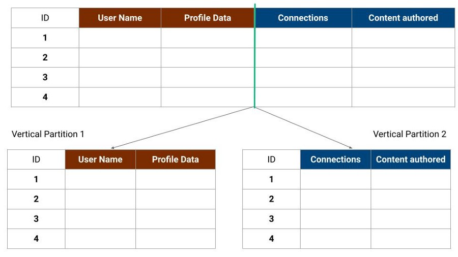
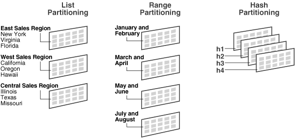
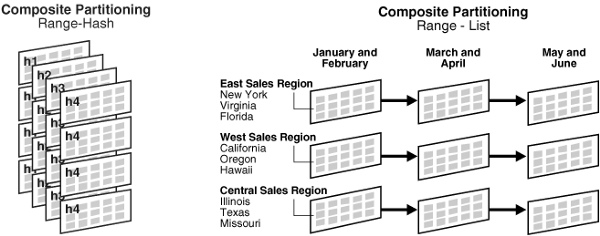

# Database Partitioning (Sharding) in System Design

# What is data partitioning?

Database partitioning is the backbone of modern distributed database management systems. It is a process of dividing a large dataset into several small partitions placed on different machines. In other words, It is a way of partitioning data like tables or indexorganized tables into smaller pieces so that data can be easily accessed and managed.

It distributes data across several partitions to improve database availability, scalability, and query processing performance. The combined data from all partitions is the same as the data from the original database.

The partition architecture is transparent to the client application, where the client application keeps talking to the database partitions as if it was talking to a single database.

## What are the problems solved by database partitioning?

With the growth in services and user base, it becomes tricky for a single server or database to function efficiently. We may experience lower performance with the architecture of a single database server. Here is some situation that could arise:
- Database operations become slower.
- Network bandwidth starts reaching the saturation level.
- The database server starts running out of disk space at some point.

Database partition helps us fix all the above challenges by distributing data across several partitions. Each partition may reside on the same machine (coresident) or different machines (remote). The idea of co-resident partitioning is to reduce individual indexes size, and the amount of I/O needed to update records. Similarly, the concept of remote partitioning is to increase the bandwidth access to data by having more RAM, avoiding disk access, or having more network interfaces and disk I/O channels available.

## When to Partition a Table?

Partitioning might seem helpful, but not all cases require us to partition data. Here are some scenarios when partition can be beneficial:
- When tables are too large to fit in memory.
- When new data are added or updated every day. A good example is a table containing historical data, where only the current month's data is updated, and the other 11 months' data are read-only.
- When the table data need to be distributed across different storage devices. The query tasks become easier if the data is distributed and stored across different servers or systems.

## Why do we need data partitioning?

- **Improve Availability**: Database partitioning provides logical independence to the partitioned database, ensuring the high availability of our application. Here individual partition can be managed independently. For example, if one partition is unavailable, all of the other partitions remain available to execute database queries successfully. So it increases the availability of the service by avoiding a single point of failure for the entire dataset.
- **Note**: Keeping data in different partitions helps the database administrator do backup and recovery operations on each partition, independent of the other partitions. This could allow the active partition of the database to be made available sooner so access to the system can continue while the inactive data is still being restored.
- **Increase Scalability**: Every hardware comes up with certain capacity limitations. With the increase in traffic, the performance of the services decreases. Data partitioning proves to increase scalability by distributing the data across multiple partitions. It gives the wings to the service to scale out without any further limitations.
- **Improve Security**: Data Partitioning also helps improve the system’s security by storing sensitive and non-sensitive data into different partitions. This could provide better manageability and desirable security to sensitive data.
- **Increase Query Performance**: Data Partitioning improves the performance of the system. Instead of querying the whole database, now the system has to query only a smaller component, which can increase service performance.
- **Improve Data Manageability**: Data Partitioning divides tables and indexes into smaller and more manageable units. It's a kind of "divide and conquer" approach to data management, where maintenance work can focus on a particular table partition.

## Data Partitioning Methods

Data Partitioning can be done through various strategies to distribute the database into separate and smaller databases. Broadly there are three different data partitioning strategies used. Let’s have a look at each one of them.

### Horizontal Partitioning or Database Sharding

In this strategy, we split the table data horizontally based on the range of values defined by the partition key. It is also referred to as database sharding, where smaller partitions are called shards.
- The table is divided into smaller and manageable tables, where each row of a table is assigned to a single partition. We can maintain and manage each partition independently from each other.
- The partition key is responsible for distributing the data among all the partitions. If we query something using the partition key, the database can determine the partition it needs to query.
- Horizontal partitioning spreads the load over more computers and ensures that the time required for a query is as minimal as possible.
- It is essential to balance the number of requests between partitions; otherwise, some might be overloaded, and some remain idle. This uneven distribution might affect the service's performance and become more prone to failure.

Suppose a large database containing multiple rows of customer data has a slow query performance. So we can think to partition the table into two separate tables horizontally. The first table includes the first half of customer data and the second table contains the second half of customer data. So if we need to query some customer data, either we would be querying partition 1 or partition 2, based on the partition key. For example, suppose we store the contact info for customers. In that case, we can keep the contact info starting with name A-H on one partition and contact info starting with name I-Z on another partition.

The benefit of the horizontal partition: it is the most straightforward partition scheme available. Each partition has the same schema as the original database. So our application layer would be relatively simple because we will not need to combine data from multiple partitions to answer any query in most scenarios.

The disadvantage of the horizontal partition: Data may not be evenly distributed. We might have many more customers whose names fall in the range of A-H than customers whose name falls in the range I-Z. In that case, our first partition will be experiencing a much heavier load than the second partition.

### Vertical Partitioning

In vertical partitioning, we partition the data vertically based on columns. We divide the tables into relatively smaller tables with fewer elements, and each part is present in a separate partition. It is also referred to as Normalisation.

For example, in a social media application like LinkedIn, a user might have profile data, a list of connections, and a set of articles he/she has authored. So using the vertical partition, we can place user profiles on one partition, the list of connections on a second partition, and the articles on a third partition.
- The main benefit of this scheme is that we can handle the critical part of data differently from the not so crucial part of our data. For example, we can store sensitive data like passwords, salary information, etc., in a separate partition to restrict access or provide additional security controls.
- Vertical partitions can be used in cases where our database is present in SSD. Suppose a few columns in the database are not frequently queried. So we think to partition the table vertically and move non often used columns to some other location. This could help to reduce the I/O and performance costs associated with fetching frequently accessed items.

The disadvantages of vertical partition are as follows:
- Our system might need to combine data from multiple partitions to answer a query.
- For example, a profile view request needs to combine a user profile, connections, and articles data. This increases the operational complexity of the system.
- If the website experiences additional growth, it may be necessary to further partition a feature-specific database across multiple servers.

## Functional Partitioning

In this type of partitioning strategy, data is aggregated based on the contextual dependency of the service. A medical store system might store the medicines' information in one partition and invoice data in another partition.

We can go ahead with any specific type of data partitioning based on the structure of the data. However, in some cases, we can combine both horizontal and vertical partitioning to get the best of it. Consider a situation in which we have a large dataset of customers with different data types. In that case, we can vertically divide the database into string values and horizontally partition the customer information.

## Data Partitioning Criteria

There are a large number of criteria available for data partitioning. Most of them use partition keys and assign partitions on their basis. Some of the data partitioning criteria are range-partitioning, list-partitioning, hash partitioning, and many more.

### Range Based Partitioning

Range partitioning maps data to various partitions based on ranges of values of the partitioning key. In other words, we partition the table in such a way that each partition contains rows within a given range defined by the partition key.

Ranges should be contiguous but not overlapping, where each range specifies a noninclusive lower and upper bound for a partition. Any partitioning key values equal to or higher than the upper bound of range are added to the next higher partition.

Range partitioning is used:
- When there is a need to organize similar data based on date and time. For example, a table with a date column as the partitioning key, the January-2022 partition would contain rows with partitioning key values from 01-Jan-2022 to 31-Jan-2022.
- This partitioning is also used when data is regularly added, and there is a need to remove old data from the database. Here each partition is divided into date ranges, and it becomes easier to remove old data. For example, we can delete all rows relating to employees who stopped working for the firm before 1991. This can be much more efficient for a table with many rows than running a delete query to remove employee data <= 1990.

## Hash-Based partitioning

This strategy divides the rows into different partitions based on a hashing algorithm rather than grouping database rows based on continuous indexes.
- We can use the IP address or application id of the client request can as an input to a hash function for generating a hash value. This hash value determines which database partition to use. For example, suppose we have 4 database partitions, and each request contained an application id. So we can simply perform a modulo operation on the application id with 4 and take the remainder to determine the partition to place the data.
- It is an ideal method for distributing data evenly across the partition.
- Hash partitioning is also an easy-to-use alternative to range partitioning, especially when the partitioning data is not historical or has no obvious partitioning key.

The disadvantage of this method is that dynamically adding/removing database servers becomes expensive. For example, if we wanted to add more partitions, some of the keys need to be remapped and migrated to a new partition, and the hash function will need to be changed. During data migration, neither the new nor the old hash function is entirely valid. So in this process, a large number of the requests cannot be served, and we will encounter a downtime till the migration completes. This problem can be solved using consistent hashing!

## List Based partitioning

In list partitioning, each partition is defined and selected based on the list of values on a column rather than a set of contiguous ranges of values.
- Here partitioning key can only consist of a single table column.
- We can easily group and organize unordered and unrelated data sets in different partitions.
- We can partition data based on the region column present in the row so that data of each region resides in a single partition. For example, all the customers from India can be stored in one partition, and customers from other countries can be stored in different partitions.

Suppose that there are 20 video stores distributed among 4 regions as shown in the following table:
- Region: India, ID Numbers: 3, 5, 6, 9, 17
- Region: USA, ID Numbers: 1, 2, 10, 11, 19, 20
- Region: Japan, ID Numbers: 4, 12, 13, 14, 18
- Region: UK, ID Numbers: 7, 8, 15, 16

We can partition this table so that rows for stores belonging to the same region are stored in the same partition. This could help us add or drop records relating to specific regions from the table.

### Composite partitioning

As the name suggests, composite partitioning partitions the data based on two or more partitioning techniques. Here we first partition the data using one technique, and then each partition is further subdivided into subpartitions using the same or some other method.
- All subpartitions of a given partition together represent a logical subset of the data.
- It supports historical operations, such as adding new range partitions and provides higher degrees of pruning and finer granularity of data placement through sub partitioning.

The various types of composite partitioning are:
- **Composite Range-Range Partitioning**: It performs range partitioning based on two table entries. For example, we can first partition the details by date and further
- **Composite Range-Hash Partitioning**: It first partition the data using the range partitioning technique, and within each partition, it subpartitions using the hash partitioning technique.
- **Composite Range-List Partitioning**: It first partition the data using the range partitioning technique, and within each partition, subpartitions it using the list partitioning technique.
- **Composite List-Range Partitioning**: In a given list partitioning strategy, this strategy helps us to perform range sub partitioning within. For example, we first perform the list partition by country name and then perform the range subpartition by date.
- **Composite List-Hash Partitioning**: It helps us further sub-partition list-partitioned data using the hash partitioning technique.
- **Composite List-List Partitioning**: It helps us perform list partitioning based on two table dimensions. For example, we can perform list partition by country name and list subpartition by customer account status.

## Effective Data Partitioning Designs

- **Query processing**: Effective Data Partitioning strategy improves the query performance by using relatively smaller data sets and by the inclusion of parallelism. Data partitioning improves the database’s manageability and allows easy backup and recovery of smaller components than the complete database.
- **Application consideration**: Data Partitioning is highly dependable on application requirements. It improves the system’s availability, scalability, and performance and adds complexity to the service’s design and development. Considering the application’s requirements, it is essential to figure out how the data will be accessed, how it is queried, modified, and which design would offer the best performance with minimal latency and in a resilient manner.
- **Rebalancing partitions**: With the increase in traffic to the system, it could be possible that the service might start getting a disproportionate amount of traffic, which leads to excessive contention. Hence, partitioning needs to be rebalanced by defining a new partitioning strategy and migrating data from old to new partitioning schemes.

## Conclusion

Data Partitioning is the backbone of modern distributed data management systems. Data Partitioning proves very effective in improving the availability, scalability, and performance of the system. In this blog, we tried to present a full conceptual understanding of Data Partitioning. Hope you liked it. Please share your views in the comments below.
