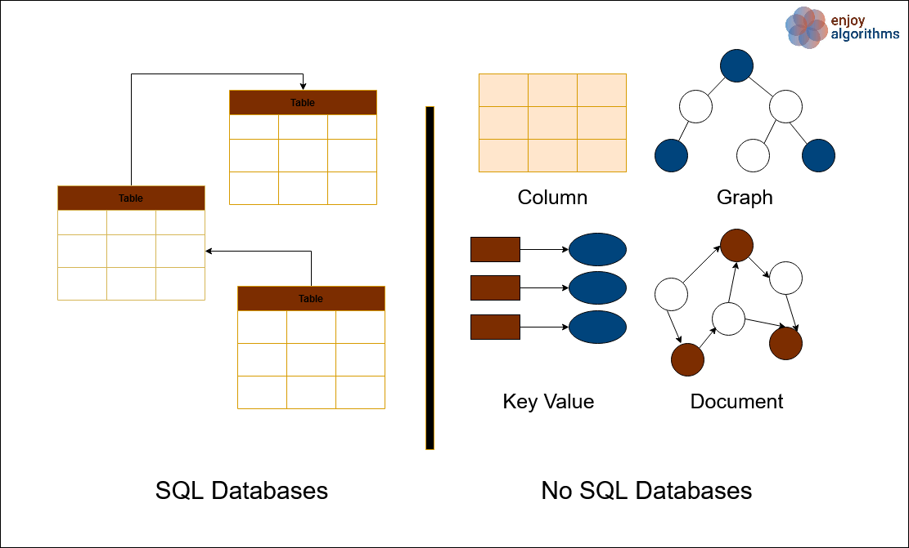

# SQL vs NoSQL

Have you ever been in a dilemma while choosing the most appropriate storage type for your application? What could be the most viable storage type that could meet the business expectations and offers efficient services? If it is so, then this blog comes to rescue you. This blog will give you complete insight while designing your database to make your application work efficiently.

Nowadays, most businesses have heavily relied on the processing and management of large amounts of data. The core decision behind choosing any type of database depends on the business logic of the application, the system’s critical functionalities, the structure of the system’s data, and requirements. The primary factor behind selecting the database is the data structure and the kind of operations associated with it. But before diving deep into selecting a suitable database, it is necessary to have a clear understanding of the structure and the functionalities of each kind of database. Databases are broadly categorized into Relational (SQL) and Non-Relational (NoSQL) databases.

## SQL Database

SQL (Structured Query Language) is a programming language used for writing the relational database. SQL is a table-oriented database. The relational database mainly comprises tables, and each table consists of rows and columns. This database is highly structured in nature. Relational Databases have a predefined schema. A schema is a relationship between the tables and the field types. It is an essential tool that keeps the data in synchronization and minimizes data redundancy. Relational Databases come with ACID compliance. Hence such types of databases are highly preferable for transaction-oriented systems and for storing financial data. ACID compliance offers error-free services even in case of failures, which is necessary for the validity of transactions. Types of SQL Databases are: MySQL, Oracle, PostgreSQL, MariaDB, IBM DB2

## NoSQL

NoSQL is a non-relational database system that is very flexible and highly scalable. NoSQL databases offer dynamic schemas and are most suitable for storing unstructured data like article content, video, social media posts, and various types of unstructured data. There are various types of NoSQL Databases like Key-Value Store, Document Oriented Database, Column Oriented Database, and Graph database. NoSQL databases are query inefficient. Due to the highly distributed and flexible nature, NoSQL databases are highly suited to modern frameworks like Hadoop and are suitable for Big data and real-time processing services.

NoSQL database offers BASE compliance because of which NoSQL database offers high flexibility. NoSQL is highly suitable for storing hierarchical data and solving data availability problems. Types of NoSQL Databases are MongoDB, Redis, Neo4j, Cassandra, Hbase.

## Why use SQL Database?

One should prefer SQL databases when:
1. Data is highly structured and requires fewer updates
2. Data Integrity is essential
3. Service requires a large number of complex queries
4. ACID compliance is very necessary

## Why use NoSQL Database?

One should prefer SQL databases when:
1. The flexibility, scalability, and speed is the key requirement of the system
2. The size of data is huge, and data needs flexible schemas
3. ACID compliance is not necessary
4. The service requires distributed architecture and cloud computing
5. The system requires rapid development

## Scalability

To handle the increasing amount of traffic efficiently, one needs to scale the system. Scalability improves the throughput of the system and offers minimum latency. However, SQL and NoSQL databases differ highly in the way they are scaled. Horizontal scaling means scaling by adding more machines to the system. Similarly, vertical scaling means increasing the capacity of the same machine so that it could handle a larger amount of traffic.

SQL databases support vertical scaling while NoSQL databases support horizontal scaling. In SQL or relational databases, the data is present in a highly structured manner, and hence while scaling, one needs to maintain the structure of the data. Hence to maintain the service’s integrity, SQL databases are designed to run using a single server. In NoSQL databases, there is no need to maintain data structure; hence, such types of systems such be easily scaled using horizontal scaling as each entity is independent of the other. Hence to scale such a system, one can add more and more servers to increase the service’s power.

## Combining the best of two

With the increase in the systems’ complexity, sometimes it becomes handy to use both types of databases for various tasks associated with the service. For example, YouTube stores the video content in NoSQL databases and stores user metadata and some other information in relational databases. Hence, to meet the business requirements, one can integrate both types of services and use them in conjunction with each other by taking each database’s best characteristics. 

Various databases offer both types of services like MySQL Document Store offers the structure of the SQL database and the features and flexibility of the NoSQL database. Similarly, MongoDB being a NoSQL database, also offers ACID transactions.

## Conclusion

The choice of database is entirely dependent on the type of application and the type of services it offers. However, there is no such database that fits all conditions. There are various aspects of businesses that require relational or non-relational databases or sometimes a combination of both. There are applications in which data structure and integrity are necessary, and schemas are well defined. Hence relational databases are suitable for them, while some applications focus more on speed and scalability; hence NoSQL databases are suitable for them. Hence, with newer technologies, real-time processing, and highly distributed systems, NoSQL databases are gaining popularity. But the final call for choosing the type of storage is application dependent. One needs to know all the edge cases while going with any particular type of architectural design.