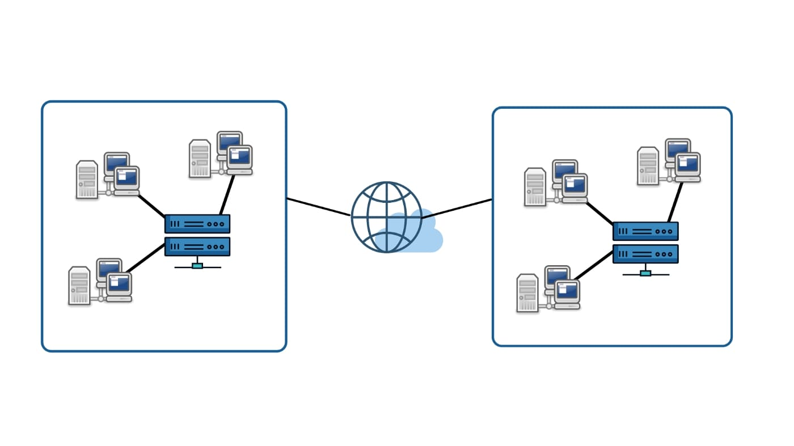

# Distributed Systems

## Introduction

Technological expansion and the increasing use of highly scalable systems have paved the way for Distributed Computing. Nowadays, almost every large-scale application is based on distributed computing. So distributed systems are crucial in designing faulttolerant, highly scalable, and low latency services.

This blog will introduce you to the fundamentals of distributed systems, their functioning, and how they are applicable in real-world systems. So, let us dive in and learn how to deal with trade-offs while designing our system.

## What is a Distributed System?

A distributed system is a collection of many independent machines that work together by coordinating and communicating with each other to achieve a common goal. These systems operate concurrently, offer high scalability, and fail independently without affecting the application’s performance.

Distributed System works in such a fashion that it appears as a single entity to the enduser. It allows resource sharing, concurrency fault-tolerance, scalability, and transparency.

## Why Distributed System?

Distributed systems are made up of machines capable of connecting over a network, having local memory, and communicating messages. Hence it is evident that such systems consist of considerable complexity. So the common question is: Why are we using distributed systems if they are so hard to manage, deploy, and debug because of their highly complex behavior? The major advantage of adopting distributed computing in almost every software is its ability to provide highly scalable services. Distributed systems allow us to add as many servers and offer **Horizontal Scaling**.

Traditional systems generally scale using **Vertical Scaling**, i.e., by increasing the single machine’s power by upgrading it multiple times. Such Vertical scalable services are not compatible when operating on a vast scale because they are expensive, and they are more prone to a single point of failure. However, horizontal scaling allows us to scale indefinitely without any worry. If there is any performance degradation, you only need to add more machines, making the service extremely fast without much overhead cost compared to Vertical Scaling. The figure below describes how it costs a company to use Vertical vs. Horizontal Scaling.

Along with scalability, distributed systems offer **low-latency** and **fault-tolerant** services. Most of the highly scalable services are read-heavy, which might decrease any system's performance. To deal with this, there is a facility in distributed computing to replicate the servers. This offers highly available services and also ensures fault-tolerant behavior.

However, one can efficiently deal with the service’s low performance by using replication, but there is also a specific limit to which this is convenient. With distributed systems, there is always a trade-off between complexity and performance. To further increase performance, distributed systems offer another way to scale the service by sharding the databases. With sharding, one can easily split the central server into smaller servers called Shards and achieve higher performance by distributing the load and achieving highly available and latency-free services.

## How Distributed System Works?

Distributed systems heavily rely on network calls and communication from all the individual components. A well-established network is the utmost requirement of the distributed system to connect with each component and offer highly scalable services.
- The messages need to be communicated reliably.
- There should be a mechanism for detecting any failure node so that if the node fails, the system should synchronize properly without affecting other functionalities.

## What are the Types of Distributed Systems?

The distributed systems fall into any one of the four architectural modes:
1. **Client-Server Model**: Most of the traditional architecture falls under this category. There is a server to which all the requests are made from the clients. Resource sharing is one of the best examples of the client-server model.
2. **Three-Tier**: In such architecture, a central server manages all the requests and services and acts as a middle layer between the communication. The middle tier accepts the request, does some pre-processing, and forwards it to the server for further processing.
3. **Multi-Tier**: Such architectures are used when an application needs to forward requests to various network services. Here the application servers interact both with the presentation tiers and data tiers.
4. **Peer-to-Peer**: There are no centralized machines required in this architecture. Each entity behaves as an independent server and performs its roles. Responsibilities are distributed among various servers called peers, and they cooperate to achieve a common goal.

**Examples that are heavily relied on distributed systems are:**
* Telecommunication Networks
* Parallel Processing
* Real-Time Distributed Services
* Distributed Databases and Caches
* Distributed File System and Stream Processing Services

## Advantages of Distributed Systems

Nowadays, systems require high availability, consistency, scalability, and they need to be fault-tolerant. Hence the vast majority of applications rely on a distributed system. The key benefits of using distributed systems are:
- **Reliability**: Distributed systems remain available most of the time irrespective of the failure of any particular server of the System. If one server fails down, the service remains operational.
- **Scalability**: Distributed systems offer extensive scalability. The advantage of adding a large number of servers allows such systems to achieve horizontal scalability.
- **Low Latency**: Distributed systems offer high-speed service because of the Replication of servers and servers’ location close to users, hence reducing the query time.

## Disadvantages of Distributed Systems

It is essential to know the various challenges that one may encounter while using any system. This will help in dealing with trade-offs. The shortcomings of distributed systems are:
- **Complexity**: Distributed systems are highly complex. Although using a large number of machines, the system can become scalable, but it increases the service’s complexity. There will be more messages, more network calls, more machines, and hence it becomes very tedious to manage such systems.
- **Network Failure**: Distributed systems have heavily relied on network calls for communications and the transfer of information or data. In case of network failure,message mismatch or incorrect ordering of segments leads to communication failure and eventually deteriorates its application’s overall performance.
- **Consistency**: Because of its highly complex nature, it becomes too challenging to synchronize the application states and manage the data integrity in the service.
- **Management**: Many functions, such as load balancing, monitoring, increased intelligence, logging, etc., need to be added to prevent the distributed systems’ failures.

## Conclusion

Distributed systems are the necessity of the modern world as new machines need to be added, and applications need to scale to deal with technological advancements and better services. It enables modern systems to offer highly scalable, reliable, and fast services.

Such systems can support many requests and compute jobs compared to a single standard system by spreading workloads and requests. Although there are some tradeoffs and challenges, distributed systems can transform the world with their services and applications. As a result, almost every application has distributed system as one of the major components.
