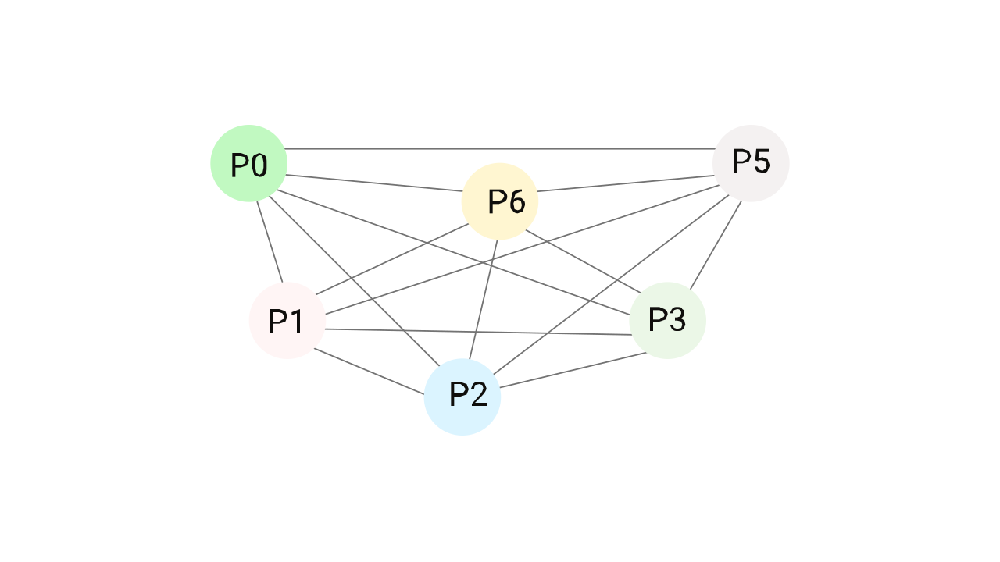

# Leader Election in Distributed Systems

The objective of leader election is to provide one item (a process, host, thread, object, or human) specific powers in a distributed system. These specific abilities could include the capacity to delegate tasks, the ability to edit data, or even the responsibility for managing all system requests.

The election of a new leader is a powerful instrument for increasing efficiency, minimizing coordination, simplifying architectures, and lowering activities. Leader election, on the other hand, may generate additional failure modes and scale obstacles. Furthermore, leader election may make evaluating the validity of a system more challenging.

The goal of the leader election is to select a processor who will coordinate the system’s actions. A leader is usually chosen based on a criterion, such as selecting the processor with the greatest identifier as the leader in any leader election procedure. The processors attain their terminated states when the leader is chosen. In a leader election algorithm, the terminated states are divided into elected and non-elected states. When a processor enters a non-elected state (or an elected state), it remains in that state at all times (or an elected state). The safety and liveness conditions for a leader election algorithm must be met.
- According to the liveness condition, every processor will eventually enter either an elected or non-elected state.
- Only one processor is allowed to enter the elected state as a safety condition for leader election. This processor takes over as the distributed network’s leader.

## Use Cases

When considering whether or not a leader election is appropriate, there are three
scenarios to consider.

When each node is roughly the same, and there isn’t a clear contender for a permanently assigned leader, the first circumstance arises. This means that any node can be voted as the system’s leader, and there is no single point of failure. 

The second scenario occurs when the cluster is performing a very complex activity that requires close collaboration. Coordination can refer to various things, including deciding how the work will be divided, assigning work to certain nodes, and combining work outcomes from various nodes.

Consider the case of a scientific computation aimed at determining how a protein folds. This computation can take a long time due to many possible answers, but it will be significantly sped up if it is dispersed. A leader node will be required to allocate each node to a distinct component of the computation and then combine the results to obtain the whole folded protein configuration.

When a system executes many distributed writes to data and requires good consistency, the third instance where leader election brings value is when it executes many distributed writes to data. You can learn more about consistency in our Databases article. Still, it basically means that no matter which node processes a request, the user will always have the most recent data version. In this case, a leader ensures consistency by being the source of truth about the system’s most recent condition (and the leader election algorithm must preserve this properly).

Although not all applications require strong consistency, you can imagine how important it would be for a bank to ensure that a user’s bank account total is accurate regardless of which server responds to their online banking request and that multiple transactions directed to the same bank account do not conflict with one another.

## Advantages and disadvantages of leader election

Leader election is a common pattern in distributed systems because it has some significant advantages:
- Humans find it easier to think about systems with a single leader. It consolidates all of the system’s concurrency, lowers partial failure possibilities, and provides a single location to search for logs and metrics.
- A single leader can accomplish more. Rather than forming consensus on the changes to be made, it might often merely tell other systems about them.
- Because they can observe and control all of the changes made to the system’s state, single leaders can easily provide consistency to their clients.
- By providing a single consistent cache of data that can be used simultaneously, a single leader can improve performance or lower costs.
- It may be simpler to write software for a single leader than writing software for a quorum. The single leader does not consider other systems that may be working in the same state simultaneously.

Leader election also has some considerable downsides:
- A single point of failure is a single leader. The entire system may become unavailable if the system fails to detect or correct a bad leader. 
- When it comes to data size and request rate, a single leader equals a single point of the scale. A complete re-architecture is required when a leader-elected system needs to expand beyond a single leader.
- A single point of trust is a leader. When a leader does the wrong task and checks it, it can swiftly spread problems throughout the system. The blast radius of a bad leader is large.
- In leader-elected systems, partial deployments may be difficult to implement. Partial deployments are used in many Amazon software safety policies, including one-box, A/B testing, blue/green deployment, and incremental deployment with automatic rollback.

## Leader Election Algorithms

With as few back-and-forth interactions as feasible, a leader election algorithm guides a cluster to agree on one node to operate as a leader jointly.

In general, the method assigns each node one of three states: Leader, Follower, or Candidate. In addition, the leader will be required to pass a “health check” or “heartbeat” regularly so that follower nodes may determine if the leader has been unavailable or failed, and a new one must be elected.

Whether you want a synchronous or asynchronous cluster determines the type of leader election mechanism you use. The asynchronous cluster has nodes synced to the same clock and sends messages in a predictable order. Messages are not reliably sent within a particular period of time or in any order in an asynchronous cluster.

Because any number of nodes in an asynchronous cluster can lag indefinitely, the leader election procedure can’t ensure both safety (no more than one leader will be elected) and liveness (every node will finish the election). In practice, implementations choose to ensure safety because it has more serious consequences for the service.

Synchronous algorithms are easy to reason about and potentially desirable because they can guarantee both safety and liveness. However, in practice, synchronizing a cluster necessitates imposing extra limits on how it runs, which aren’t necessarily possible or scalable.

## Bully Algorithm

A simple synchronous leader election technique is the Bully Algorithm. This approach necessitates that each node has a unique numeric id and that all nodes in the cluster know each other’s ids. When a node starts up or the current leader fails the health check, the election process begins. There are two possibilities:
1. If a node has the highest id, it declares itself the winner and transmits it to the other nodes.
2. If a node has a lower id, it sends messages to all nodes with higher ids, and if it doesn’t hear back, it assumes they’ve all failed or are unavailable and declares itself the winner.

## Paxos

Paxos is a general consensus protocol that can be used for asynchronous leader elections. Paxos models the distributed system using state machine replication and then chooses a leader by having some nodes suggest a leader and some nodes accept proposals. When a quorum of (enough) accepting nodes vote for the same proposed leader, that proposed leader takes over as the actual leader.

## RAFT

Raft is a popular alternative to Paxos because it is easier to comprehend and thus implement and use. Raft is a non-blocking algorithm.

Each node in the Raft consensus keeps track of the current “election term.” Each node increments its copy of the term number and listens for messages from other nodes when the leader election begins. If the node does not hear anything after a random interval, it will become a candidate leader and ask other nodes for votes.

If the candidate wins a majority of votes, it becomes the leader, and if another candidate with a higher term number sends a message, it concedes. If the election is split or the timer runs out without a consensus, the algorithm resumes. Restarts are rare because random timeouts prevent nodes from colliding.

## Apache ZooKeeper (ZAB)

Apache Zookeeper is a “self-distributed and highly dependable” centralized coordination service. The Apache ZooKeeper philosophy is that distributed system coordination is tough; hence it’s better to have a shared open-source implementation with all the key components so your service doesn’t have to reimplement everything from scratch. In big distributed systems, this is extremely useful.

Apache ZooKeeper uses the ZAB (ZooKeeper Atomic Broadcast) protocol to manage leader election, replication order guarantees, and node recovery. Because the leader “broadcasts” state changes to followers, it is known as this. This ensures that writes are consistent and propagated to all nodes. The ZAB algorithm is an asynchronous algorithm.

## Conclusion

Leader election is a strong technique that may be employed in systems to help make them more fault-tolerant and easier to use. However, when we employ leader election, we pay close attention to the guarantees that each protocol gives and, more critically, does not give.