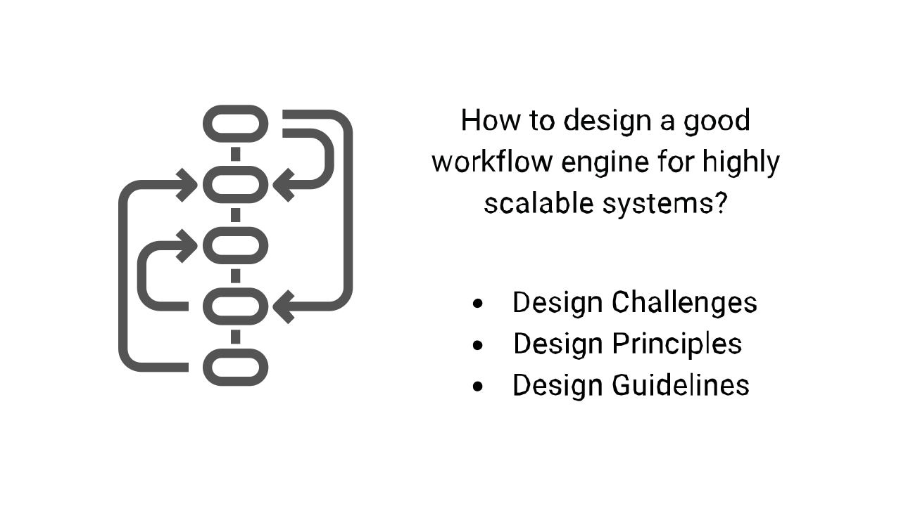
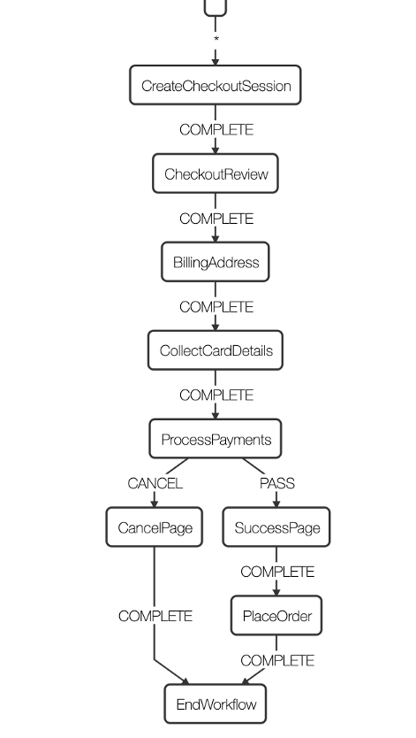

# Workflow in a Distributed System

## Introduction

Ever wondered how does 1-click-buy works on Amazon? How does an e-commerce platform show the status of your order after the order is placed? What happens when you cancel your order right after you place an order, or after your item is shipped, or even delivered? How is all the activity related to an order tied to just one order Id? This blog will try to tackle such system design challenges and layout key insights on designing a workflow system.

In a distributed software system, it is often required to achieve some goals with a combination of multiple operations, such as downstream calls, database transactions, and authentications. A workflow engine is an orchestration system that will help you hand out worker processes and manage the central state. It is possible to encounter failure, network glitch, or timeout, or the host running the software can fail. Therefore, a reliable workflow engine design is essential to the smooth performance of the overall software system.

I will highlight the design considerations of a good workflow engine in this blog from the lessons I’ve learned in the past while working on designing highly scalable systems.

### Simple Example: Payment workflow

## Design Challenges

Given the distributed nature of the software system, the workflow engines face a series of challenges:
1. The workflow state may be distributed and can be expensive to reconstruct if only part of the workflow work items has failed. A workflow restart should be started from the failed activities using the result of completed activities.
2. Actions in a workflow are not always reliable. Because they go through network calls, the request can be lost, the remote system can be unresponsive, the response can be lost, or the latency can be high to cause a timeout. A failed workflow can produce various changes to the state, including NO-OP (action is not taken), expected operation (action is taken but the response is lost), and sometimes unexpected operation.
3. The workflow engine can fail, so in-flight workflows must be picked up cleanly by another host running the same workflow instance.
4. If more than one host runs the workflow engine, workflows must be efficiently and correctly distributed to them to ensure one and only one host works on any workflows at any time.
5. Actions are rate-limited (throttled) by type or activities. Proper rate limiting must be done to protect the workflow engine’s dependencies.
6. Some actions are asynchronous, and state transitions of such actions take time. The workflow engine must timely and efficiently go through state transitions.

## Workflow Modelling

A workflow is a finite, ordered series of actions transforming the start state to the end state. It can be modeled as a directed acyclic graph with multiple paths between two special states: the initial state and the end state. Each state is a node, and each action is an edge. There can be multiple actions given some conditions for each state, but only one action can be taken on a state, and the choice of action is well-defined. The initial and end state of a workflow is well defined, and the consequence (“change set”) of each action is well-defined. Therefore, each workflow state is well-defined. The state of a workflow is the state of a collection of resources, database entries, or states in remote systems. An action in a workflow is a dependencies API call, a database transaction, etc., that changes at least one aspect of the state of the workflow, e.g., payment is completed. Item is shipped etc.

## Design Principles

Following design principles should be considered to address the challenges:

### Action
1. Each action should include only one mutating operation that, under normal circumstances, can either succeed as a whole or fail as a whole. This includes one API call, one database transaction, etc. Multiple operations can be grouped into one action if a transactional lock can be used to roll back partially succeeded operations if later operations in the same activity fail.
2. After an action is taken successfully, the change set of the workflow state is welldefined. There should be no ambiguity of the change action.
3. The failure mode of activity is finite and well-defined.
4. Any API calls, database operations, etc., should be rate-limited to prevent downstream from bad clients.
5. The result of asynchronous activities should be retrieved timely.
6. Whenever possible, activity should be idempotent. If an action cannot be idempotent, it can either be taken multiple times without side effects, or the consequence of the extra calls does not impact the workflow state and can be efficiently cleaned up independently.

### Workflow State
1. The workflow state should be cached in memory after an action is taken, and the next action can be taken without reconstructing the workflow state from the persistent storage.
2. Workflow state should be persisted in the data store after each action is taken so that when it is assigned to a different host, its state can be efficiently retrieved without restarting the workflow.
3. External conditions required to take different actions are well-defined, and their true state can be efficiently computed.

## Design Guideline

A workflow engine can be divided into the following functional units.

### Workflow Worker

Workflow workers perform actions and state transitions. There are a couple of ways of designing workflow workers (Let’s call them activity).

1. We can build a workflow engine such that we can have individual workers dedicated to working on only one workflow item until the item completes.
2. We can have individual workers work on only a small set of actions, and workflow items are worked by multiple workers in a defined order in a pipeline.
3. workers are agnostic to the workflow item or the specific action; they receive the workflow state and the action, execute the action and record the state change, and move on to the next one, which can be the same workflow item, a different workflow item in a different state, or even a different type of workflow. Because the workers are completely dumb, this is called the “dumb worker” paradigm.

There are both advantages and disadvantages to all techniques. In the dedicated worker approach, workflow state is maintained by a single worker, eliminating the need of passing state from one worker to the next. All the actions of this workflow must be defined in a single place, which can be good or bad depending on the situation. However, this process does not allow batch processing, and thus a workflow scheduler that distributes workflows to workers is required.

In the assembly line approach, workflow actions are spread to multiple workers, reducing the readability of the code. It requires passing workflow state between workers but allows batch processing.

It is recommended to model complicated, less frequent workflows with the dedicated worker approach and define many simple workflows using the assembly line approach.

### Workflow Scheduling

You will always have some activities which run faster than other activities in a workflow.
If you get n number of requests, then a particular activity from all the workflows may be completed, but the remaining activities are just piling up in the queue. To ensure workflows are organized desirably, prioritize on-the-fly tasks over new tasks, or distribute workflow tasks to multiple hosts running the workflow engine to avoid conflict, a workflow scheduler is helpful to manage workers so that workflows can be processed in the desired way.

The scheduler should adjust the speed of each worker so that it is limited to the slowest one to ensure no accumulation of work items becomes operational debt. The number of concurrent workers should be limited so that no dependency is overwhelmed just because lightweight activities are completed quickly.

### Capacity planning and Rate Limiter

There is usually a limit of capacity for any dependencies. This is often defined as allowed Transaction per Second, or TPS, from a given service. Thus, the workflow engine should implement a rate limiter at the client-side to efficiently use the fleet capacity and network bandwidth.

The implementation of a Rate Limiter depends on the design of the worker. If workers are designed as threads, then the threads must be paused when allowed TPS is exceeded. If workers are designed as event handlers, API calls or database transactions should be registered as events scheduled with proper internal between them not to exceed the TPS requirement. The workflow engine should handle throttled requests with an appropriate back-off and retry mechanism.

### Wait Queue

Activities in a Workflow blocked on state change of asynchronous operations must be handled efficiently. For example, if payment confirmation notification from the bank is delayed, the order shouldn’t be confirmed. This use case must be handled using a wait queue. Similarly, workflows that are waiting for an asynchronous operation to complete should be handled separately. The wait queue in the workflow engine should gather pending activities and perform state polling at a much slower rate than the workers. Wait queue should handle notification of completion. The wait queue should remove messages from the queue as the related activities are completed and notify the worker.

### Question
1. Design google play store app submission workflow system. A user needs to submit a binary file through the developer portal. List out a set of activities to be performed for the following workflows.
2. a) app submission workflow,
3. b) version update
4. c) cancel a submission
