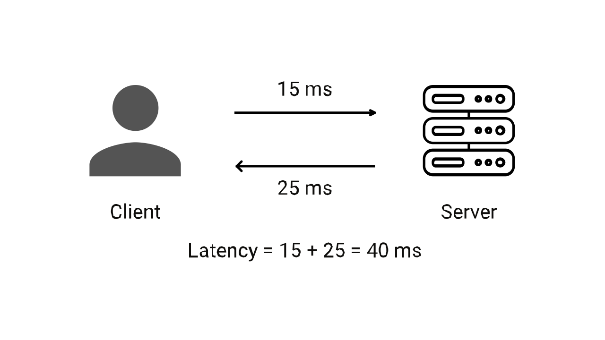

# Độ trễ của Hệ thống là gì?

[Version English](./README_EN.md)

Khi quan sát dòng nước chảy ra từ một đường ống nào đó, ta có thể thấy tốc độ của nước ra khỏi đường ống không đồng nhất, đôi khi nước chảy ra rất nhanh và đôi khi là quá chậm. Khái niệm nó có phần tương đồng với một khái niệm trong hệ thống máy tính là độ trễ.

Trong ví dụ trên độ trễ xác định tốc độ nước trong đường ống có thể được chuyển từ đường ống này sang đường ống khác. Còn với thuật ngữ máy tính, nó xác định tốc độ truyền dữ liệu từ server đến client và ngược lại. Đây là thước đo trực tiếp cho hiệu suất hệ thống, tức là độ trễ càng thấp hiệu suất càng cao.

Bài viết này sẽ tập trung vào hiểu biết khái niệm về độ trễ, cách nó tác động đến hiệu suất của hệ thống và những biện pháp nào nên được áp dụng để cải thiện độ trễ của hệ thống.

## Ý nghĩa và định nghĩa độ trễ

Độ trễ là khoảng thời gian từ khi bắt đầu yêu cầu ở đầu phía client đến khi server gửi kết quả trở lại client, tức là thời gian khứ hồi giữa trình duyệt và server.

Mục tiêu của hầu hết chúng ta là phát triển một hệ thống không có độ trễ, nhưng ở thế giới thực sẽ có rất nhiều nút thắt cổ chai khác nhau ngăn cản việc phát triển một hệ thống như vậy. Song chúng ta vẫn cần giảm độ trễ của hệ thống vì độ trễ càng giảm, càng mất ít thời gian để xử lý các yêu cầu của chúng ta. 

Bất cứ khi nào một yêu cầu được thực hiện, trình duyệt sẽ gửi một tín hiệu đến server, Server xử lý các yêu cầu và lấy thông tin để đưa nó trở lại cho client.

## Độ trễ hoạt động như thế nào?

Độ trễ không gì khác ngoài thời gian ước tính mà người dùng phải đợi sau khi bắt đầu thực hiện yêu cầu để nhận kết quả từ hệ thống. Hãy lấy một ví dụ và xem xét cách nó hoạt động.

Giả sử bạn tương tác với một trang web thương mại điện tử, chẳng hạn như Shopee, bạn cảm thấy thích một thứ gì đó và thêm nó vào giỏ hàng. Bây giờ khi bạn nhấn nút *Add to cart*, các sự kiện sau sẽ xảy ra:
- Ngay khi nhấn nút *Add to cart*, đồng hồ thời gian chờ bắt đầu và trình duyệt bắt đầu gửi yêu cầu server.
- Server ghi nhận yêu cầu và xử lý nó.
- Server trả lời yêu cầu, và gửi phản hồi đến trình duyệt của bạn là sản phẩm đã được thêm vào giỏ hàng của bạn.

Bạn có thể khởi động đồng hồ bấm giờ ở bước đầu tiên và dừng đồng hồ bấm giờ ở bước cuối cùng, sự chênh lệch thời gian chính là độ trễ.

## Nguyên nhân nào gây ra Độ trễ?

Bây giờ, bạn chắc hẳn đã nắm bắt được vấn đề chính, nhưng bạn có biết độ trễ đến từ đâu không? 

Độ trễ trong mạng phụ thuộc vào các tham số khác nhau và chúng có ảnh hưởng lớn đến việc xác định giá trị của nó. Một trong những yếu tố chính gây ra độ trễ là các cuộc gọi đi. Trong ví dụ trước về thêm giỏ hàng, khi bạn click vào nút trên trình duyệt, yêu cầu sẽ chuyển đến một số server ở phía backend, server này lại gọi nhiều dịch vụ nội bộ để tính toán (song song hoặc tuần tự) và sau đó chờ phản hồi hoặc tổng hợp chúng. Tất cả điều này làm tăng thêm độ trễ của cuộc gọi. Tuy nhiên, độ trễ chủ yếu được gây ra bởi các yếu tố sau:
- **Phương tiện truyền tải**: Phương tiện truyền dẫn là đường dẫn vật lý giữa điểm đầu và điểm cuối. Độ trễ của hệ thống phụ thuộc vào loại phương tiện được sử dụng để truyền yêu cầu. Các phương tiện truyền dẫn như WAN và Cáp quang được sử dụng rộng rãi, nhưng mỗi phương tiện đều có những hạn chế, ảnh hưởng đến độ trễ.
- **Truyền**: Nó được đề cập đến khoảng thời gian cần thiết để một gói tin truyền từ nơi này sang nơi khác. Độ trễ của hệ thống phụ thuộc nhiều vào khoảng cách giữa các nút giao tiếp. Các nút nằm càng xa thì độ trễ càng nhiều.
- **Bộ định tuyến**: Bộ định tuyến là một thành phần thiết yếu trong giao tiếp mạng và mất một khoảng thời gian để phân tích thông tin tiêu đề của một gói tin. Độ trễ phụ thuộc vào mức độ hiệu quả của bộ định tuyến xử lý yêu cầu. Bước nhảy từ bộ định tuyến đến bộ định tuyến khác làm tăng độ trễ của hệ thống.
- **Độ trễ của bộ nhớ**: Độ trễ của hệ thống cũng tùy thuộc vào loại hệ thống lưu trữ được sử dụng, vì có thể mất một khoảng thời gian để xử lý và trả lại dữ liệu. Do đó việc truy cập dữ liệu được lưu trữ có thể làm tăng độ trễ của hệ thống.

## Cách đo Độ trễ?

Có nhiều phương pháp được sử dụng để định lượng độ trễ. Chúng ta có thể đo lường nó theo nhiều cách khác nhau; ba phương pháp phổ biến nhất là:
- **Ping**: Ping là công cụ phổ biến nhất được sử dụng để đo độ trễ. Nó gửi các gói đến một địa chỉ và xem phản hồi đang diễn ra nhanh như thế nào. Ping đo khoảng thời gian để dữ liệu di chuyển từ nguồn đến đích và quay trở lại nguồn. Ping nhanh hơn tương ứng với kết nối nhanh hơn.
- **Traceroute**: Traceroute là một công cụ khác được sử dụng để kiểm tra độ trễ. Nó cũng sử dụng các gói để tính toán thời gian thực hiện cho mỗi bước nhảy khi được chuyển đến đích.
- **MTR**: MTR là sự kết hợp của cả ping và Traceroute. MTR đưa ra một báo cáo liệt kê cách mỗi bước trong mạng được yêu cầu để một gói truyền từ đầu này sang đầu kia. Báo cáo thường bao gồm các chi tiết khác nhau như phần trăm mất mát, độ trễ trung bình,...

## Tối ưu hóa độ trễ

Độ trễ hạn chế hoạt động của hệ thống; do đó cần phải tối ưu hóa nó. Chúng ta có thể giảm nó bằng cách áp dụng các biện pháp sau:
- **HTTP/2**: Chúng tôi có thể giảm nó bằng cách sử dụng HTTP/2. Nó cho phép truyền song song và giảm thiểu các chuyến đi vòng từ người gửi đến người nhận, có hiệu quả cao trong việc giảm độ trễ.
- **Ít yêu cầu HTTP bên ngoài hơn**: Độ trễ tăng do các dịch vụ của bên thứ ba. Bằng cách giảm số lượng yêu cầu HTTP bên ngoài, độ trễ của hệ thống được tối ưu hóa do các dịch vụ của bên thứ ba ảnh hưởng đến cả tốc độ và chất lượng của ứng dụng.
- **CDN**: CDN được chứng minh là một tiện lợi trong việc giảm độ trễ. CDN lưu trữ tài nguyên ở nhiều vị trí trên toàn thế giới và giảm thời gian di chuyển của yêu cầu và phản hồi. Do đó, thay vì quay trở lại server gốc ngay bây giờ, yêu cầu có thể được tìm nạp bằng cách sử dụng các tài nguyên được lưu trong bộ nhớ cache gần client hơn.
- **Bộ đệm trình duyệt**: Bộ đệm của trình duyệt cũng có thể giúp giảm độ trễ bằng cách lưu vào bộ đệm các tài nguyên cục bộ để giảm số lượng yêu cầu được gửi đến server.
- **Disk I/O**: Mục tiêu là tối ưu hóa các thuật toán để giảm thiểu tác động của các thao tác I/O. Do đó, thay vì thường xuyên ghi vào đĩa, hãy sử dụng bộ nhớ đệm hoặc cơ sở dữ liệu trong bộ nhớ hoặc kết hợp ghi nếu có thể hoặc sử dụng các hệ thống lưu trữ nhanh, chẳng hạn như SSD.

Là một nhà phát triển, độ trễ cũng có thể được tối ưu hóa bằng cách đưa ra các lựa chọn thông minh hơn liên quan đến lớp lưu trữ, lập mô hình dữ liệu, fanout cuộc gọi đi,... Dưới đây là một số cách để tối ưu hóa độ trễ ở cấp ứng dụng:
    - Các thuật toán không hiệu quả là nguồn gốc của độ trễ rõ ràng nhất trong mã. Cần tránh các vòng lặp không cần thiết hoặc các phép toán lồng vào nhau.
    - Sử dụng các mẫu thiết kế tránh khoá vì khoá đa luồng gây ra độ trễ.
    - Sử dụng mô hình lập trình không đồng bộ để sử dụng tài nguyên phần cứng tốt hơn vì các hoạt động bloking gây ra thời gian chờ lâu.
    - Hàng đợi không bị giới hạn nghe có vẻ dị thường, nhưng những hàng đợi này dẫn đến việc sử dụng tài nguyên phần cứng không giới hạn, điều mà không máy tính nào có được. Việc giới hạn độ sâu hàng đợi và cung cấp áp lực ngược thường dẫn đến thời gian chờ code của bạn ít hơn, và độ trễ có thể dự đoán được nhiều hơn.
## Kết luận

Độ trễ là một khái niệm quan trọng gắn liền với thiết kế của mọi hệ thống. Người ta không bao giờ có thể tạo ra một hệ thống hoàn toàn không có độ trễ, nhưng người ta có thể dễ dàng tối ưu hóa nó. Với phần cứng hiện đại và những cỗ máy tính toán hiệu quả nặng, độ trễ không còn là điểm nghẽn của hệ thống.