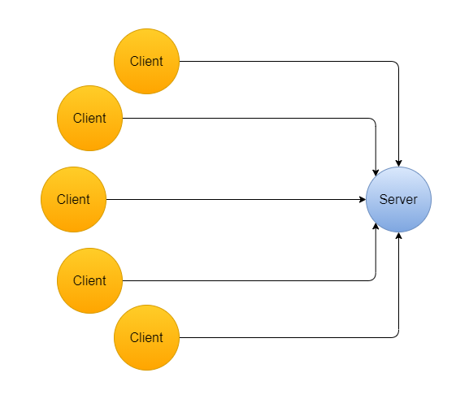
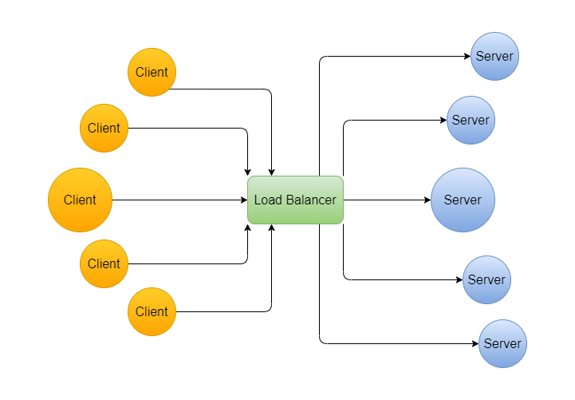

# Cân bằng tải

Cân bằng tải là yếu tố cần thiết để xây dựng các ứng dụng hiệu suất cao và dễ dàng mở rộng trong thiết kế hệ thống. Nó cũng là một câu hỏi phổ biến cho các cuộc phỏng vấn công nghệ về thiết kế hệ thống.

## Bộ cân bằng tải là gì?

Bộ cân bằng tải là một phần mềm hoặc một thiết bị phần cứng nằm giữa client và các server nhằm cân bằng khối lượng công việc trên các tài nguyên. Nó giúp server của chúng ta không bị quá tải và tăng lưu lượng của hệ thống.

## Tại sao chúng ta cần bộ cân bằng tải?

Khi sử dụng các dịch vụ web khác nhau trong đời sống thực, ta có thấy các dịch vụ này nhanh chóng đáp ứng các yêu cầu của chúng ta. Nhưng hầu hết chúng ta không biết về các tiến trình chạy ngầm và quy mô của hệ thống chịu trách nhiệm cung cấp các phản hồi nhanh chóng. Thực ra điều này liên quan đến việc phân bổ các yêu cầu trên một số server khi hàng nghìn người dùng yêu cầu dịch vụ đồng thời.

Khi tải trên các server tăng cùng với sự tăng trưởng lưu lượng truy cập, nó làm cho trang web chậm hơn để phục vụ yêu cầu của người dùng. Để cung cấp phản hồi nhanh chóng và đáng tin cậy, một ý tưởng sẽ là tăng số lượng server. Nhưng điều này mang đến một thách thức mới: làm thế nào để phân phối các yêu cầu trên nhiều server? Chúng ta có thể giải quyết vấn đề này bằng cách sử dụng ý tưởng về bộ cân bằng tải!

**Hãy hiểu nó từ một góc độ khác!**

Giả sử chúng ta có một số client gửi yêu cầu đến một server. Khi số lượng yêu cầu tăng lên đáng kể, server gặp phải tình trạng quá tải, dẫn đến hệ thống bị lỗi.

Sẽ có hai vấn đề quan trọng:
- **Quá tải server**: Luôn có một giới hạn cho các server để xử lý các yêu cầu. Khi số lượng yêu cầu không ngừng tăng lên, server có thể bị quá tải.
- **Single point of the failure**: Nếu một server gặp sự cố, toàn bộ ứng dụng sẽ không khả dụng cho người dùng trong một khoảng thời gian nhất định. Nó sẽ tạo ra trải nghiệm người dùng không tốt.

**Vậy chúng ta xử lý vấn đề trên như thế nào?**

Chúng ta có thể cố gắng mở rộng hệ thống của mình. Cách đầu tiên là mở rộng quy mô hệ thống của chúng ta theo chiều dọc hay tăng sức mạnh của server. Tức chúng ta sẽ cần làm rất nhiều thứ chỉ để tăng sức mạnh cho một cái máy. 

Một cách khác là mở rộng quy mô hệ thống theo chiều ngang bằng cách thêm nhiều máy vào hệ thống của chúng ta. Bây giờ để xử lý yêu cầu, chúng ta có thể thêm bộ cân bằng tải và phân phối yêu cầu trên nhiều server. Điều này cho phép các dịch vụ của chúng ta xử lý một số lượng lớn các yêu cầu bằng cách thêm nhiều server hơn.

Ngay cả khi một trong các server ngoại tuyến vì lý do nào đó, dịch vụ vẫn sẽ khả dụng. Nó liên tục kiểm tra tình trạng của các tài nguyên backend và ngăn chặn việc gửi lưu lượng đến các server không thể thực hiện yêu cầu nữa.

## Chúng ta có thể thêm bộ cân bằng tải ở đâu?

Chúng ta có thể thêm bộ cân bằng tải ở nhiều vị trí khác nhau trong hệ thống, đặc biệt là với nhiều tài nguyên như server, cơ sở dữ liệu hoặc bộ nhớ đệm.
- Giữa client và server.
- Giữa server và application server.
- Giữa ứng dụng và bộ nhớ đệm.
- Giữa bộ nhớ đệm và cơ sở dữ liệu.

## Các loại bộ cân bằng tải là gì?

Có thể có hai loại bộ cân bằng tải: **bộ cân bằng tải phần mềm** và **bộ cân bằng tải phần cứng**. Sự khác biệt chính giữa chúng là chúng ta có thể làm được nhiều việc hơn với bộ cân bằng tải phần mềm. Chúng ta có nhiều quyền hơn để tùy chỉnh và mở rộng quy mô với bộ cân bằng tải phần mềm. Với bộ cân bằng tải phần cứng, chúng ta bị giới hạn ở phần cứng mà chúng ta được cung cấp.

### Ưu và nhược điểm của bộ cân bằng tải phần mềm

* Linh hoạt trong việc điều chỉnh theo nhu cầu thay đổi.
* Có thể mở rộng quy mô vượt quá dung lượng ban đầu bằng cách thêm nhiều phiên bản phần mềm hơn.
* Chi phí thấp hơn so với mua và bảo trì phần cứng vật lý. Phần mềm có thể chạy trên bất kỳ thiết bị tiêu chuẩn nào, có xu hướng rẻ hơn.
* Nó có thể cho phép cân bằng tải dựa trên đám mây.
* Có thể có một số độ trễ khi mở rộng quy mô vượt quá dung lượng ban đầu trong khi chỉ định cấu hình phần mềm cân bằng tải.
* Sẽ có một số chi phí bổ sung cho các nâng cấp liên tục.

### Ví dụ về bộ cân bằng tải phần mềm

- HAProxy: Một bộ cân bằng tải TCP.
- NGINX: Một bộ cân bằng tải HTTP với hỗ trợ SSL.
- mod_athena: Bộ cân bằng tải HTTP dựa trên Apache.
- Varnish: Bộ cân bằng tải dựa trên proxy ngược.
- Balance: Bộ cân bằng tải TCP mã nguồn mở.
- LVS: Máy chủ ảo Linux cung cấp cân bằng tải lớp 4.

### Ưu và nhược điểm của bộ cân bằng tải phần cứng

* Cung cấp thông lượng nhanh do phần mềm chạy trên bộ vi xử lý chuyên dụng.
* Tăng cường bảo mật vì chỉ tổ chức mới có thể truy cập vật lý vào server.
* Cần thêm nhân lực có chuyên môn để cấu hình và quản lý máy móc.
* Nó không thể mở rộng khi số lượng yêu cầu vượt quá một giới hạn cụ thể.
* Nó đòi hỏi chi phí mua và bảo trì cao hơn.

### Ví dụ về bộ cân bằng tải phần cứng

- Bộ cân bằng tải F5 BIG-IP.
- Chất xúc tác hệ thống CISCO.
- Cân bằng tải Barracuda.
- Cân bằng tải Coytepoint.
- Citrix NetScaler.

## Ưu điểm của cân bằng tải

- Chúng ta sử dụng bộ cân bằng tải để có trải nghiệm người dùng tốt hơn và dịch vụ không bị gián đoạn bằng cách phân phối các yêu cầu của client đến một server khả dụng và sẵn sàng đáp ứng. Nói cách khác, nó đảm bảo tính khả dụng và khả năng mở rộng của ứng dụng.
- Nó ngăn chặn tình trạng quá tải của server và một điểm lỗi duy nhất. Nói cách khác, nó đảm bảo rằng không có server duy nhất nào chịu quá nhiều yêu cầu làm giảm hiệu suất tổng thể của ứng dụng.
- Nó cũng có thể cung cấp các chức năng như mã hóa, xác thực, v.v. để cung cấp một điểm kiểm soát duy nhất để bảo mật, quản lý và giám sát ứng dụng. Nó có thể bảo vệ hiệu quả khỏi cuộc tấn công DoS.
- Người dùng cuối chỉ cần biết địa chỉ của bộ cân bằng tải, không phải địa chỉ của mọi server trong cụm. Vì vậy, nó cũng cung cấp một lớp trừu tượng.
- Chúng ta có thể tung ra các bản cập nhật phần mềm mà không cần gỡ bỏ toàn bộ dịch vụ bằng cách sử dụng bộ cân bằng tải để lấy ra từng server tại một thời điểm.
- Nó giảm thiểu thời gian phản hồi của server và tối đa hóa thông lượng.
- Nó có thể kiểm tra và giám sát khả năng xử lý yêu cầu của các server.
- Dựa trên số lượng yêu cầu, nó có thể thêm hoặc bớt số lượng server.

## Các khái niệm quan trọng cần tìm hiểu thêm

- Sự khác biệt giữa Load Balancer và Reverse Proxy là gì?
- Các hạng mục Cân bằng tải khác nhau:
    1. Cân bằng tải lớp 4 (L4)
    2. Cân bằng tải lớp 7 (L7)
    3. Cân bằng tải server toàn cầu (GSLB)
- Tính năng kiểm tra tình trạng của bộ cân bằng tải.
- Cân bằng tải DNS so với Cân bằng tải phần cứng.
- Ứng dụng bộ cân bằng tải trong việc thiết kế một số hệ thống.
- Cân bằng tải đám mây.