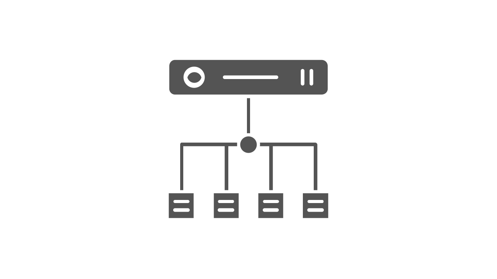

# Types of Load Balancing Algorithms

**Load Balancer** can receive and distribute requests to a particular server based on various load balancing techniques which use different load balancing algorithms to select servers based on a specific configuration. Load balancing algorithms are categorized into two parts:
- **Static algorithms**: It works in the same way regardless of the state of the backend serving the requests. It is simpler and more efficient to implement but can lead to uneven distribution of requests. Some examples of static load balancing algorithms are **Round robin, Weighted Round Robin, Source IP Hash, URL Hash, Randomized algorithm, etc.**
- **Dynamic algorithms**: It takes into account the state of the backend and considers server load when distributing requests. It requires communication between the load balancers and servers. So it would be a little complex but can distribute requests efficiently. Some examples of dynamic load balancing algorithms are the **Least connection method, Weighted least connections method, Least response time method, etc.**

## Round Robin Load Balancing

Round robin is one of the simplest load balancing algorithms, ensuring client requests to a different server based on a rotating list. Here load balancer maintains the list of available servers and directs the incoming request in a round-robin fashion: 1st request to the 1st server, 2nd request to the 2nd server, so on. When the load balancer reaches the end of the list, it goes to the list's beginning and starts from the first server again.
- Easy to implement.
- Evenly balances the traffic between the servers.
- Doesn't consider the server's load and specifications. So there is a risk that a server with low capacity receives many requests and becomes overloaded.
- Works best if every server in the load balancer list has roughly the exact specification.
- Otherwise, a low processing server may have the same load as a high processing serve

## Weighted Round Robin Balancing

The weighted round-robin load-balancing algorithm is an advanced version of the simple round-robin algorithm. It distributes the incoming request based on the weighted score of the servers. Here weight can be an integer that can vary according to the server's processing power or specification. So, It considers server specifications and distributes the traffic based on that.
- Little complex compared to a simple round-robin algorithm but works well with servers with different specifications.
- The current load of each server and the relative computation cost of each request are not considered.
- Based on the weighted score, some of the servers may get many requests of the overall request count.

## Random Load Balancing

This algorithm randomly maps requests to the server using some random number generator. Whenever a load balancer receives requests, a randomized algorithm distributes the requests evenly to the servers. So like Round Robin, this algorithm also works well for the group of servers with similar configurations.

## Source IP Hash Load Balancing

Here server is selected based on a unique hash key. It combines the source and destination IP address to generate a unique hash key and allocate the request to a particular server. The key can be regenerated if the session is broken and the client request is directed to the same server it was using previously. In other words, this is useful when a dropped connection needs to be returned to the same server initially handling it.

## URL Hash Load Balancing

Load balancer generates the hash value based on the URL present in requests coming from the clients. Based on hash value, requests will be forwarded to servers. The load balancer caches the hashed value of the URL, and subsequent requests that use the same URL make a cache hit and are forwarded to the same server.
- It improves the capacity of backend caches by avoiding cache duplication.
- This method is used when load-balanced servers serve mostly unique content per server. So, basically, what this means is that all requests related to one process will go to one server, say “running code,” and all requests related to another process, say “payments,” will go to another server, and so on…

## Least Connection Method

This algorithm considers the current load on a server and delivers better performance. Here load balancer sends requests to the server with the least number of active connections.
- The load balancer does additional calculations to figure out the server with the least number of connections.
- This algorithm is useful when there are many persistent connections in the traffic unevenly distributed between the servers. If the servers are busy in long computations, the connections between client and server stay alive for a long period of time.

## Weighted Least Connections Method

In weighted least connections, the load distribution is based on both the factors – the number of current and active connections to each server and the relative capacity of the server.
- Some servers can handle more connections than others
- Servers are rated based on their processing capabilities.

## Least Response Time Method

This algorithm is a little advanced form of the least connection method, where a request is forwarded to the server with the fewest active connections and the least average response time.
- It relies on the time taken by a server to respond to a health monitoring request.
- The speed of the response is an indicator of how loaded the server is.
- Also, consider the number of active connections on each server.
- The backend server that responds the fastest receives the subsequent request.

**Note**: The interesting thing about all this is that it might make sense to have multiple load balancers that use different server selection strategies in a system.
