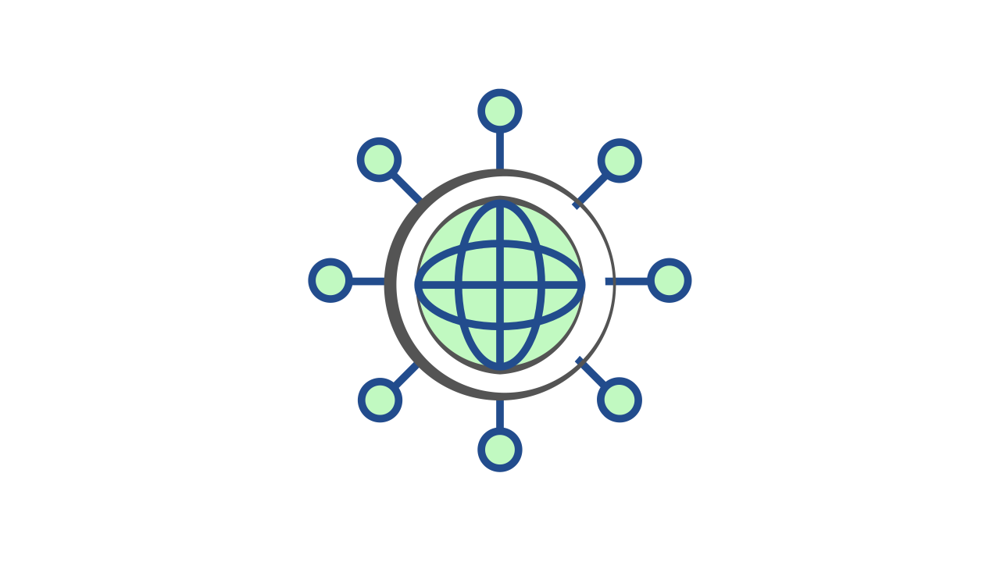
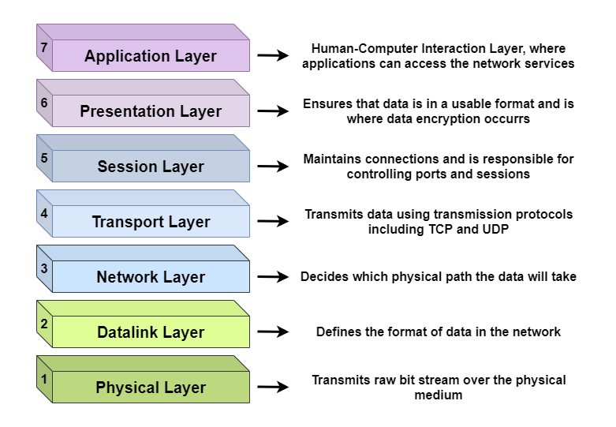
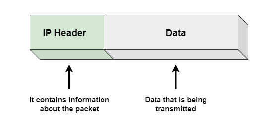
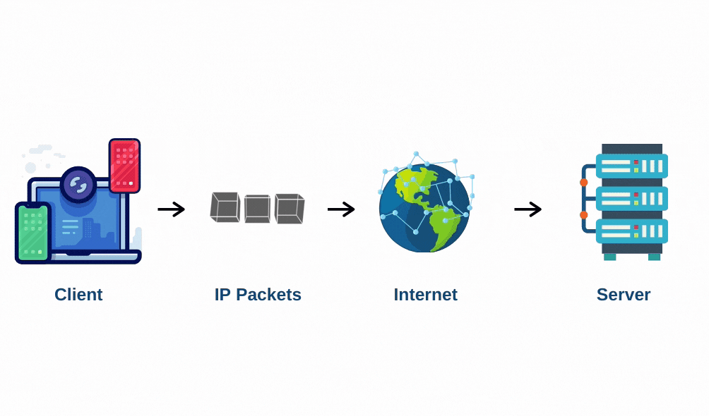
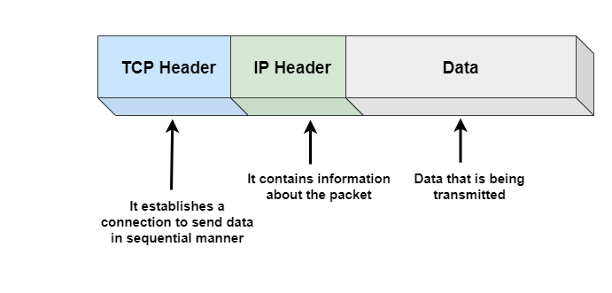

# Network Protocols

A network can be defined as a group of computers and other devices connected in some ways to exchange data. It is a group of computers that use standard communication protocols over digital interconnections to share resources.

## What are Network Protocols?

A network protocol is a defined set of rules that specify how data is transmitted on the same network between different devices. In general, it allows connected devices to interact with each other, irrespective of any variations in their internal processes, structure, or configuration.

## The OSI model

The **Open Systems Interconnection (OSI)** model describes seven layers that computer systems use to communicate over a network. Each layer represents a different category of networking functions.

These networking functions are made possible by protocols. For example, by indicating where data **packets** originate and their destination, the **Internet Protocol (IP)** is responsible for routing data. Internet Protocol allows for network-to-network communications. IP is, thus, considered a protocol of the network layer (**layer 3**). 

The **Transmission Control Protocol (TCP)** ensures, as another example, that the transport of data packets through networks goes smoothly. Thus, TCP is considered to be a transport layer (**layer 4**) protocol.

**Note**: A packet is a tiny segment of a large message. The data transmitted over networks of machines, such as the Internet, is split into packets. The computer or system that collects them then recombines these packets.

## Network Protocols

### Internet Protocols

The **Internet Protocol (IP)** is a network layer protocol or collection of rules that allow data packets to be routed and addressed to pass through networks and reach the correct destination. Modern Internet effectively runs on IP, or it follows the IP protocols.

When a machine or a client tries to interact with another machine or a server and sends data to other machines, it is sent in as an IP packet. IP packets are a fundamental unit of data sent from one machine to another, or we can say IP packets are the building blocks of communication between machines. It is usually made of up bytes. IP packets have two main sections, IP header, and data.

**IP address**: An IP address is a unique identifier assigned to a device or domain that connects to the Internet.

The image above shows a simple IP Packet. The **IP Header** contains essential information about the packet. Some of the information is:

1. It contains the source IP address of the packet.
2. It contains the destination IP address of the packet.
3. It also contains other information such as the packet's total size and the version of the IP that the IP packet is operating by (IPv4, IPv6, …).

### IPv4 vs. IPv6

**IPv4** was the first version of IP. It was deployed for production in the ARPANET in 1983. Today it is the most widely used IP version. It is used to identify devices on a network using an addressing system.

The **IPv4** uses a 32-bit address scheme to store 2³² addresses which is more than 4 billion addresses. To date, it is considered the primary Internet Protocol and carries 94% of Internet traffic. 

**IPv6** is the most recent version of the Internet Protocol. Internet Engineer Taskforce initiated it in early 1994. The design and development of that suite are now called IPv6.

This new IP address version is being deployed to fulfill the need for more Internet addresses. It was aimed to resolve issues that are associated with IPv4. With 128-bit address space, it allows 340 unique address spaces. **IPv6** is also called IPng (Internet Protocol next generation).

#### IP Packet Transfer

One IP Packet's size is significantly less, which is not enough to send large files such as images, emails, and other heavy information. So, it will not fit in one IP packet. So, we have to use multiple packets to send such data. In this case, there is a chance that all the packets may not reach the destination and get lost in the route. There may also be a problem in the ordering of packets.

### Transmission Control Protocols (TCP)

We need to address the issue mentioned above and establish a protocol to transmit large files with correct ordering. This is where **Transmission Control Protocol (TCP)** comes into play. **TCP** is a transport layer protocol built on top of the IP to solve the issues that we can face, as already mentioned.

The main idea behind the TCP is that when a machine wants to communicate with another machine over TCP, it will create a TCP connection with the destination server when a browser wants to communicate with a website’s server. The way this connection is established is what is called a handshake.

A handshake is a special TCP interaction where one machine contacts the other by sending a packet or few packets. A request message that says it wants to establish a connection to the other machine to which the other machine responds by sending a message if it accepts the connection request. Then the client responds again by sending a message saying that the  connection has been established (or cannot establish). Now that the connection is established, they can freely communicate with each other.

Transmission Control Protocol (TCP) is a more powerful and more functional wrapper around the Internet Protocol (IP). It still lacks a robust framework that developers can use to define meaningful and easy-to-use communication channels for clients and servers in a system.

### HyperText Transfer Protocol (HTTP)

**Hypertext transfer protocol** is built on top of TCP and provides a higher-level abstraction above TCP and IP. Its main characteristic is the request-response sequence. A request is sent by one machine, and a response needs to be returned by the other machine. For communication, most modern systems rely on the HTTP protocol.

While using HTTP, we don’t need to know about TCP and IP packets. It takes care of the developers of this complicated stuff connected to low-level machines. Some fundamental HTTP methods include Put, Get, Post, Delete. HTTP gives us the ability, rather than just data transfer, to incorporate business logic.

### The World Wide Web Consortium (W3C)

World Wide Web Consortium, or W3C, is a vendor-neutral organization created in 1994 that develops common, interoperable protocols for the World Wide Web (WWW).

### Principles of W3C Consortium

**Web for All**: The social value of the Web is that it enables human communication, commerce, and opportunities to share knowledge. One of W3C’s primary goals is to make these benefits available to all people, whatever their hardware, software, network infrastructure, native language, culture, geographical location, or physical or mental ability.

**Web on Everything**: The number of different kinds of devices that can access the Web has grown immensely. Mobile phones, smartphones, personal digital assistants, interactive television systems, voice response systems, kiosks, and even certain domestic appliances can all access the Web.

### Remote Procedure Call (RPC)

**Remote Procedure Call (RPC)** is a protocol that can be used by one program to request a service from a program on a network located on another device without having to understand the details of the network. It is an interprocess communication technique that is used for client-server-based applications. It is also known as a subroutine call or a
function call.

### RFC (Request for Comments)

RFC (stands for **Request For Comments**) is a document that describes the standards, protocols, and technologies of the Internet and TCP/IP.

It is the result of committee drafting and subsequent review by interested parties. Some RFCs are informational in nature. Of those intended to become Internet standards, the final version of the RFC becomes the standard, and no further comments or changes are permitted.