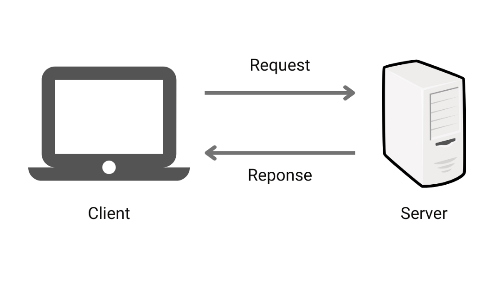
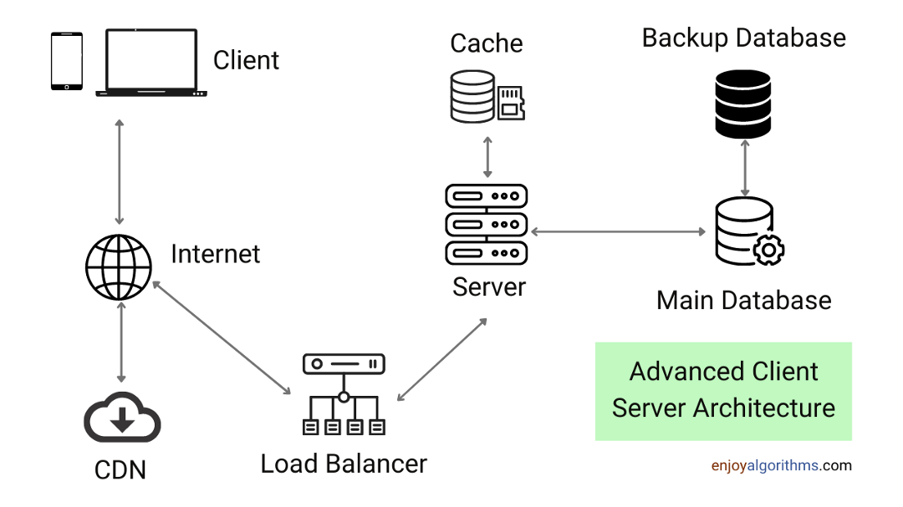
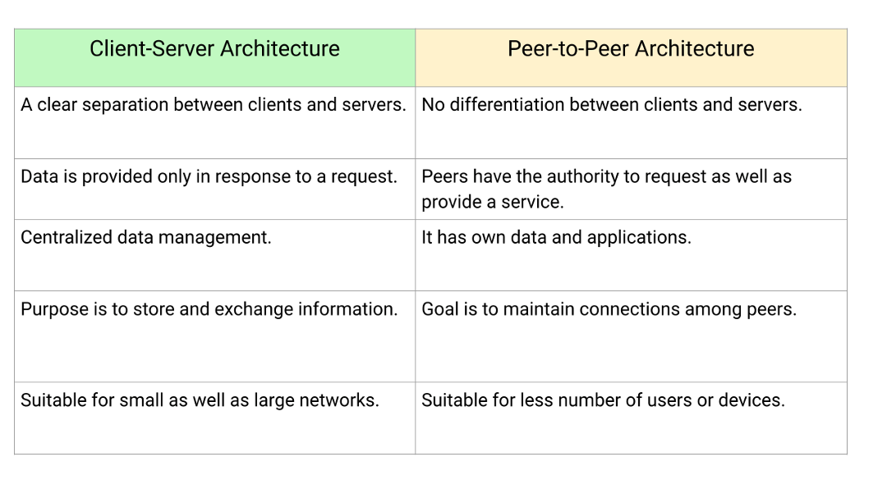

# Client Server Architecture

You all must be familiar with the internet. But have you ever thought of how your request fetches the desirable result? If you want to understand the idea, this blog is for you. Here we’ll discuss the concept behind the Client-Server Model and how it works. So let’s get started.

## What is Client-Server Architecture?

The client-server architecture is a distributed application framework consisting of clients and servers in which the server hosts, manages, and delivers the client’s services. Here clients are connected to a central server, and they communicate over a network or internet connection through a computer network. Whenever the client needs any service, it sends a request to the servers, which process the request and return the response to the client.

## Examples of Client-Server Architecture

**Healthcare application**: A client computer can be running an application to enter patient information. At the same time, a server computer can be running another code to retrieve and manage the database system where data is stored.

**Banking application**: When a bank customer accesses banking services with a web browser (the client), the client initiates a request to the webserver. The customer's login credentials may be stored in a database, and the webserver accesses the database server as a client. An application server interprets the returned data by applying the bank's business logic and providing the output to the webserver. Finally, the webserver returns the result to the client web browser for display.

Similarly, various applications such as email, the World Wide Web, and network printing use client-server architecture.

## Components of Client-Server Architecture

There are four components required in client-server architecture: Client, load balancer, servers, and network-layer protocols. Let’s discuss them in detail:
- **Server**: A software that receives and processes requests from clients. It usually operates on a remote machine and can be accessed by a user’s local computer or workstation. A client can use a server to share resources and distribute tasks. Example: Webserver 
- **Load balancer**: Responsible for distributing incoming requests across a group of servers to manage traffic and optimize resource usage.
- **Client**: A computer application that takes the input and sends requests to the servers. It runs on a user’s local computer/remote machines and connects to a server. They are software application that requests resources and services made available by a server. Example: Web browser
- **Network protocols**: The client-server model follows a request-response messaging pattern. It communicates using the typical TCP/IP protocol suite, which distributes the application data into packets that networks can deliver and manages flow control. Once a connection is established in TCP protocol, it is maintained until the client and server have completed the message exchange. While IP is a connectionless protocol in which each independent unit of data is unrelated to any other data units and travels through the internet.

## How does the Client-Server Model work?

The data flow is unidirectional, which forms a cycle. It is initiated when a client requests some data, and the server processes the request and sends some sort of data back to the client via a protocol. Clients cannot directly talk to each other. A topological data flow in a client-server architecture will look like this:
- Client requests data from the server
- The load balancer routes the request to the appropriate server
- The server processes the client request and queries an appropriate database for some data
- Database returns the queried data back to the server
- The server processes the data and sends data back to the client

To better understand the data flow in a client-server architecture, let’s explore how the browser (Client) interacts with the servers?

- A user enters the website URL
- The browser sends a request to the DNS server to look up the IP address of the webserver.
- DNS sends the IP address of the webserver to the browser
- Now browser sends an HTTP/HTTPS request to the IP address of the webserver.
- The web server sends back the necessary files for the website.
- Now browser renders the files and displays the website.

## Client-Server Architecture vs Peer-to-Peer Architecture

Here are some major differences between peer-to-peer and client-server architecture:

## Advantages of the Client-Server Model

**Centralized Management**: It is a centralized network of systems with all data in a single place, with complete leverage to control the processes and activities. One can easily share resources and data across various platforms, and users have the authority to access any file residing in the central storage at any time.

**Flexibility**: Since the data being passed between the client and server and the server’s services are entirely up to the programmer. So there could be several ways to use clientserver architecture to solve problems that may arise in the future. It can also be easy to combine with other types of architecture on the client or server sides.

**Extensibility**: The system can be updated based on changes in functional and nonfunctional requirements without altering the client-server architecture or disrupting service.

**Transparency**: Clients only make requests to the server with their input data, so they don’t see how the servers will handle the request. It may seem like a single, central server for a user only exists.

**Availability**: Most of the time, servers do not need to shut down or restart for a long duration. So server uptime is possible during maintenance with server duplication. On another side, there is a clear separation between clients and servers because clients are consumers, and servers are service providers. If several servers offer the same services, the system can still function if one or more servers fail.

**Scalability**: Capable of adding or removing servers in the network (Horizontal scaling) or migrating to larger and faster server machines (Vertical scaling).

**Some other benefits**
- Requires less maintenance cost, and data recovery is possible.
- Request allocation to servers is done by a load balancer, which can be easily configured to perform some set of tasks efficiently.
- Data transfer is platform-agnostic using client-server protocols.
- The capacity of the client and servers can be changed separately.

## Disadvantages of Client-Server Model

- There could be more chances of failure due to centralized control. Many clients can send simultaneous requests to the server (traffic congestion), which might overload the server and drastically slow down the performance. This could also lead to a server failure, in which case the whole system goes down, and the clients may not get any responses back.
- Servers are much more powerful than client computers, which means they are more expensive. It also needs some human resources with networking and infrastructure knowledge to manage the system.
- Vulnerable to Denial of Service (DOS) attacks because the number of servers is considerably smaller than the number of clients.
- Data packets may be modified during transmission, so the loss of helpful information can be also common.

## Use cases of the Client-Server Model

- The client-server architecture is suitable for applications that require separation of concerns between client and server and the ability of computer systems or software to exchange and make use of information.
- In systems that require functional separation, the client-server approach is utilized. Clients and servers each have their own set of responsibilities. Validation, like requests, might be handled and managed on the client side. The server, likewise, is in charge of executing the client’s request and returning the result. As a result, both the client and the server assist in implementing abstract functions without interfering with each other’s capabilities.
- Modern solutions have been created inside the client-server architecture to address scalability issues such as load balancing, sharding, and partitioning. Each layer can work more efficiently on a big scale, thanks to the separation of functionality.
