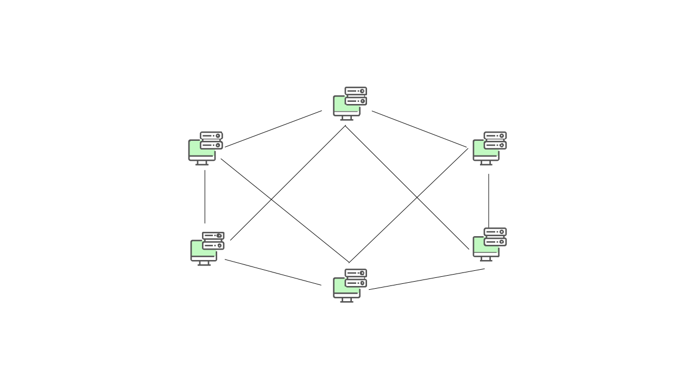
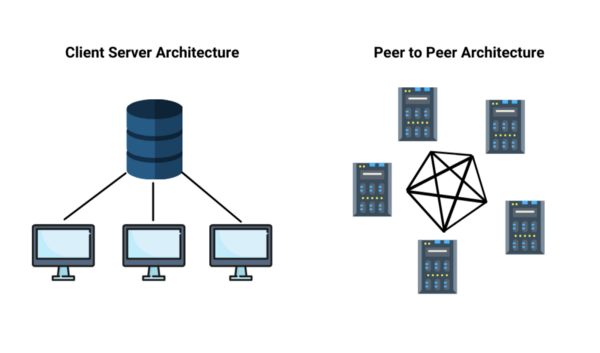

# Peer-to-Peer (P2P) Networks

## Introduce

In the common client-server architecture, multiple clients will communicate with a central server. A peer-to-peer (P2P) architecture consists of a decentralized network of peers, which are nodes that can act as both clients and servers. Without a central server's need, P2P networks distribute workload among peers, and all peers contribute and consume resources within the network.

## How Does P2P Network Work?

A peer-to-peer network does not have a dedicated server for user authentication. Since each computer is responsible for its own protection, a separate user account might be required for each computer that a user wants to access. Users usually save files on their own machines and are responsible for ensuring they are backed up properly. And the computer in a peer-to-peer network usually runs both client and server software. It can be used to make resources accessible to other users or access shared network resources.

Security is a major concern for peer-to-peer networks. Since access to data and resources is managed on each machine, each computer on this form may allow or deny access to other computers. For instance, users might share a folder on their computer containing payroll information, allowing other users to access the files in that folder. A single person doesn’t manage network administration because users can manage access to their computers' files and resources. Therefore, peer-to-peer networks are often used in small deployments and situations where security isn’t a major concern, such as home networks or small businesses.

## Applications of peer-to-peer architecture

P2P architecture works best when there are many active peers in an active network, so new peers joining the network can easily find other peers to connect to. There are enough remaining peers to take up the slack if many peers leave the network. There are fewer resources available overall if there are just a few peers. In a P2P file-sharing program, the more common a file is, the faster it can be downloaded because many peers share it.

The easiest way to do P2P work is to divide the workload into tiny bits that can be reassembled later. As a result, many peers will work on the same task simultaneously, and each peer has less work to do. A file can be broken down in P2P file-sharing so that a peer can download several chunks of the file from various peers simultaneously.

### Some uses of P2P architecture:
- File sharing
- Instant messaging
- Voice Communication
- Collaboration
- High Performance

### Computing Some examples of P2P architecture:
- **Napster**: It was shut down in 2001 since they used a centralized tracking server.
- **BitTorrent**: It is a popular P2P file-sharing protocol, usually associated with piracy.
- **Skype**: It is used to use proprietary hybrid P2P protocol, now uses the client-server model after Microsoft’s acquisition.
- **Bitcoin**: It is a P2P cryptocurrency without a central monetary authority.

## Types of peer-to-peer network

There are three different types of P2P networks:
- Unstructured P2P networks
- Structured P2P networks
- Hybrid P2P networks

### Unstructured P2P networks

The nodes in unstructured P2P networks are not arranged in any particular order. This implies that node-to-node communication is random in nature. As a result, unstructured P2P networks are better suited for high-activity activities. For instance, people can choose to leave or enter the network regularly, so a social platform driven by P2P can take advantage of it.

Unstructured P2P networks, on the other hand, have a disadvantage in that they need a significant amount of CPU and memory to function properly. The hardware should be able to support the maximum number of network transactions, which ensures that all nodes should be able to communicate with each other at any given time.

### Structured P2P networks

Structured peer-to-peer networks are the exact opposite of unstructured peer-to-peer networks. Here, the nodes do have a way to interact with each other. This is possible thanks to a well-organized architecture that allows users to find and use files more effectively rather than searching randomly. Hash functions are used for database lookups in these types of organized P2P networks.

Structured peer-to-peer networks are inarguably more effective. They do, however, have some centralization because they use organized architecture. It also means that they
would cost more to maintain and set up. Finally, it is more stable than an unstructured P2P network.

### Hybrid P2P networks

Hybrid peer-to-peer networks combine the peer-to-peer architecture with the clientserver model. This is beneficial for networks that need a central server with P2P capabilities. 

Structured and unstructured P2P networks are less effective than hybrid P2P networks. Other main benefits include a more strategic approach, increased performance, and more!

## Advantages of Peer to Peer Networks

P2P networks have many advantages. This form of network, for example, can be more cost-effective since there is no central server to manage and pay for (apart from monitoring servers). As a result, there is no need for a network operating system, further reducing costs.

Another advantage would be that there is no single point of failure unless the network is minimal in the improbable case. Changes in peers do not affect P2P networks; if one peer
leaves, the overall network is unaffected. 

When a large number of peers enter the network simultaneously, the network can easily manage the increased load. Due to their decentralized nature, P2P networks can survive attacks fairly well since no centralized server exists.

To summarise, some features of peer to peer network are:
1. No single point of failure. If the service hosting your content goes down, all your data is likely to get erased. But with P2P, that doesn’t happen.
2. Scalable bandwidth & storage. Unlimited & Automatic; It’s a distributed decentralized architecture; Nodes get added as more & more people interact with your data.
3. It has zero data storage and bandwidth costs; therefore, we don’t have to shell out money to corporations for storing our data.
4. There is no third-party intervention; data is secure. We can share only with friends we intend to share with.
5. It’s an open neutral platform with all the nodes having equal privileges, ensuring no corporate intervention and control of our data in our hands.

## Disadvantages of Peer to Peer Networks

P2P networks raise several security issues. If one peer becomes infected with a virus and uploads a snippet of the virus-infected file, the virus spreads easily to other peers.Furthermore, if a peer shares a sensitive file, it can be difficult to ensure that they have the correct permissions to access the network if there are several peers in the network.

Many users of P2P networks make use of resources exchanged by other nodes but do not share anything themselves. Leechers are the term for these types of free-riders. Although being difficult to shut down is a benefit, it can also be a drawback if used to promote illegal or unethical activities.

Furthermore, because of the widespread use of mobile devices, many businesses have switched to different architectures. With many people using mobile devices that are not always on, it can be difficult for users to contribute to the network without draining battery life and using up mobile data.

Some other drawbacks of the P2P network are:
1. Though P2P file transfer is getting safer over time with encryption & stuff still malware can be bundled with the files we download and can spread through our device.
2. Copyrighted content can be easily distributed; there is no control over it.
3. If all the nodes are offline, our data becomes unavailable.
