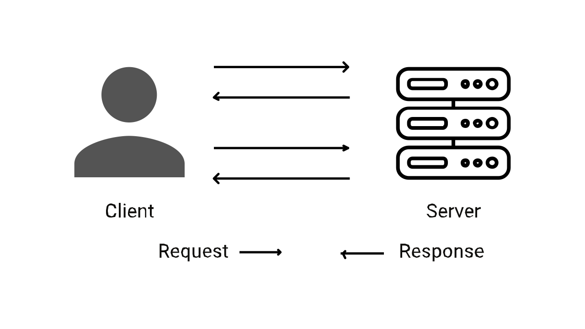

# Long Polling

Bất cứ khi nào ta xây dựng một ứng dụng web xử lý vời thời gian thực, ta cần xem xét việc truyền tải dữ liệu đến client. Và trong khi xây dựng một kiểu ứng dụng web, chúng cần đến cơ chế phân phối tốt nhất, đúng không! Trong bài viết này, ta sẽ tập trung vào Long Polling, và ở đây, ta sẽ có được cái nhìn tổng quan hoàn chỉnh để hiểu các hoạt động và các tính năng bên trong nó. Ok bây giờ bắt đầu thôi.

## Long Polling là gì?

Trước tiên ta phải hiểu polling là gì và rồi mở rộng xem long polling là gì.

Polling là một kỹ thuật cho phép các server đẩy thông tin đến một client. Long polling là một phiên bản của polling truyền thống cho phép server gửi dữ liệu đến một client bất cứ khi nào khả dung. Nó đòi hỏi client gửi yêu cầu đến server theo cùng một cách là polling tiêu chuẩn, 