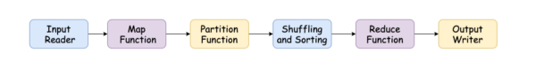
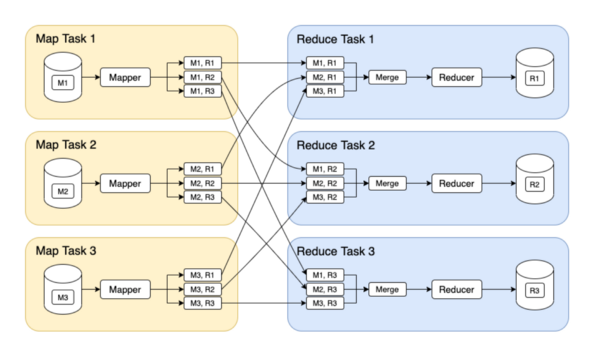

# MapReduce in Hadoop: System Design Concept

## What is Map Reduce?

MapReduce is a batch processing programming paradigm that enables massive scalability across a large number of servers in a Hadoop cluster. It was published in 2004 and was called “the algorithm that makes Google so massively scalable.” MapReduce is a relatively low-level programming model compared to the parallel processing systems developed for data warehouses many years previously. However, it was a significant step forward in terms of the processing scale that could be achieved on commodity hardware.
- “MapReduce” refers to two distinct tasks, i.e., Map and Reduce, that Hadoop programs perform.
- The mapper’s job is to take a data set and convert it into key/value pairs.
- The reducer job takes the output from a mapping job as input and combines those data tuples into a smaller set of tuples.

## MapReduce Dataflow

MapReduce is used to work with a massive amount of data. The data flows through various phases to handle the data in a parallel and distributed form. The phases of MapReduce dataflow are:



**Input Reader**: It reads the incoming data, splits it into the data blocks, and associates each data block with a Map function. It reads the files stored in HDFS and generates the corresponding key-value pairs.

**Map Function**: It takes a series of key/value pairs, processes each, and generates zero or more output key/value pairs. The mapped input and output types may be different from each other.

**Partition Function**: It assigns the output of each map function to the appropriate reducer for sharding purposes and returns the reducer’s index.

**Shuffling and Sorting**: The data move out from the map, shuffle between/within nodes, and a sorting operation is performed on that data. The data is compared using a comparison function and arranged in a sorted form.

**Reduce Function**: For each unique key stored in sorted order, the framework calls the reduce function. The values associated with the keys can iterate the reduce and generate the corresponding output.

**Output Writer**: It writes the output of the reduce function to the storage.



The above figure shows the data flow in a Hadoop MapReduce job. Its parallelization is based on partitioning, where the input to a job is the directory in HDFS. Each file within the input directory is considered a separate partition that can be processed by a separate map task (marked by M1, M2, and M3).
- Each input file is consists of hundreds of megabytes in size. The MapReduce scheduler tries to run each mapper on one machine that stores a replica of the input file. It starts the map task and begins reading the input file by passing one record at a time to the mapper callback. The output of the mapper consists of key-value pairs.
- The number of input file blocks determines the number of map tasks, while the reduced tasks depend on the job author. The framework uses a hash of the key to ensuring that all key-value pairs with the same key end up at the same reducer.
- The key-value pairs must be sorted, and the sorting is performed in stages where each map task partitions its output based on the key’s hash, and each of these partitions is written to a sorted file on the mapper’s local disk.
- Whenever a mapper finishes its job, the MapReduce scheduler notifies the reducers that they can start fetching the output files from that mapper. The reducers connect to each of the mappers, take the files, and merge them by preserving the sort order.
- The reducer is called with a key and an iterator that incrementally scans overall records with the same key. The reducer processes these records and generates output records written to a file on the distributed filesystem.

## How does MapReduce Work?

MapReduce works by dividing the job into two tasks. However, the complete execution process is controlled by two types of entities:
1. Jobtracker: Acts like a master
2. Multiple Task Trackers: Acts like slaves

For every submitted job, there is one Jobtracker that resides on Namenode, and there are multiple task trackers that reside on Datanode.
A job is divided into multiple tasks, then run onto multiple data nodes in a cluster. The task tracker looks into the execution of individual tasks, and its responsibility is to send the progress report to the job tracker. In addition, the task tracker periodically sends a heartbeat signal to the Jobtracker to notify it regarding the current state of the system. In the case of task failure, the job tracker can reschedule it on a different task tracker.

**Example**

Let’s look at how to count the number of words using MapReduce. It reads text files and counts the frequency of each word. Here the input and the output are text files, and each mapper takes a line as input and breaks it into words. It outputs a key/value pair of the word, and each reducer sums the counts for each word and emits a single key/value with the word and sum.

The code for the mapper is stored in **mapper.py**

```py
import sys
for line in sys.stdin:
    line = line.strip() # remove whitespace(leading/trailing)
    words = line.split() # split the line into words
    for word in words:
        print ('%s\t%s' % (word, 1))
```

The code for the reducer is stored in **reducer.py**

```py
import sys
cur_word = None
cur_count = 0
word = None
for line in sys.stdin:
    line = line.strip() # remove whitespace(leading/trailing)
    word, count = line.split('\t', 1) # parse the mapper.py
    if cur_word == word:
        cur_count += count
    else:
        if cur_word:
            print ('%s\t%s' % (cur_word, cur_count))
        cur_count = count
        cur_word = word
if cur_word == word:
    print ('%s\t%s' % (cur_word, cur_count))
```

The above program can be run using `cat word_count.txt | python mapper.py | sort - k1,1 | python reducer.py`

## Use Case of MapReduce

1. MapReduce is helpful in a wide range of applications such as distributed patternbased searching, distributed sorting, web link-graph reversal.
2. MapReduce model is also used in several computing environments like multi-core systems, desktop grids, multi-cluster, volunteer computing environments, dynamic cloud environments, mobile environments, and high-performance computing environments.
3. MapReduce is also used to regenerate Google’s index of the World Wide Web completely. It replaced the old programs that updated the index and ran the various analyses.

## Conclusion

MapReduce programming offers several benefits in the big data paradigm. It allows businesses to process petabytes of data stored in the HDFS and enables more accessible access to multiple data sources and multiple data types. With parallel processing and minimal data movement, it offers fast processing of massive amounts of data. And above all, it is straightforward and allows developers to write code in a choice of languages, including Java, C++, and Python.