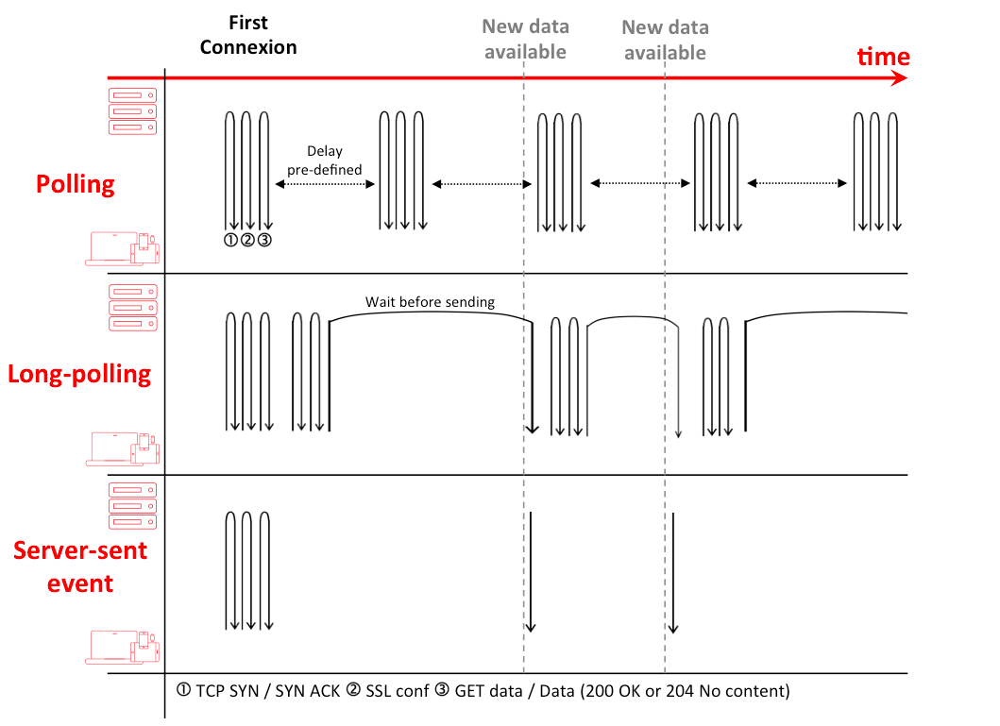
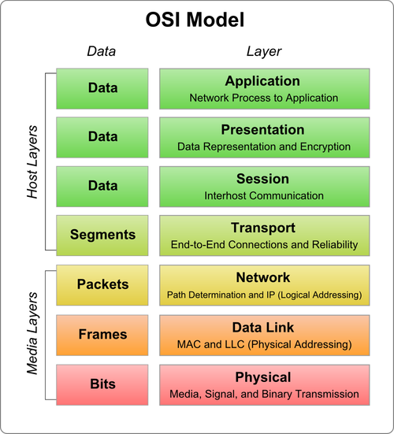
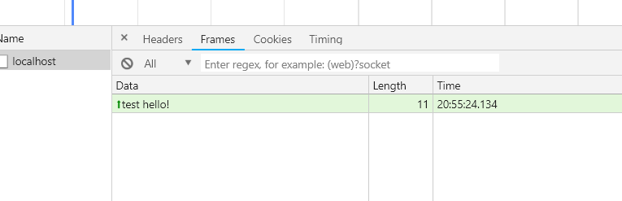
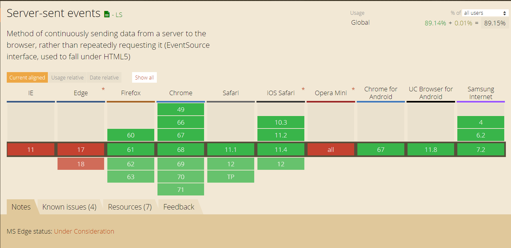

# System Design Concepts - Polling vs SSE vs WebSocket

Building a real-time web application is a bit challenging one, where we need to consider how we are going to send our data from the server to the client. Technologies that enable this “proactively” have been around for quite some time and are limited to two general approaches: client pull or server push.

A few ways to implement these:

- Long/short polling (client pull)
- WebSockets (server push)
- Server-Sent Events (server push)

*Client pull — client* asking server for updates at certain regular intervals

*Server push — server* is proactively pushing updates to the client (reverse of client pull)



Let’s take a simple use case to compare the above technologies and choose the right one.

## Example:

Our example use case is very simple. We need to develop a dashboard web app that streams list of activities from websites like (GitHub/Twitter/..etc). The purpose of this app is to choose the right one among the various methods listed previously.

## 1. Using Polling:

Polling is a technique by which the client asking the server for new data regularly. We can do polling in two ways: Short Polling and Long Polling. In simple terms, Short polling is an AJAX-based timer that calls at fixed delays whereas Long polling is based on Comet (i.e server will send data to the client when the server event happens with no delay). Both have pros and cons and suited based on the use case. For in-depth details, read the answers given by the StackOverflow community.

Let’s see how a simple client-side long polling snippet might look like:

```js
/* Client - subscribing to the github events */
subscribe: (callback) => {
    const pollUserEvents = () => {
        $.ajax({
            method: 'GET',
            url: 'http://localhost:8080/githubEvents', 
            success: (data) => {
                callback(data) // process the data
            },
            complete: () => {
                pollUserEvents();
            },
            timeout: 30000
        })
    }
    pollUserEvents()
}
```

This is basically a long polling function that runs the first time as usual but it sets up the thirty (30) second timeout and after each Async Ajax call to the server, the callback calls Ajax again.

AJAX calls work on the HTTP protocol meaning requests to the same domain should get multiplexed by default. There are a few pitfalls we found with this approach.

- Multiplexing (Polling responses can’t really be in sync)
- Polling requiring 3 round-trips (TCP SIN, SSL, and Data)
- Timeouts (Connection getting closed by the proxy server if it remains idle for too long)

## 2. Using WebSockets:

A WebSocket is nothing but a persistent connection between the client and the server. This is a communications protocol providing full-duplex communication channels over a single TCP connection.

RFC 6455 states that WebSocket *“is designed to work over HTTP ports 80 and 443 as well as to support HTTP proxies and intermediaries”* thus making it compatible with the HTTP protocol. To achieve compatibility, the WebSocket handshake uses the HTTP Upgrade header to change from the HTTP protocol to the WebSocket protocol. Both HTTP and WebSockets are located at the application layer from the OSI model and as such depend on TCP at layer 4.



There is an MDN doc that explains WebSocket in detail and I encourage you to read it as well.

Let’s see how a very simple WebSocket client-side implementation might look like:

```js
$(function () {
  // if user is running mozilla then use it's built-in WebSocket
  window.WebSocket = window.WebSocket || window.MozWebSocket;

  const connection = new WebSocket('ws://localhost:8080/githubEvents');

  connection.onopen = function () {
    // connection is opened and ready to use
  };

  connection.onerror = function (error) {
    // an error occurred when sending/receiving data
  };

  connection.onmessage = function (message) {
    // try to decode json (I assume that each message
    // from server is json)
    try {
      const githubEvent = JSON.parse(message.data); // display to the user appropriately
    } catch (e) {
      console.log('This doesn\'t look like a valid JSON: '+ message.data);
      return;
    }
    // handle incoming message
  };
});
```

If the server supports the WebSocket protocol, it will agree to the upgrade and will communicate this through the Upgrade header in the response.

Let’s see how this can be implemented in Node.JS (Server):

```js
const express = require('express');
const events = require('./events');
const path = require('path');

const app = express();

const port = process.env.PORT || 5001;

const expressWs = require('express-ws')(app);

app.get('/', function(req, res) {
	res.sendFile(path.join(__dirname + '/static/index.html'));
});

app.ws('/', function(ws, req) {
	const githubEvent = {}; // sample github Event from Github event API https://api.github.com/events
	ws.send('message', githubEvent);
});

app.listen(port, function() {
	console.log('Listening on', port);
});
```

Once we get the data from the GitHub event APIs we can stream it to the client once the connection is established. There are a few pitfalls with this approach too for our scenario.

- With WebSockets, we need to handle lots of problems that are taken care of in HTTP on their own.
- WebSocket is a different protocol for delivering data, it’s not automatically multiplexed over HTTP/2 connections. Implementing custom multiplexing both on the server and the client is bit complicated.
- WebSockets are frame-based and not stream-based. When we open the network tab. You can see the WebSocket messages are listed underframes.



## 3. Using SSE:

SSE is a mechanism that allows the server to asynchronously push the data to the client once the client-server connection is established. The server can then decide to send data whenever a new “chunk” of data is available. It can be considered as a one-way publish-subscribe model.

It also offers a standard JavaScript client API named EventSource implemented in most modern browsers as part of the HTML5 standard by W3C. Polyfills are available for browsers that do not support EventSource API.



We can see that Edge and Opera Mini are lagging behind this implementation, the most important case for SSE is made for mobile browser devices where these browsers have no viable market share. Yaffle is a well known pollyfill for Event Source.

Since SSE is based on HTTP, it has a natural fit with HTTP/2 and can be combined to get the best of both: HTTP/2 handling an efficient transport layer based on multiplexed streams and SSE providing the API up to the applications to enable push. So Getting multiplexing over HTTP/2 out of the box. The client and server are informed when the connection drops. Maintaining unique Id with messages the server can see that the client missed n number of messages and send the backlog of missed messages on reconnect.

Let’s see how a sample client-side implementation might look like:

```js
const evtSource = new EventSource('/events');

evtSource.addEventListener('event', function(evt) {
    const data = JSON.parse(evt.data);
    // Use data here
},false);
```

This snippet is fairly simple. It connects to our source and waits to receive messages. Now the sample NodeJS server will look something like this.

```js
// events.js
const EventEmitter = require('eventemitter3');
const emitter = new EventEmitter();

function subscribe(req, res) {

	res.writeHead(200, {
		'Content-Type': 'text/event-stream',
		'Cache-Control': 'no-cache',
		Connection: 'keep-alive'
	});

	// Heartbeat
	const nln = function() {
		res.write('\n');
	};
	const hbt = setInterval(nln, 15000);

	const onEvent = function(data) {
		res.write('retry: 500\n');
		res.write(`event: event\n`);
		res.write(`data: ${JSON.stringify(data)}\n\n`);
	};

	emitter.on('event', onEvent);

	// Clear heartbeat and listener
	req.on('close', function() {
		clearInterval(hbt);
		emitter.removeListener('event', onEvent);
	});
}

function publish(eventData) {
  // Emit events here recieved from Github/Twitter APIs
	emitter.emit('event', eventData);
}

module.exports = {
	subscribe, // Sending event data to the clients 
	publish // Emiting events from streaming servers
};

// App.js
const express = require('express');
const events = require('./events');
const port = process.env.PORT || 5001;
const app = express();

app.get('/events', cors(), events.subscribe);

app.listen(port, function() {
   console.log('Listening on', port);
});
```

The main benefits we get from this approach are:

- Simpler implementation and Data efficiency
- It is automatically multiplexed over HTTP/2 out of the box
- Limits the number of connections for data on the client to one

### How to choose among SSE, WebSocket and Polling?

After the long and exhaustive client and server implementations, it looks like SSE is the final answer to our problem for data delivery. There are some issues with it as well but it can be solved.

A few simple examples of applications that could make use of Server-Sent Events:

* A real-time chart of streaming stock prices
* Real-time news coverage of an important event (posting links, tweets, and images)
* A live Github / Twitter dashboard wall fed by Twitter’s streaming API
* A monitor for server statistics like uptime, health, and running processes.

However, SSE is not just a viable alternative to the other methods for delivering fast updates. Each one dominates over others in a few specific scenarios like in our case where SSE proved to be an ideal solution. Consider a scenario like MMO (*Massive Multiplayer Online*) Games that need a huge amount of messages from both ends of the connection. In such a case, WebSockets dominates SSE.

If your use case requires displaying real-time market news, market data, chat applications, etc., like in our case relying on HTTP/2 + SSE will provide you with an efficient bi-directional communication channel while reaping the benefits from staying in the HTTP world.