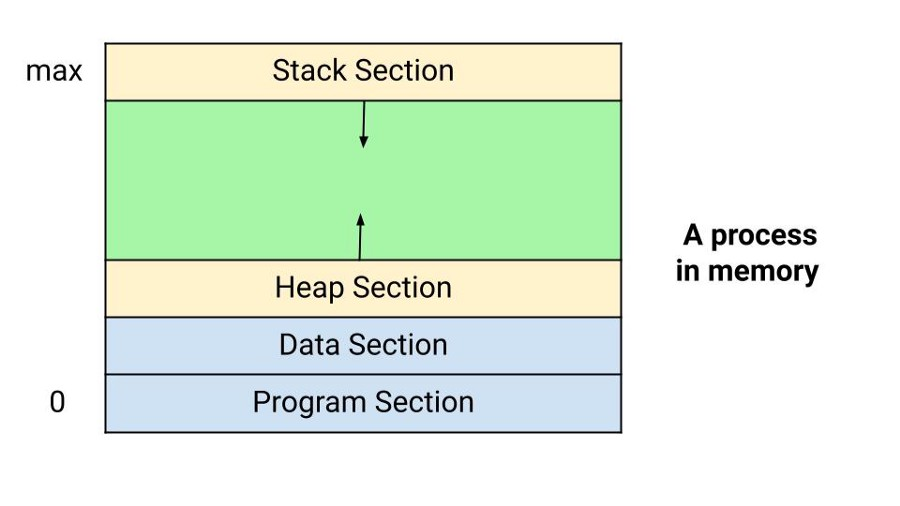
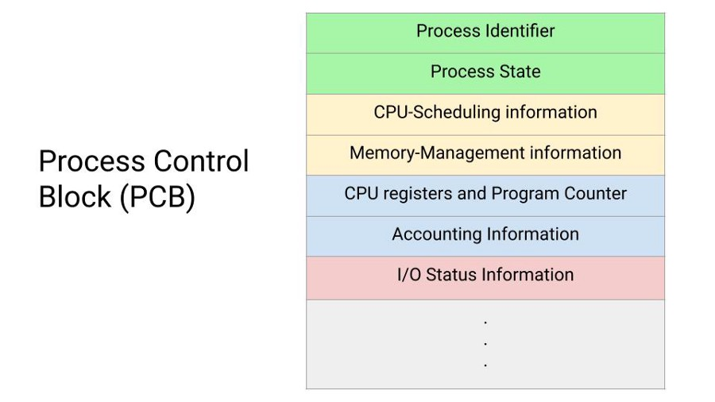
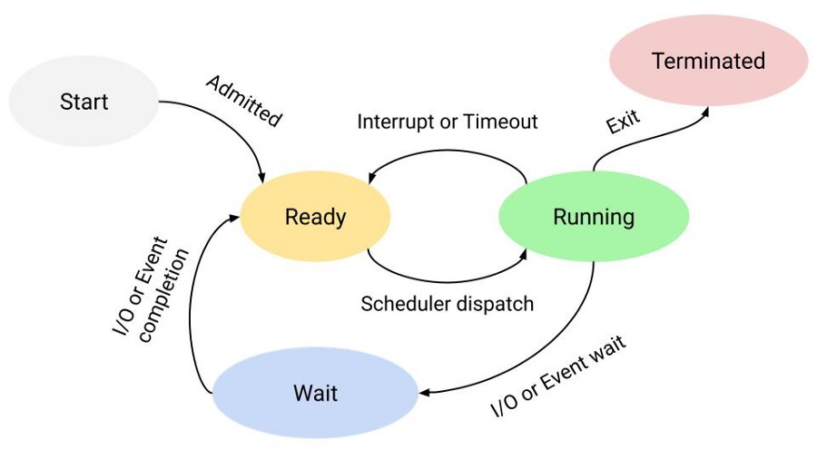
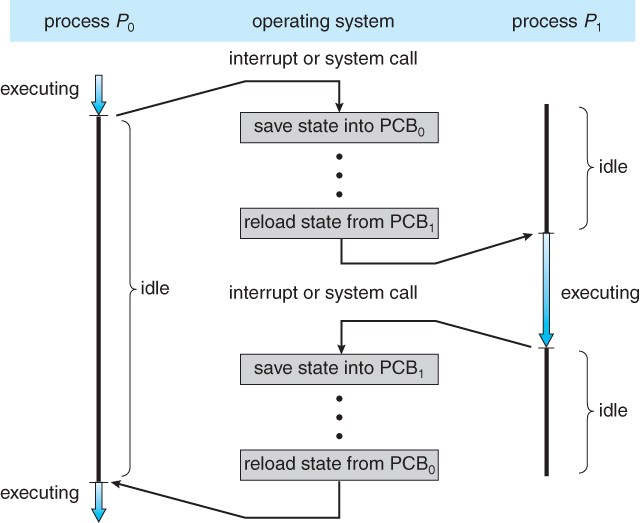
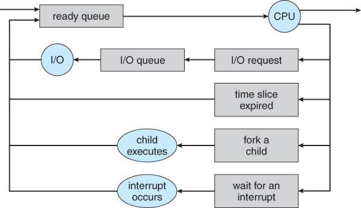

# Process Management in Operating System (OS)

IIn this blog, we will learn about process management in the Operating System and various Algorithms and interesting facts related to it. Before actually looking into process management and how it works, let's start with the definition and various aspects of a process.

Most simply, a program in execution is called a **process**. In other words, it is an instance of a program that actually runs, i.e., an entity that can be assigned and executed on a processor. Two essential elements of a process are program code and a set of data associated with that code. 

**Process memory** is divided into four sections:
The program memory stores the compiled program code, read in from non-volatile storage when the program is launched.

The data section stores global and static variables, allocated and initialized before executing the main program.

The heap section is used to manage dynamic memory allocation inside our program. In other words, it is the portion of memory where dynamically allocated memory resides i.e., memory allocation via new or malloc and memory deallocation via, delete or free, etc.

The stack section stores local variables defined inside our program or function. Stack space is created for local variables when they are declared, and the space is freed up when they go out of scope.

**Note**: stack and the heap start at opposite ends of the process's free space and grow towards each other. A stack overflow error will occur if they meet, or a call to new memory allocation will fail due to insufficient memory available in a heap section.

## Process Control Block (PCB)

A program executing as a process is uniquely determined by various parameters. These parameters are stored in a Process Control Block (PCB) for each process. It is a data structure, which stores the following information:
- **Identifier or Process Id**: A unique identifier or id associated with every process to distinguish it from other processes.
- **Process State**: It can be ready, running, halted, completed, etc.
- **CPU-Scheduling information**: priority level relative to the other processes and pointers to scheduling queues.
- **CPU registers and Program Counter**: These need to be saved and restored when swapping processes in and out of the CPU.
- **I/O status information**: Includes outstanding I/O requests, I/O devices (e.g., disk drives) assigned to this process, and a list of files in use by the process.
- **Memory-Management information**: page tables or segment tables.
- **Accounting information**: user and kernel CPU time consumed, account numbers, limits, etc.

## States of a Process in Operating System

Now, we understood the process, where we defined one parameter of a process called State. Processes in the operating system can be in any of the five states: start, ready, running, wait, and terminated.

Let's understand these states and transition from one state to another state:
- **Null -> Start state**: When a new process is created, it is said that the process is initiated or a process from the NULL state has come to a new state.
- **Start state -> Ready state**: The OS then moves a process from the New state to the Ready state when it is prepared to take on an additional process. At this stage, The process has all the resources available that it needs to run and waiting to get the CPU time for its execution.
- **Ready state -> Running state**: At this transition, the OS chooses one of the processes from the Ready state using the process scheduler or dispatcher. After this, the CPU starts executing the selected process in the running state.
- **Running state -> Terminated state**: The currently running process is terminated by the OS if the process indicates that it has been completed.
- **Running state -> Ready state**: The scheduler sets a specific time limit for executing any active process. But if the current process takes more time specified by the scheduler, it pushes it to the ready state again. The most typical reason for this transition is that it has achieved its maximum permissible period for uninterrupted execution. Almost all multiprogramming operating systems enforce this time
constraint.
- **Running state -> Wait state**: If a process wants anything for which it must wait, it is placed in the waiting state. The process cannot run now because it is waiting for some resource to become available or for some event to occur. For example, the process may be waiting for keyboard input, disk access request, inter-process messages, a timer to go off, or a child process to finish.
- **Wait state -> Ready state**: When the event for which it has been waiting occurs, a process in the Waiting state is transferred to the Ready state.

**Note**: Some systems may have other states besides the ones listed here. Explore and think!

## Execution of a process in an Operating System

The operating system executes various activities in creating a process, which uses a process control block (PCB) to track the execution status of each process.
- To keep track of all processes, it assigns a process ID (PID) to each process to identify it uniquely. As discussed above, it also stores several other critical details in the process control block (PCB).
- The operating system updates information in the process’s PCB as the process transitions from one state to another.
- To access the PCB frequently, the operating system keeps pointers to each process’s PCB in a process table.

## Process Schedulers in Operating System

Process scheduling is critical for selecting and removing the running process based on a particular strategy or algorithm. The main objectives of the process scheduling are to keep the CPU busy and deliver "acceptable" response times for all programs. Multiprogramming operating systems allow more than one process to be loaded into the executable memory at a time, and the loaded process shares the CPU using time multiplexing.

The operating system has three types of process schedulers for process scheduling. 

**Long Term or job scheduler**: This scheduler's job is to bring the new process to the Ready state. It determines which process is assigned to the CPU for processing, selects processes from the queue, and loads them into memory for execution.
    
    The primary objective of the job scheduler is to provide a balanced mix of jobs (such as I/O bound and processor bound) and control the degree of multiprogramming. It is a heavily loaded system, which can afford to take the time to implement intelligent and advanced scheduling algorithms.

**Short-term or CPU scheduler:** It is in charge of selecting one process from the ready state and scheduling it to the running state. They are also known as Dispatchers.
    - The CPU scheduler is responsible for ensuring no starvation due to high burst time processes.
    - It runs very frequently and quickly swaps one process from the running state to the ready state

**Medium-term scheduler**: It is in charge of swapping the processes when a particular process is performing an I/O operation. If a running process makes an I/O request, it may be suspended. A process that has been suspended cannot make any progress toward completion. The suspended process is transferred to secondary storage in this situation to remove it from memory and make room for other processes. This is known as switching, and the procedure is referred to as being switched out or rolled out.

## CPU Scheduling in Operating System

Now our next aim would be to understand the concept of CPU Scheduling and why do we need it. I/O and CPU time are both used in a typical procedure. Time spent waiting for I/O in an old operating system like MS-DOS is wasted, and the CPU is free during this time. One process can use the CPU while another waits for I/O in multiprogramming operating systems. Only process scheduling allows for this. CPU Scheduling is the process of determining which process will have exclusive use of the CPU while another is paused. The basic goal of CPU scheduling is to ensure that whenever the CPU is idle, the OS chooses at least one of the programs in the ready queue to run. The CPU scheduler will be in charge of the selection process. It chooses from among the processes in memory that are ready to run.

### Types of CPU Scheduling

There are two major Kinds Of CPU Scheduling:
1. **Preemptive Scheduling**: Tasks are generally assigned with their priorities in Preemptive Scheduling. Even if the lower priority activity is still running, it is sometimes necessary to run a higher priority task before a lower priority task. The lower priority task is put on hold for a while and then resumes when the higher priority task is completed.
2. **Non-Preemptive Scheduling**: The CPU has been assigned to a certain process in this scheduling mechanism. The process that keeps the CPU occupied will either switch context or terminate to relieve the CPU. It’s the only method that works across a variety of hardware platforms. That’s because, unlike preemptive scheduling, it doesn’t require any particular hardware like timers.

### Differences between Preemptive and Non-Preemptive Scheduling

1. In Pre-emptive the memory allocated in the main memory of the CPU is for a limited time, it may be assigned to any other process depending on the state of the current process or priority of the new incoming process. Whereas in Non-Preemptive the memory is allocated to the same process until it is completed.
2. In Preemptive Scheduling, if high priority processes keep on coming that low priority process will remain interrupted for an indefinite time whereas in NonPreemptive Scheduling if any large process is processing it will keep on processing and will not allow even a very small process to process before it’s complete execution.
3. In Preemptive Scheduling, it has to save all the data of the process in a halted state so that it can continue from that point only whereas no such requirements are there in Non-Preemptive Scheduling.

## Different Scheduling Algorithms in Operating System 

Now, we will look at the overview of the various scheduling algorithms involved in Process Management one by one. We will cover each algorithm separately in different blogs.

### First Come First Serve (FCFS) Scheduling Algorithm

FCFS stands for “First Come, First Serve.” It is the most basic and straightforward CPU scheduling algorithm. The process that asks the CPU to get the CPU allocation first in this type of method. A FIFO queue can be used to manage this scheduling strategy. The PCB (Process Control Block) of the process is linked to the tail of the queue as it enters the ready queue. As a result, whenever a CPU becomes available, it should be assigned to the process at the front of the queue.

Some Important Points of this method:
- It offers a non-preemptive and pre-emptive scheduling algorithm.
- Jobs are always executed on a first-come, first-serve basis
- It is easy to implement and use.
- Poor performance and the general wait time are quite high.

Suppose we have 5 processes p1, p2, p3, p4, p5, and they are received by the ready queue at time t1, t2, t3, t4, t5 such that t1 < t2 < t3 < t4 < t5. Hence p1 arrived first in the ready queue and therefore it will be executed first followed by p2, p3, p4, p5 respectively.

#### Convoy Effect

In the FCFS (First Come First Serve) type of algorithm if a certain effect with a large CPU burst time arrived before any small process then the small process will get blocked by that large process and this effect is called Convoy Effect.

### Shortest Job First(SJF) Scheduling Algorithm

The SJF algorithm is a non-preemptive one. It’s a scheduling policy that prioritizes the waiting process with the shortest execution time. Among all scheduling algorithms, Shortest Job First has the advantage of having the shortest average waiting time. It first sorts all of the processes by arrival time. Then choose the method with the shortest arrival time and the shortest burst time. After completing the process, create a pool of processes that will run until the preceding process is completed, then choose the process with the shortest Burst time from the pool.

Some Important Points of this method
- Short processes are handled very quickly. 
- The system also has a low overhead because it only makes decisions when a process is finished or a new one is added.
- When a new process is added, the algorithm just has to compare the presently running process to the new process, ignoring any other processes that are waiting to run.
- Long processes can be postponed indefinitely if short processes are added on a regular basis.
- It is further categorized into two types: 
    1. Pre-emptive Priority Scheduling if due to incoming of smaller CPU Burst time process the current process is sent to halted state and execution of the new process proceeds. 
    2. Non-Preemptive Priority
- Scheduling if due to incoming smaller CPU Bursts time process the current process is not disturbed.

A simple example of this Algorithm:

Suppose we have 5 processes p1, p2, p3, p4, p5, and they are received by the ready queue at time t1, t2, t3, t4, t5 such that t1 < t2 < t3 < t4 < t5. Now, you can assume this time the ready queue as the priority queue which rearranges the incoming process on the basis of CPU bursts time. Therefore, the process with the least CPU burst time is delivered first, and so on.

### Longest Job First Scheduling Algorithm

The algorithm Longest Job First (LJF) is a type of non-preemptive scheduling. This algorithm primarily keeps track of the Burst time of all processes accessible at the moment of arrival, and then assigns the processor to the process with the longest burst time. In this algorithm, once a process begins to run, it cannot be halted in the middle of its execution. Only until the allocated process has completed its processing and been terminated may any other process be executed. It organizes the processes in ascending order of their Arrival Time. Then, out of all the processes that have arrived up to that point, it will choose the one with the longest Burst Time. After that, it will process it throughout the duration of the burst. Until this process completes its execution, the LJF monitors if any more processes arrive.

Some Important Points of this method:
- This algorithm reduces processing speed, resulting in a decrease in system efficiency and utilization.
- The average waiting time and average turn-around time for a particular set of procedures rise as a result of this approach.
- With this technique, it’s possible that a short process will never be executed, while the system continues to run large processes.

A simple example of this Algorithm:

Similar to the above example but you can assume here that the same ready queue prioritizes on the basis of a larger CPU first time i.e. out of those five processes the one with the largest CPU burst time will be executed first and so on.

### Round Robin scheduling Algorithm

Round Robin is a CPU scheduling system in which each process is cyclically assigned a set time slot. The Round Robin algorithm was created with time-sharing systems in mind. This algorithm is similar to FCFS scheduling, except that it includes preemption, which allows the system to transition between processes. Each process has a set amount of time assigned to it, and once that time period has passed, the process is preempted and another process takes its place. As a result, all processes get an equal amount of CPU time. This algorithm performs the best in terms of average response time. Some Important Points of this method:
- Round robin is a pre-emptive algorithm and similar to FCFS with some improvements
- The CPU is shifted to the next process after a fixed interval time.
- Widely used scheduling method in traditional OS.

A simple example of this Algorithm:

Again suppose we have 5 processes p1, p2, p3, p4, p5, and let them have total execution time t1, t2, t3, t4, t5. Now, we have one extra factor t'(a time quanta) which is going to ensure the equal sharing of CPU time for each process. Suppose the first state arrives and after t' time this p1 process is been executed for (t1 — t') time. Now, it moves to the wait state where it can perform its I/O operation but now the main memory is released for the next process p2. After completing its I/O operation the process p1 is pushed to the ready queue again for its next cycle of processing. The data of the p1 process for its execution up till (t1 — t') is already saved by the CPU so that it can continue from that state in the next cycle. The same goes for all the processes.

### Priority Based Scheduling

Priority scheduling is one of the most often used batch scheduling methods. A priority is assigned to each process. The highest-priority process is carried out first, and so on. On a first-come, first-served basis, processes of the same priority are executed. Prioritization can be determined by memory limitations, time constraints, or any other resource constraint. Priority scheduling does not always set the priority as the inverse of the CPU burst time and memory; instead, it can be set internally or externally, but the scheduling is done on the basis of process priority, with the most urgent processes being processed first, followed by those with lower priority in order.

Some Important Points of this method:
- In a priority scheduling algorithm, the chances of indefinite blocking or starvation.
- We can leverage the concept of aging to prevent the starving of any process by increasing the priority of low-priority processes based on their waiting time.
- It is also categorized into two types: 
    1. Pre-emptive Priority Scheduling if due to the incoming of a higher priority process the current process is sent to halted state and execution of the new process proceeds. 
    2. Non-Preemptive Priority Scheduling if due to an incoming higher priority process the current process is not disturbed.

A simple example of this Algorithm:

Similar to the example of the FCFS algorithm the processes are inserted in the ready queue but here on the basis of a priority now which can be CPU burst time, memory constraints, etc, and then its execution follows similar to the FCFS algorithm