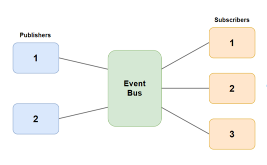
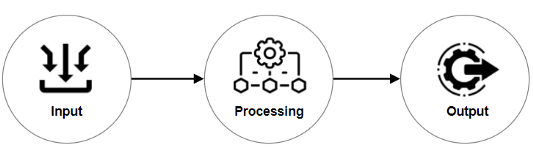
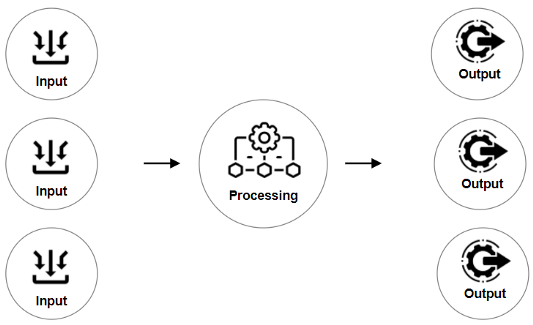
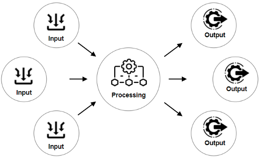

# Publisher-Subscriber (Pub-Sub) Design Pattern

## What is Publisher-Subscriber Pattern?

The Publish/Subscribe pattern, sometimes known as pub/sub, is an architectural design pattern that enables publishers and subscribers to communicate with one another. In this arrangement, the publisher and subscriber rely on a message broker to send messages from the publisher to the subscribers. Messages (events) are sent out by the host (publisher) to a channel, which subscribers can join.

Compared to older design patterns like message queuing and event brokers, Pub/Sub is more versatile and scalable. The key to this is that Pub/Sub allows messages to flow between different system components without the components knowing one other’s identities.
## A Real-life Example of Pub-Sub Pattern

Many social networks already use the pub-sub model via “following” features. Let’s look at an example to build a better intuition.

Imagine a simple social network that allows users to share recipes, follow their friends, and see a timeline of their friends’ recipes. When users share a recipe, they can put it in a topic. One user might categorize by what meal it is, and another user might categorize by the season of the ingredients. When a user follows another user, they subscribe to the recipes their friend publishes.

Followers can pick whether they want to view everything published or just the issues that interest them. Followers can also create their content filters, such as excluding recipes with specific ingredients.

Users can follow as many other users as they desire, so their timeline will be full of ideas from various people, but one person only publishes each idea. Many people can also follow a user, and everyone who follows them will see a copy of the idea on their timeline.

The Event Bus knows what subject each subscriber is subscribed to in this topic-based example. The event bus will filter messages by topic and deliver them to subscribers who have subscribed to the message’s topic. The publishers are in charge of deciding what the topics of their communications will be.

Any message published with Topic A will be forwarded to Subscriber 1 and Subscriber 3 in the diagram above. Likewise, any message published with Topic B will be forwarded to Subscribers 2 and 3. If a publisher sends a message regarding Topic A but defines it incorrectly as Topic B, it will only be sent to Topic B subscribers.

## How Does The Publish-Subscribe Pattern Work?

Building reusable arrangements of modules and their interconnections is the foundation of software design patterns. In a UML design diagram, these modules are often classes or objects. Modern architectural patterns, on the other hand, see modules as larger, selfexecuting processes scattered over distributed systems.

To fully comprehend the benefits of the Pub/Sub design, you must first understand the fundamental pattern upon which an information system is formed and then trace its progression into a distributed system. An information system is often made up of a generic set of software modules that are organized in this simple sequential structure.

Consider the diagram above as simple software made up of three parts. The input module receives user input and converts it into a message that is sent to the processing module. The data is processed by the processing module and sent to the output module as a new message. The data is shown on the user’s screen using the output module.

The real world, on the other hand, is seldom so simple. For handling concurrent queries at a suitable size, the system will require several inputs and output modules.

The system faces the difficulty of routing messages from input modules to their appropriate output modules at this scale. The input and output modules will require an addressing mechanism to handle this challenge. The messages will be processed and routed to the relevant recipient based on an address by the processing module. In order to solve the routing problem, all three modules work together.

The system will be able to manage thousands of concurrent connections at an Internetscale. Users from all over the world will send and receive messages using the system. It must also be able to handle a large number of users from all over the world. The system modules, on the other hand, will not work as planned at such a vast scale:
- The load is too much for the processing module to handle. The load must be divided across numerous processing modules due to the high volume and geographical spread.
- The dynamics of input and output change at this scale. The use of pre-defined addressing between modules adds a significant amount of overhead.

The first issue can be solved by using numerous processing units. This has the effect of horizontally separating the system. This, however, adds to the routing complexity. The messages must now be routed to the appropriate processing module by the input modules.

At the internet scale, attaching module-specific routing metadata to messages becomes a bottleneck. Under these conditions, the design of message transfer from one module to the next necessitates a complete overhaul.

## Advantages of Publisher-Subscriber Pattern

**Low coupling on the publisher’s end**: Subscriptions are not a problem while creating publishing modules. The publisher is only responsible for outputting data in response to the correct events through its API because it has no knowledge of the number, identity, or message kinds of the subscribers. When a change is detected, the “onchange” DOM handler for HTML elements simply broadcasts the new value of the input field; it is the developer’s responsibility to interpret that data correctly. 

**Reduced cognitive load for subscribers**: The publisher is a black box from the perspective of a subscriber. Subscribers don’t have to worry about a publisher’s inner workings, and they sometimes don’t even have access to the source code. Subscribers can only communicate with the publisher using the publisher’s public API.

**Separation of concerns**: Because of the architecture’s simplicity (data travels one way from publishers to subscribers), developers can practice fine-grained separation of concerns by splitting up message types into distinct types that each fulfill a single straightforward purpose. For example, data with the topic “/cats” should only contain information about cats, and data with the topic “/dogs” should only contain information about dogs. Cat lovers can subscribe to “/cats,” dog lovers to “/dogs,” and fans of both can subscribe to both channels; nevertheless, we know that a message from “/cats” will not contain information about dogs.

**Improved testability**: It is simple to confirm that the various event buses are transmitting the necessary messages thanks to the fine-grained topic control mentioned above.

**Improved Security**: The security notion of assigning minimal privileges/information works well with the Pub/Sub architecture. Developers can easily create modules that are subscribed to the bare minimum of message types required to function.

## Disadvantages of Publisher-Subscriber Pattern

### The inflexibility of data sent by the publisher

The publish/subscribe approach introduces a high level of semantic coupling in the messages that publishers send to subscribers. It’s tough to update the data structure once it’s been formed. To modify the format of the messages, all of the subscribers must be modified to accept the new format. If the subscribers are external, this can be difficult or impossible. This is a common drawback of any versioned API.

The use of a versioned message format, which allows subscribers to validate the format they are receiving, is a typical solution to this problem. This, however, presupposes that subscribers are correctly consuming the versioning information. For backward compatibility, another option is to utilize versioned endpoints like /APIV0/ and /APIV1/. This technique has the disadvantage of requiring developers to support several versions, which is time-consuming.

### Instability of Delivery

Another disadvantage of the publish/subscribe model is the difficulty in determining the health of subscribers. The publisher does not have complete information about the systems that are listening to the messages. For example, logging systems frequently employ publish/subscribe. The ‘Critical’ messages may be lost if a logger subscribed to the ‘Critical’ message type crashes or becomes locked in an error state! Any services that rely on error warnings will then be uninformed of the publisher’s issues.

This issue can be found in any client/server system. However, one advantage of pub/sub is that numerous identical instances of a logger can be run concurrently with little additional system effort. This enables system designs to have a high level of redundancy. To reduce this risk, changes to the design might be implemented, such as requiring receipts of received messages. With that capability, the publisher can receive feedback on the status of the subscribers