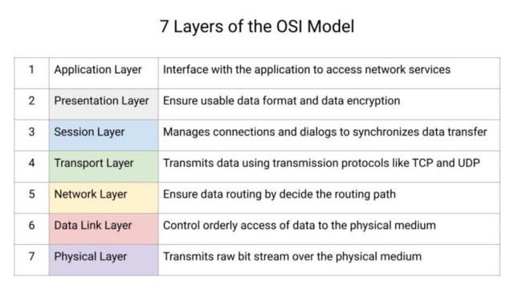

# What are Web Sockets? - System Design Concept

While building any web application, one needs to consider what delivery mechanism would be best. The web has been built around HTTP’s request and response paradigm. However, such a paradigm faces the overhead problem of HTTP, and as a result, they are not suitable for low latency applications. 

In this blog, we focus on Web Sockets, which are vital components behind the applications like multiplayer games or any application that rely on real-time data transfer. We will give you insight into how web-socket works and what are its key features.

## Let's Understand Web Socket

Web Socket is a bidirectional lightweight communication protocol that can send the client’s data to the server or from the server to the client. It aimed to provide a fullduplex communication channel compared to a single TCP connection. Once the connection is established, then kept alive until it is terminated by either the server or the client. 

Web Sockets are highly used in almost every real-time application like trading, multiplayer, and online games to receive data on a single communication channel in a bidirectional manner.

Web sockets and HTTP differ significantly, but both protocols depend on TCP at layer 4 (transport layer) in the OSI model and are located at layer 7 (application layer).

Web socket protocol mitigates the overhead associated with HTTP by enabling the communication between a client and a server with low-weight overheads, aiming to provide real-time data transfer across the channel.

It maintains a long-held single TCP socket connection between the client and the server to enable the bi-directional messages to be distributed efficiently, providing a latency-free connection.

## How does Web Socket work?

Web Socket is a full-duplex protocol. Once the connection is established in a clientserver architecture, the message exchange starts in a bidirectional mode and it will remain alive between client and server until either party terminates it.
- However, for opening a web socket connection, one needs to call the web socket constructor. For web socket **ws**: and **wss**: URL schema is used, while for HTTP, https: is used.
- After the establishment of a connection with the server, the data is sent to the server using the send() method on the connection object. Previously it used to support only strings, but now in the latest spec, it can send even the binary messages using **Blob** or **ArrayBuffer** object. 
- Similarly, the server might send us messages by firing the **onmessage** callback. The callback receives an event object while the data property is used to access the actual message.
- Web sockets also have an additional feature named **Extension**, which helps in sending compressed or multiplexed frames.

## Key Features of Web Sockets

**Bi-directional data exchange**: Web sockets play a significant role in reducing network traffic by transmitting data in both directions simultaneously using a single connection.

**HTTP compatibility**: Web sockets are highly compatible with earlier versions of HTTP connection, which allow us to switch between HTTP and web socket.

**Publish/Subscribe event pattern**: Web sockets allows a highly efficient data transfer model. Communication channels are established, allowing sending messages to and from a server and receiving event-driven responses without continuously polling the server.

## How is Web Socket useful?

**Instant chat**: Web Sockets play a significant role in real-time messaging. They are quite useful in building real-time and complex features like encrypted messages, typing indicators, etc., for chat services.

**Multi-Player gaming**: Web Sockets are quite helpful in synchronizing the game states between players and allow the low-latency network to work with. They allow seamless experiences across devices and allow many real-time interactive features for online and connected gaming.

**Online maps**: Live geo-location data is used to build real-time online maps. Web Sockets play a significant role in routing and navigation of any moving asset on an alive map.

**Live results**: Web Sockets help enhance the platform and keep updating the user with the latest information and lie status like election polls and their results, live score updates, etc.

## Conclusion

Web Sockets have genuinely revolutionized web development. Using their stateful and bi-directional nature, they are beneficial in systems that require real-time updates or continuous data streams. However, if we only need to fetch only once, then a simple HTTP request would be considered compared to Web Sockets.
