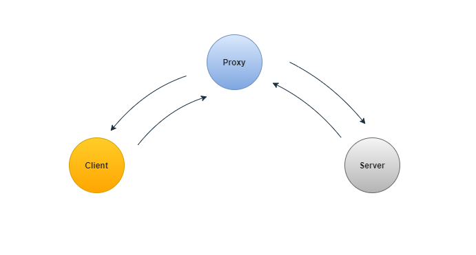
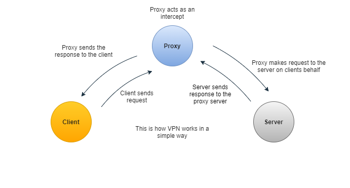
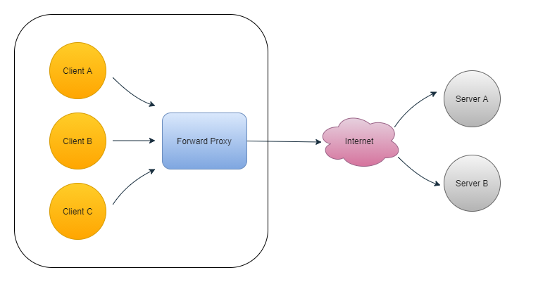
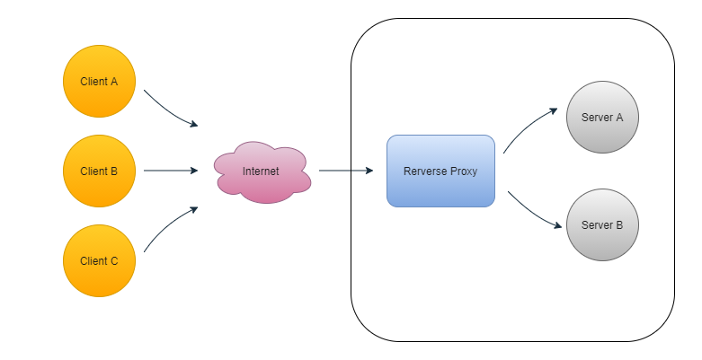
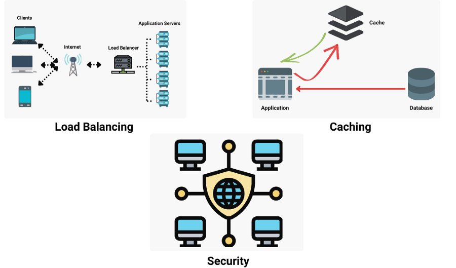
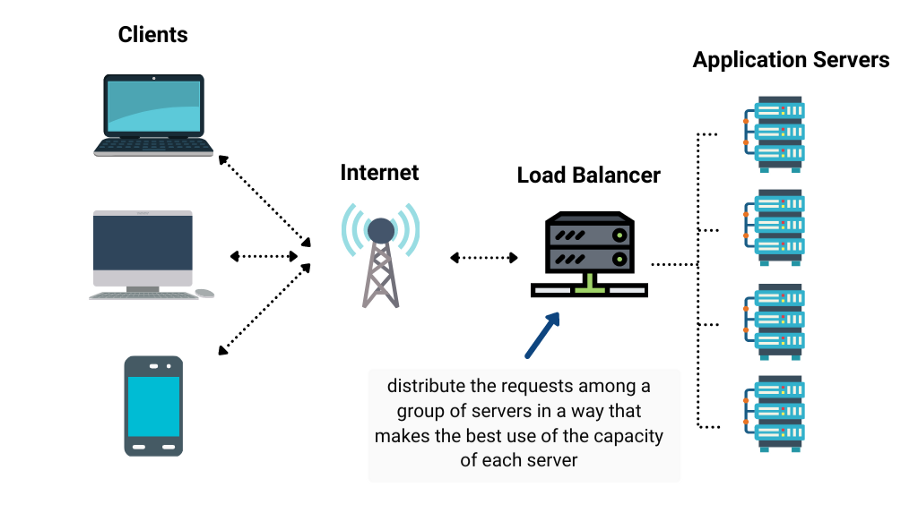

# What are Proxies in System Design?

In this blog, we will learn about Proxy, an essential concept for a system design interview. Many of us have used tools that help us maintain our privacy or anonymity or remain safe from third-party users eavesdropping in our connection. Do you know how it works and how it is useful? Let’s find out!

## What are Proxies?

A proxy is a server that acts as an intermediary between a client and another server. When these clients send requests to websites on the Internet, the proxy server intercepts these requests, then communicates with the servers on behalf of these clients, like a gobetween allowing us to perform something either before or after the request gets through to the original destination.

## How does a proxy server work?

A proxy acts on behalf of a client or group of clients. When a client issues a request to communicate with the server, it goes to the proxy instead of going directly to the server, which then forwards the request to the server. In other words, the client makes a request meant to go to the server but first goes to the proxy to communicate with the server on the client’s behalf.

## Where is the Proxy server used?

Proxy servers are used not only to hide the identity of the client from the server, but instead, it has many other usages:
- Proxy servers are used to manage requests and responses.
- It is used to filter, log, and transform requests by adding and removing headers.
- If several clients access a particular resource, the proxy server can cache it and respond to all clients without sending the request to the server multiple times.
- It is also used as a load balancer between servers.

## What is a Forward Proxy?

Forward proxy, often called a proxy, is a server that sits between a client and a server. Here, instead of sending requests directly to the servers, requests are sent to a forward proxy, which then sends the requests to the server.

Forward proxies are used as a middleman instead of directly interacting with the servers for many reasons such as to avoid browsing restrictions, to access blocked contents, or to protect their identity online.

## What is a Reverse Proxy?

A Reverse Proxy is a proxy server that sits between one or more servers. Reverse proxies are the exact opposite of forwarding proxies in terms of their interaction pattern. A forward proxy acts on behalf of clients, whereas a reverse proxy acts on behalf of severs.

In this case, when a client sends a request to the server, the request actually goes to the Reverse Proxy without the client knowing about it. The client thinks it is directly interacting with the server, and for the client, there are no other servers here, and it thinks that the one it is interacting with is the server it wanted to send a request to. Let us take an example:

> “Suppose, if we type https://www.enjoyalgorithm.com in our browser, our browser makes a DNS query to get the IP address of https://www.enjoyalgorithm.com. If https://www.enjoyalgorithm.com used a reverse proxy and configured it correctly, the DNS query will return the reverse proxy's IP address.”

## What are the use cases of a reverse proxy?

Now, a reverse proxy is handy when we design a complex system, and it can be used for many purposes, such as:

- **Security**: When we use a reverse proxy, a website’s origin server IP address is abstracted from the attackers. So to exploit any vulnerabilities, malicious clients can not access them directly. Many reverse proxy servers include features that help protect backend servers against distributed denial-of-service (DDoS) attacks, such as rejecting traffic from specific IP addresses of the client (blacklisting) or limiting the number of requests accepted from each client.
- **Load Balancing**: A website with millions of users visiting every day may find it hard to handle such huge traffic with a single server. Instead, we can use more than one server and use reverse proxy as a load balancing solution to distribute the traffic among servers and prevent any server from getting overloaded.
- **Caching**: A reverse proxy can also be used to cache requests, resulting in faster performance.

## Disadvantages of Reverse Proxies

Reverse proxies are not always useful, and it has their own drawbacks:
- Adding reverse proxies to the architecture increases the complexity of our system.
- A single reverse proxy can act as a single point of failure, and adding multiple reverse proxies increases complexity even more.
- When we use unencrypted connections to a proxy server, the server can modify the responses we receive, good or bad, in both ways.
- Even after using the encrypted connections or network, our data or information can be leaked using the technique of** TLS and SSL** encrypted connections.

## Reverse Proxy vs. Load Balancer

Reverse proxy servers and load balancers are components in a client-server system design. In the interaction between clients and servers, both act as intermediaries, performing efficiency-enhancing functions.

A load balancer distributes incoming client requests among a group of servers, returning the response to the appropriate client from the selected server in each case. When a site needs multiple servers, load balancers are most commonly deployed because the volume of requests is too much to handle efficiently for a single server. The load balancer's job is to distribute the requests in a way that makes the best use of the capacity of each server, prevents overload on any server, and results in the client’s quickest possible response.

A reverse proxy accepts a request from a client or set of clients, forwards it to a server, and returns the client’s response from the server. Whereas deploying a load balancer only makes sense when you have multiple servers, even with just one web server or application server, deploying a reverse proxy often makes sense.
