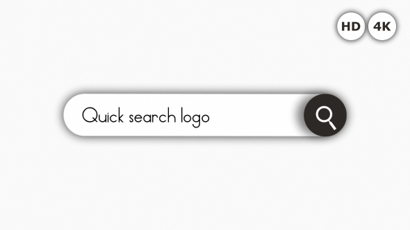

# System Design in Real World

|| System Design |
|-|-|
|  | [Dropbox](./dropbox/README_EN.md) |
|  | [Facebook](./facebook/README_EN.md) |
|  | [Instagram](./instagram/README_EN.md) |
|  | [Messenger](./messenger/README_EN.md) |
|  | [Rate Limiter](./rate-limiter/README_EN.md) |
|  | [TinyURL](./tinyurl/README_EN.md) |
|  | [Twitter](./twitter/README_EN.md) |
|  | [Typeahead Suggestion](./typeahead-suggestion/README_EN.md) |
|  | [Uber](./uber/README_EN.md) |
|  | [Web Crawler](./web-crawler/README_EN.md) |
|  | [Yelp](./yelp/README_EN.md) |
|  | [Youtube](./youtube/README_EN.md) |
