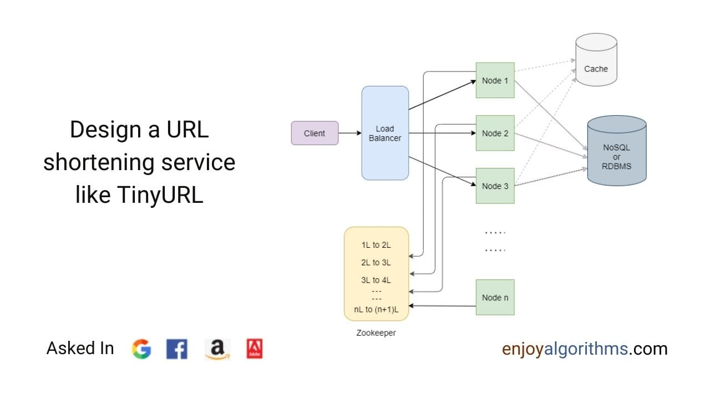

# Thiết Kế Dịch Vụ Rút Gọn URL - TinyURL

## Hiểu vấn đề

Thiết kế một dịch vụ rút gọn URL như trang [TinyURL](https://tinyurl.com/app). Đích đến là thiết kế một dịch vụ có khả năng mở rộng cao có thể cho phép nhiều người dùng tạo ra nhiều URL ngắn hơn từ chuỗi URL rất dài.

### TinyURL là gì?

TinyURL là dịch vụ web rút gọn URL, nó tạo ra các URL với tên bí danh ngắn hơn thay thế cho URL rất dài. Bấy cứ khi nào người dùng đến với URL ngắn, nó sẽ tự động điều hướng sang các URL gốc.

Trước khi đi đến giải pháp, chúng ta nên thảo luận về phạm vi và yêu cầu hệ thống về các tính năng cần có cho hệ thống.

## Yêu cầu hệ thống

### Các tính năng yêu cầu

- Người dùng có thể tạo ra URL ngắn hơn từ các URL gốc.
- Link ngắn tự động điều hướng đến link gốc.
- Người dùng nên có tuỳ chỉnh để tạo một link ngắn theo ý của họ.

### Mục tiêu đạt được

- Nếu hệ thống sập, điều đó có nghĩa là tất cả link ngắn hơn sẽ không hoạt động. Do đó, hệ thống của chúng ta phải có tính khả dụng cao.
- Điều hướng phải là thời gian thực với độ trễ thấp.
- Không được để tạo ra các link ngắn hơn nằm ngoài dự đoán.

### Mục tiêu mở rộng

- Dịch vụ nên là REST API.
- Thống kê: Bao nhiêu URL được truy cập?
- Người dùng có thể chỉ định thời hạn của từng URL.

## Phân tích hệ thống

Bây giờ ta sẽ xem qua các ước lượng cơ bản về hệ thống. Điều quan trọng cần nhớ là hệ thống của chúng ta sẽ thiên về **đọc dữ liệu**, các yêu cầu đọc có thể gấp hàng ngàn lần so với yêu cầu ghi. Do đó, ta giả sử tỉ lệ đọc/ghi sẽ là 100/1.

#### Các thành phần chính

Các thành phần chính trong ứng dụng rút gọn URL:

1. **Clients** - Trình duyệt Web/Ứng dụng di động. Giao tiếp với server thông qua giao thức HTTP.
2. **Load Balancer** - Để phân phối tải trên nhiều server.
3. **Web Servers** - Nhiều server sẽ được triển khai để mở rộng theo chiều ngang.
4. **Database** - Nó sẽ lưu các URL dài ánh xạ đến các URL ngắn.

#### Ước lượng độ mở rộng

- **Lưu lượng truy cập**: ta có thể giả sử ta có 500 triệu URL được tạo mỗi tháng, với tỉ lệ 100/1, ta có thể ước lượng là 50 tỉ điều hướng xuyên suốt thời điểm đó.